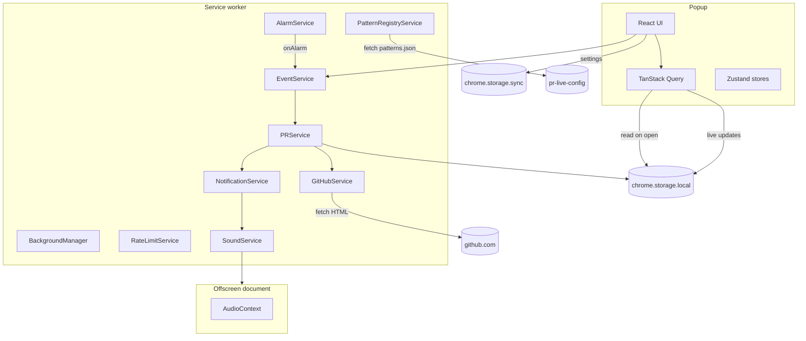

# Architecture

This is the deeper tour of how Pullwatch works under the hood. The [README](README.md) covers what the extension is and what it does; this file is for readers who want to understand how it does it.

## At a glance

## Service worker lifecycle

Manifest V3 service workers do not stay running. Chrome shuts the worker down after about 30 seconds of inactivity. The next time something interesting happens (an alarm fires, the popup sends a message, the browser starts), Chrome wakes the worker and the entrypoint file runs from scratch. Every in memory variable from the previous run is gone.

Pullwatch deals with this with the **initialization gate** pattern in [extension/background/main.ts](extension/background/main.ts):

1. As soon as the file loads, it kicks off `BackgroundManager.initialize()` and stores the resulting `Promise` in `initPromise`.
2. It registers all Chrome listeners (`onInstalled`, `onStartup`, `onAlarm`, `onMessage`, `notifications.onClicked`) **synchronously**, because Chrome only counts listeners that exist before the first `await`.
3. Each listener body awaits `initPromise` before doing real work. That guarantees the services are ready, no matter which event woke the worker.

A side effect of this is that `BackgroundManager.performInitialSetup` runs on every wake, not only on install. That is why it deliberately does not fetch PR data: writing fresh PR data to storage on a wake would race the alarm handler and silently swallow new PR notifications. Initial seeding lives in `onInstalled` and `onStartup` only.

## Service map

The background is a small, intentional set of services wired together by a service container. Each has one job.

| Service                    | Source                                                                                               | Role                                                                                                                                                             |
| -------------------------- | ---------------------------------------------------------------------------------------------------- | ---------------------------------------------------------------------------------------------------------------------------------------------------------------- |
| `BackgroundManager`        | [BackgroundManager.ts](extension/background/services/BackgroundManager.ts)                           | Orchestrates init on every wake. Calls permissions check, alarm setup, and badge sync from storage. Never fetches PRs.                                           |
| `EventService`             | [EventService.ts](extension/background/services/EventService.ts)                                     | Routes runtime messages through a `Map` based dispatch table. Owns `withPrUiFetchIndicator`, the depth counter that tracks overlapping fetch waves.              |
| `PRService`                | [PRService.ts](extension/background/services/PRService.ts)                                           | Coordinates per list fetches. Dedupes concurrent calls, applies a 60 second TTL cache, runs account swap detection against `github_viewer_identity`.             |
| `GitHubService`            | [GitHubService.ts](extension/background/services/GitHubService.ts)                                   | The only place the extension calls `fetch()` against `github.com`. Picks the route (search or legacy) using a 24 hour route hint, then runs the parser gauntlet. |
| `AlarmService`             | [AlarmService.ts](extension/background/services/AlarmService.ts)                                     | Owns the periodic fetch alarm. Default cadence is `FETCH_INTERVAL_MINUTES = 3`. Persists any dev override across worker restarts.                                |
| `RateLimitService`         | [RateLimitService.ts](extension/background/services/RateLimitService.ts)                             | Tracks GitHub 429 responses, applies exponential backoff (capped at 30 minutes), and persists the state so it survives a worker restart.                         |
| `PatternRegistryService`   | [PatternRegistryService.ts](extension/background/services/PatternRegistryService.ts)                 | Pulls remote regex patterns every 6 hours. Validates with Valibot, compiles, and falls back to bundled defaults if anything is wrong.                            |
| `NotificationService`      | [NotificationService.ts](extension/background/services/NotificationService.ts)                       | Builds and shows Chrome notifications per category (assigned, merged, authored). Encodes the PR URL into the notification ID so click handling survives a wake.  |
| `SoundService` + offscreen | [SoundService.ts](extension/background/services/SoundService.ts), [offscreen/](extension/offscreen/) | Plays notification sounds. Manifest V3 workers cannot play audio, so a one off offscreen document holds the `AudioContext`.                                      |
| `StorageService`           | [StorageService.ts](extension/background/services/StorageService.ts)                                 | Type safe wrapper around `chrome.storage.local` and `chrome.storage.sync` with retry on transient post wake failures.                                            |

## Parser waterfall

GitHub serves two different "all my pull requests" experiences depending on the user, the route, and ongoing rollouts. To stay resilient, [GitHubService](extension/background/services/GitHubService.ts) runs the response through three parsers in order, accepting the first one that produces well formed PRs.

1. **Embedded JSON.** [GitHubEmbeddedJsonPullHarvest](extension/background/services/GitHubEmbeddedJsonPullHarvest.ts) looks for the SSR JSON blob that the new dashboard ships in the page. When it is there, this is the cleanest source of truth.
2. **New experience HTML.** [NewExperienceGitHubHTMLParser](extension/background/services/NewExperienceGitHubHTMLParser.ts) parses the new dashboard markup with the `patterns.newExperience` block.
3. **Legacy HTML.** [GitHubHTMLParser](extension/background/services/GitHubHTMLParser.ts) parses the classic `/pulls?q=...` page with the legacy patterns.

To keep steady state polling cheap, the service stores a **route hint** in `chrome.storage.local` (`pulls_list_route_hint`) that records which URL shape (`/pulls/search` or `/pulls?q=...`) last succeeded. The hint has a 24 hour TTL so that a GitHub rollout cannot pin a user to a stale route forever. None of the parsers contain hardcoded selectors; every selector and regex comes from the pattern registry.

## Remote pattern config

The regexes that drive the parsers live in two places.

- **Bundled defaults** ship with the extension at [extension/common/default-patterns.ts](extension/common/default-patterns.ts). The extension always works with these, even with no network.
- **Remote config** lives in a separate public repo at [github.com/dragosdev-code/pr-live-config](https://github.com/dragosdev-code/pr-live-config). The extension fetches `patterns.json` every 6 hours and applies it if the `version` field is higher than the version it has stored.

There are two branches in that repo:

- `main` is what production reads, at `raw.githubusercontent.com/dragosdev-code/pr-live-config/main/patterns.json`.
- `staging` is what the schema smoke test reads, at `.../staging/patterns.json`. It is used to validate config changes before they are merged into `main`.

The flow is intentionally cautious. When [PatternRegistryService](extension/background/services/PatternRegistryService.ts) downloads a config:

1. It validates the JSON shape with [Valibot](https://valibot.dev/) against `PatternRegistrySchema` in [pattern-registry-schema.ts](extension/common/pattern-registry-schema.ts). A bad shape is rejected with a dotted path error and the current patterns are kept.
2. It compiles each regex inside a `safeCompile` guard. A bad regex falls back to the bundled defaults.
3. It writes the compiled set to `chrome.storage.local`.

The version check is a hard `>` comparison on the integer `version` field. A new config has no effect unless its version is bumped. This means a regex hot fix can ship to live users without releasing a new extension build, and a misconfigured push cannot accidentally roll back live users to an older revision.

## Popup hydration

The popup never calls GitHub itself. It reads from the same `chrome.storage.local` that the background writes to.

When the popup opens, [src/main.tsx](src/main.tsx) awaits [hydratePrQueriesFromStorage](src/hydrate-pr-queries-from-storage.ts) **before** the first React render. That call reads the three PR list keys from storage and seeds them into TanStack Query with `setQueryData`. The result is that the popup is filled in on the very first paint, with no spinner and no service worker round trip.

While the popup is open, [usePrListsStorageSync](src/hooks/use-pr-lists-storage-sync.ts) listens to `chrome.storage.onChanged` and pushes any new value into the same TanStack Query keys. So if the alarm fires while you have the popup open, the lists update live without you doing anything.

Manual refresh from the refresh button does send a runtime message to the service worker, but only to ask it to fetch. The render still goes through storage, not through the message reply. This keeps the rendering path identical for alarm driven, install driven, and manual refresh paths.

## State boundaries

| Storage area             | What lives there                                                                                                                                                                                                                         |
| ------------------------ | ---------------------------------------------------------------------------------------------------------------------------------------------------------------------------------------------------------------------------------------- |
| `chrome.storage.local`   | PR lists (`github_assigned_prs`, `github_merged_prs`, `github_authored_prs`), route hint, rate limit state, parser pattern registry, viewer identity for account swap detection, install gate flags, custom sound metadata. Device only. |
| `chrome.storage.sync`    | User settings (theme, notification preferences, sound choices). Carried across the user's signed in Chrome instances by Chrome sync if it is enabled.                                                                                    |
| `chrome.storage.session` | Manual refresh throttle timestamp (`last_manual_refresh_at`). Cleared when the browser quits. Lives here because it is a short lived rate limiter, not user data.                                                                        |

The only writes that ever leave the user's browser profile are HTTP requests to `github.com` and `raw.githubusercontent.com/dragosdev-code/pr-live-config/*`. There is no Pullwatch owned server.
