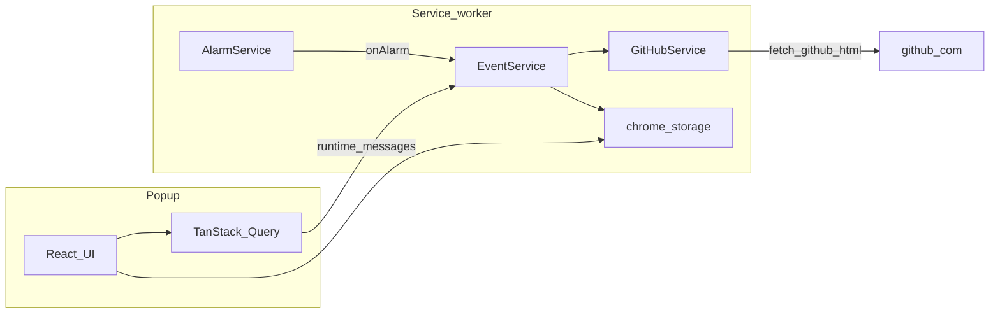

<div align="center">
  

  <h1>Pullwatch</h1>

  <p><strong>Your GitHub pull request inbox in the toolbar—sorted, session-based, and rate-limit aware.</strong></p>

  <p>
    <a href="https://react.dev/"></a>
    <a href="https://tailwindcss.com/"></a>
    <a href="https://vite.dev/"></a>
    <a href="https://developer.chrome.com/docs/extensions/develop/migrate/what-is-mv3"></a>
  </p>
</div>

---

Pullwatch keeps the PRs you care about visible without living on [github.com](https://github.com). It uses your **existing GitHub browser session** (no personal access tokens and no OAuth app). A Manifest **V3** service worker syncs review requests, authored PRs, and recently merged work on a schedule, with backoff when GitHub signals rate limits.

## Install

**Chrome Web Store:** coming soon (link will be added when the listing is live).

**From source:** see [Development](#development) below, then load the unpacked `dist/` folder in `chrome://extensions`.

## Features

| | |
| --- | --- |
| **Session-based access** | Reads GitHub HTML you can already see while signed in—no PATs or OAuth flows. |
| **Three-tab inbox** | **To review** (pending vs already-reviewed sections), **Authored** (ordered by author review state: changes requested, approved, pending, commented, draft), **Merged** (recently shipped). |
| **Notifications** | Desktop notifications and sounds per category (**assigned**, **merged**, **authored**); draft-related options for assigned work (e.g. notify on drafts off by default). |
| **Themes** | **35** built-in [DaisyUI](https://daisyui.com/) themes on **Tailwind CSS 4**. |
| **Background sync** | Default fetch cadence **3 minutes** (`FETCH_INTERVAL_MS` in [`extension/common/constants.ts`](extension/common/constants.ts)); respects rate-limit state and skips work when offline. |
| **Resilient parsing** | HTML list parsing with a **`/pulls/search` vs legacy `/pulls`** route hint and fallback; remote pattern updates from [`dragosdev-code/pr-live-config`](https://github.com/dragosdev-code/pr-live-config) (TTL in code). |
| **Fast popup** | UI hydrates from **`chrome.storage.local`**; background fetches can bypass short-lived caches so data stays fresh. |

## Architecture (short)

- **Popup:** React 19 UI, **TanStack Query** for server-state style refresh flows, **Zustand** for local UI state.
- **Background:** Service worker (`extension/background/main.ts`) wires alarms → **`EventService`** → **`PRService`** / **`GitHubService`**. **`AlarmService`** owns the periodic alarm; **`RateLimitService`** applies exponential backoff toward GitHub **429**s.
- **Concurrency:** Manual refresh paths use **`chrome.storage.session`** plus coordinated “wave” handling in **`EventService`** so overlapping refreshes do not stampede GitHub.
- **Offscreen document** (`offscreen`): used for capabilities such as audio playback (see manifest `offscreen` permission).



## Tech stack

| Area | Packages / tools |
| --- | --- |
| UI | React 19, **TanStack React Query**, **Zustand**, **react-hook-form**, **Valibot**, **@heroicons/react**, **@react-spring/web**, **react-focus-lock** |
| Styling | **Tailwind CSS 4**, **@tailwindcss/vite**, **DaisyUI** 5 |
| Dates | **date-fns** |
| Build | **Vite** 8, **TypeScript** ~5.8, **@vitejs/plugin-react**, **vite-plugin-static-copy** |
| Quality | **Vitest**, **@testing-library/react**, **Playwright**, **oxlint** |

## Permissions (why they exist)

Declared in [`public/manifest.json`](public/manifest.json):

| Permission | Role |
| --- | --- |
| `storage` | Persist PR lists, settings, route hints, and rate-limit state. |
| `notifications` | Optional desktop alerts for new or updated PRs. |
| `alarms` | Periodic background sync. |
| `offscreen` | Offscreen document for audio and related APIs not available in the service worker alone. |
| `https://github.com/*` | Fetch signed-in HTML for pulls lists and related pages. |
| `https://avatars.githubusercontent.com/*` | Load avatar images for enriched rows. |
| `https://raw.githubusercontent.com/dragosdev-code/pr-live-config/*` | Download remote parser / pattern config JSON. |

## Development

**Prerequisites:** Node.js **18+** and npm (or pnpm).

```bash
git clone https://github.com/dragosdev-code/pullwatch.git
cd pullwatch
npm install
```

Icons for the extension package are generated from `public/logo.png`:

```bash
npm run icons
```

Build the extension (output in **`dist/`**):

```bash
npm run build
```

Then in Chrome: open `chrome://extensions`, enable **Developer mode**, **Load unpacked**, and choose the **`dist`** directory.

**Other scripts:**

- `npm run dev` — Vite dev server for UI development.
- `npm test` / `npm run test:run` — Vitest.
- `npm run lint` — Oxlint.

## Contributing

Issues and pull requests are welcome. For larger changes, open an issue first so direction matches the project goals.
