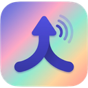
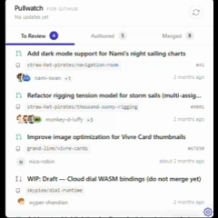
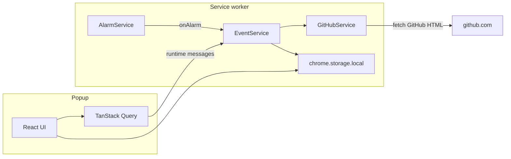

<div align="center">
  

  <h1>Pullwatch</h1>

  <p><strong>Your GitHub PR inbox. Sorted. No tokens. No noise.</strong></p>

  <p>
    <a href="https://react.dev/"></a>
    <a href="https://tailwindcss.com/"></a>
    <a href="https://vite.dev/"></a>
    <a href="https://developer.chrome.com/docs/extensions/develop/migrate/what-is-mv3"></a>
  </p>
</div>

---

Pullwatch keeps the pull requests you care about visible without you having to live on [github.com](https://github.com). It uses the GitHub session your browser already has, so there are no personal access tokens, no OAuth app, and no sign-in flow to worry about. A Manifest V3 service worker quietly refreshes review requests, the PRs you authored, and your recently merged work in the background, and it backs off politely when GitHub asks it to.

## Demo

<div align="center">
  
</div>

## Install

**Chrome Web Store:** coming soon (the listing link will be added when the store item is live).

**Privacy policy:** [PRIVACY.md](PRIVACY.md) (also on the [docs site](https://dragosdev-code.github.io/pullwatch/privacy/) after the next docs deploy).

**From source:** see [Development](#development) below, then load the unpacked `dist/` folder in `chrome://extensions`.

## Features

|                          |                                                                                                                                                                                                                     |
| ------------------------ | ------------------------------------------------------------------------------------------------------------------------------------------------------------------------------------------------------------------- |
| **Session based access** | Reads the GitHub HTML you can already see while signed in. No personal access tokens, no OAuth, nothing to authorize.                                                                                               |
| **Three tab inbox**      | **To review** (pending vs already reviewed), **Authored** (sorted by review state: changes requested, approved, pending, draft), and **Merged** (recently shipped).                                                 |
| **Notifications**        | Optional desktop alerts and sounds for **assigned (to review)** and **merged** PRs. The **Authored** tab is for visibility only (no toasts). Draft alerts for assigned PRs are off by default and can be turned on. |
| **Themes**               | 35 built-in [DaisyUI](https://daisyui.com/) themes on Tailwind CSS 4.                                                                                                                                               |
| **Background sync**      | Default refresh cadence is 3 minutes (see `FETCH_INTERVAL_MINUTES` in [extension/common/constants.ts](extension/common/constants.ts)). It pauses when you go offline.                                               |
| **Resilient parsing**    | A three stage parser handles both the new and legacy GitHub list pages. Regex updates can be shipped from a public config repo without releasing a new extension build.                                             |
| **Fast popup**           | The UI hydrates instantly from `chrome.storage.local` so the panel is filled before any network call.                                                                                                               |

## Privacy and safety

Pullwatch is built so that you do not have to take its word for it. The whole codebase is open and the rules below are easy to verify.

- **No tokens. No OAuth app.** Pullwatch never asks for a token and never creates an OAuth integration on your account. It reads the same pages your browser would render if you typed `github.com/pulls` in the address bar yourself.
- **Outbound network (four host origins, all declared in the manifest).** Pullwatch does not run its own servers and does not use analytics or third-party SDKs. The only destinations it contacts are:
  - **`https://github.com/*`**: the background worker fetches your signed-in pulls list HTML; the popup may open PR links and load pages on this origin using your existing session.
  - **`https://avatars.githubusercontent.com/*`**: avatar images shown next to PR rows in the popup.
  - **`https://raw.githubusercontent.com/dragosdev-code/pr-live-config/*`**: a public `patterns.json` file used to update parser regexes without a new extension release.
  - **`https://www.githubstatus.com/*`**: GitHub’s public Statuspage API (`summary.json`) so outage banners can be corroborated against real Pull Requests incidents. No credentials are sent; responses are cached locally in `chrome.storage.local`.
- **Your data stays on your machine.** PR lists, route hints, rate limit state, and other operational data live in `chrome.storage.local` on this device only. Your appearance and notification preferences live in `chrome.storage.sync` so Chrome can carry them across your own signed in Chrome instances if you have Chrome sync turned on. Nothing is uploaded anywhere by Pullwatch itself.
- **Non-goals.** Pullwatch does not act on PRs for you, does not write anything back to GitHub, and does not sync your PR data across devices. It is read only by design.

## How it works

Pullwatch has two halves: a background service worker that fetches and parses pages from GitHub, and a popup that renders the result.

The service worker wakes up on a Chrome alarm every 3 minutes, asks GitHub for your pulls list HTML using the cookie your browser already has, runs the HTML through a three stage parser (embedded JSON, then the new dashboard HTML, then the legacy HTML), and writes the result into `chrome.storage.local`. If GitHub returns a 429, an exponential backoff kicks in. The popup itself never calls GitHub. When you open it, it pulls the last persisted lists straight from `chrome.storage.local` before the first paint, then listens for storage updates while it stays open.

When GitHub returns a transport error or its [Statuspage](https://www.githubstatus.com) reports a Pull Requests incident, Pullwatch keeps the last-known list and shows an outage banner over the top of it; the banner links to `githubstatus.com` only when the cached snapshot corroborates a real incident. The full reason taxonomy and the integrity layer that catches "200 OK with an incomplete list" are documented in the [GitHub Health and Outages](https://dragosdev-code.github.io/pullwatch/architecture/github-health/) docs cluster.



For the longer tour of the service worker lifecycle, the parser waterfall, the remote pattern config, and the popup hydration flow, see the [Architecture Overview](https://dragosdev-code.github.io/pullwatch/architecture/overview/) in the docs site ([full docs](https://dragosdev-code.github.io/pullwatch/)).

## Canary monitor

GitHub changes its DOM from time to time, and a small change can break a regex that the parser relies on. To catch this before users do, Pullwatch ships a canary suite that runs every hour as a GitHub Action.

It has two tiers. Tier 1 is a public baseline that fetches a known repository's pulls page with no credentials and asserts that the parser still produces well formed PRs. Tier 2 uses [Playwright](https://playwright.dev/) to sign two real bot accounts into GitHub and exercise both the legacy and the new dashboard experiences end to end. If either tier fails, the workflow posts a Discord alert with a link to the failing run and an HTML snapshot for triage. The full runbook lives at [canary/DOM_CHANGE_RUNBOOK.md](canary/DOM_CHANGE_RUNBOOK.md).

## Tech stack

Each entry below explains what the package actually does inside Pullwatch, not just that it is installed.

| Area          | Package                           | What it does here                                                                            |
| ------------- | --------------------------------- | -------------------------------------------------------------------------------------------- |
| UI            | **React 19**                      | Renders the popup and settings.                                                              |
| Data          | **@tanstack/react-query**         | Holds PR lists in the popup; hydrated from `chrome.storage.local` before the first paint.    |
| State         | **zustand**                       | Small UI stores for global error, debug mode, and tab control.                               |
| Forms         | **react-hook-form**               | Powers the settings forms in the settings overlay.                                           |
| Validation    | **valibot**                       | Validates the remote `patterns.json` at runtime before any regex is compiled or stored.      |
| Dates         | **date-fns**                      | Renders relative timestamps on PR rows ("3h ago", etc.).                                     |
| Icons         | **@heroicons/react**              | Iconography used across the popup.                                                           |
| Animation     | **@react-spring/web**             | List entrance animations and the theme picker ripple effect.                                 |
| A11y          | **react-focus-lock**              | Traps focus inside the settings overlay so keyboard users do not escape it by accident.      |
| Styling       | **tailwindcss 4** + **daisyui 5** | Styling and the 35 ready made themes.                                                        |
| Build         | **vite 8** + **typescript ~5.8**  | Builds the popup, service worker, and offscreen document. Strict TypeScript across the repo. |
| Static assets | **vite-plugin-static-copy**       | Copies the manifest, icons, and offscreen HTML into `dist/`.                                 |
| Unit tests    | **vitest** + **@testing-library** | Test runner and React testing helpers.                                                       |
| Browser tests | **playwright**                    | Drives the canary's Tier 2 logins and screenshot capture.                                    |
| Lint          | **oxlint**                        | Fast linter used across the repo.                                                            |

## Permissions

All permissions are declared in [public/manifest.json](public/manifest.json). Each one exists for a single, narrow reason.

| Permission                                                          | Why it exists                                                                                                                                  |
| ------------------------------------------------------------------- | ---------------------------------------------------------------------------------------------------------------------------------------------- |
| `storage`                                                           | Saves your PR lists, settings, route hints, and rate limit state inside Chrome's own storage on this device.                                   |
| `notifications`                                                     | Lets Pullwatch show optional desktop alerts when something on your inbox changes. You can turn this off per category.                          |
| `alarms`                                                            | Lets the background refresh run on a schedule (every 3 minutes by default) without keeping a tab open.                                         |
| `offscreen`                                                         | Manifest V3 service workers cannot play audio. The offscreen document is used to play notification sounds and nothing else.                    |
| `https://github.com/*`                                              | Reads the signed in pulls pages your browser would already render. This is where every PR row comes from.                                      |
| `https://avatars.githubusercontent.com/*`                           | Loads avatar images shown next to each PR.                                                                                                     |
| `https://raw.githubusercontent.com/dragosdev-code/pr-live-config/*` | Downloads the public regex config file used by the parser. See the [pr-live-config repo](https://github.com/dragosdev-code/pr-live-config).    |
| `https://www.githubstatus.com/*`                                    | Fetches GitHub’s public status API so outage banners match real Pull Requests incidents (see **How it works** above). No account data is sent. |

### Chrome Web Store listing (copy-paste justifications)

Use the same wording in the store’s permission and host-access fields so the listing matches this README.

- **`storage`**: Saves PR lists, settings, route hints, and rate-limit state on this device only.
- **`notifications`**: Optional desktop alerts when your inbox changes (per-category; can be disabled).
- **`alarms`**: Background refresh on a schedule without keeping a GitHub tab open.
- **`offscreen`**: Plays notification sounds; MV3 service workers cannot use `AudioContext` directly.
- **`https://github.com/*`**: Reads signed-in pulls pages the user could already open in the browser; no tokens or OAuth.
- **`https://avatars.githubusercontent.com/*`**: PR author avatars in the popup UI.
- **`https://raw.githubusercontent.com/dragosdev-code/pr-live-config/*`**: Public parser regex updates (data only, validated before use).
- **`https://www.githubstatus.com/*`**: Public outage status for accurate “GitHub may be down” banners; no user credentials.

**Single purpose:** Read-only GitHub PR inbox in the toolbar: track reviews, authored PRs, and merges using the browser’s existing GitHub session.

## Development

**Prerequisites:** Node.js 18 or later, plus npm (or pnpm).

```bash
git clone https://github.com/dragosdev-code/pullwatch.git
cd pullwatch
npm install
```

Build the extension (output goes into `dist/`):

```bash
npm run build
```

Then in Chrome: open `chrome://extensions`, enable **Developer mode**, click **Load unpacked**, and choose the `dist` folder.

**Other useful scripts**

- `npm run dev` runs the Vite dev server. Useful for fast UI iteration in a browser tab; the service worker is not wired up here.
- `npm test` and `npm run test:run` run the unit tests with Vitest.
- `npm run canary:test` runs the canary suite locally.
- `npm run test:remote-patterns` validates the production `patterns.json` against the schema. There are also `:staging`, `:production`, and `:production:parity` variants.
- `npm run lint` runs oxlint.
- `npm run zip` runs `npm run build`, then writes `pullwatch.zip` at the repo root (production `dist/` contents only; excludes marketing `pullwatch-view.gif`, analyzer `stats.html`, and `*.map`). Use this archive for Chrome Web Store uploads.
- `npm run icons` regenerates `public/logo-{16,32,48,128}.png` from `public/logo.png` (via `sharp`). The icons are already committed, so a normal build does not need this: it is a one-time step run only when the logo changes.

Squash minigame architecture and simulation contracts: [`src/components/squash-minigame/docs/README.md`](src/components/squash-minigame/docs/README.md).

## Issues and feedback

Pullwatch is a personal project that I build and maintain on my own, so I am not accepting code contributions for the moment. That said, bug reports and feature ideas are very welcome and genuinely useful.

If something is off, please open an issue at [github.com/dragosdev-code/pullwatch/issues](https://github.com/dragosdev-code/pullwatch/issues). What helps most:

- The extension version (visible in `chrome://extensions`).
- The browser and OS you are on.
- A short description of what you expected and what you saw.
- A screenshot if it is a UI issue.
- **The console logs.** They are the single most useful thing you can attach: they are what let me reproduce and debug the problem. See **Grabbing logs** below for where to find them and what to paste.

### Grabbing logs

Pullwatch logging is always on, including in production builds, so you do not need a special debug build to capture it. Every line is prefixed `[DEBUG]`, `[DEBUG WARN]`, or `[DEBUG ERROR]`, so you can filter the console on `[DEBUG` and copy only Pullwatch's output.

- **Background (service worker) logs** cover the scheduled refresh, page parsing, rate-limit backoff, and notifications. Open `chrome://extensions`, enable **Developer mode**, find the Pullwatch card, click the blue **service worker** link, then open the **Console** tab and filter on `[DEBUG`.
- **Popup logs** cover what the UI does when you open it. Right-click the open popup, choose **Inspect**, then open the **Console** tab.

The most useful thing you can attach is the console output captured while reproducing the bug: open the relevant console first, trigger the problem, then paste the lines from around that moment (any `[DEBUG ERROR]` lines especially).

Thanks for taking the time. It really does help.

## License

[MIT](LICENSE).
