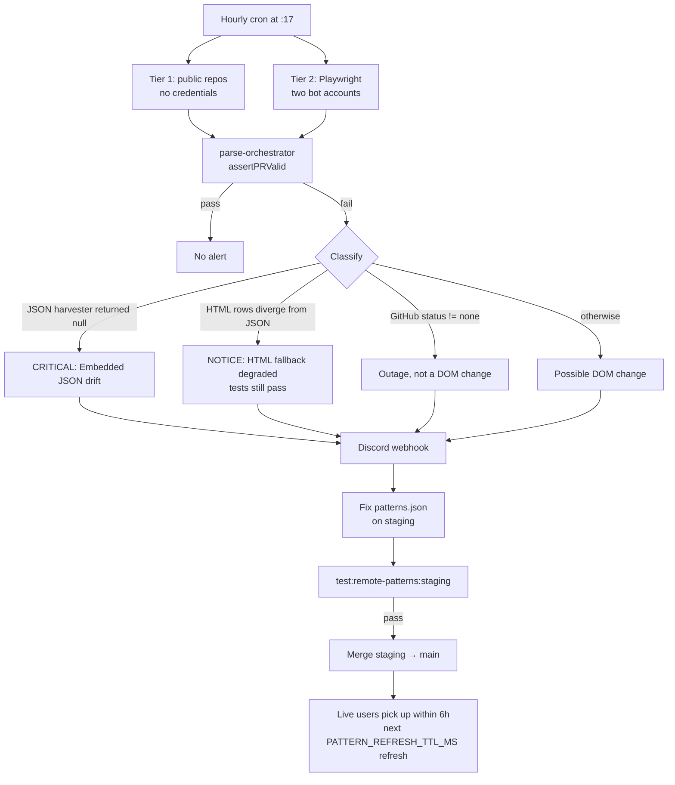

> **Summary.** Pullwatch collects zero telemetry. Without an error pipeline, a DOM change on GitHub would reach users before it reached the maintainer. The canary closes that loop by running the real parser against the real GitHub site every hour in CI. Two tiers (public and authenticated), two chapters inside the authenticated tier (legacy `/pulls?q=...` and new `/pulls/search?q=...`), and a Discord webhook that classifies every failure into one of four buckets: critical JSON drift, degraded HTML fallback, generic DOM change, or GitHub outage. When a canary alert fires, the runbook's path is short: get a fresh HTML sample, fix the regex, push it to the `pr-live-config` staging branch, promote to `main`, and live users recover on the next 6 hour refresh.

---

## Why this page exists

The parser waterfall and the remote config flow both assume the maintainer finds out when GitHub ships a DOM change. Without that assumption, a single selector rename would silently produce empty lists for every user, the maintainer would not learn until a bug report arrived, and by then the window for a hot fix would be over.

The canary exists so that "GitHub changed something" becomes a timed, routed, actionable alert, not a bug report. One hour is the worst case detection budget; the fix path is a commit, a smoke test, a merge.

---

## The detect to patch loop

The diagram is the whole system. Everything else on this page zooms into one of these boxes.

---

## Tier 1: public, no credentials

The first tier is the cheap and always available probe. It targets public repositories (e.g., `facebook/react/pulls`) with a `curl`-like fetch using `BROWSER_HEADERS` from [canary/utils/config.ts](https://github.com/dragosdev-code/pullwatch/blob/main/canary/utils/config.ts), then runs the same shared waterfall the extension uses.

Why public first? Because it catches the biggest class of breakage (legacy selectors changing) with no secrets, no Playwright, and no bot accounts. If this tier fails, the DOM change affects every visitor to GitHub, not just signed in users. It is the simplest possible signal that something upstream moved.

Tier 1 only exercises the legacy parser. The new dashboard at `/pulls/search` tends to return a logged out HTML shell or no embedded JSON to anonymous requests; exercising it meaningfully requires a session, which is what Tier 2 is for.

---

## Tier 2: Playwright with two bot accounts

Two accounts, not one. GitHub rolls the new dashboard out per user, and the same URL serves different experiences depending on whose cookies you bring. To test both experiences in the same CI run, Tier 2 uses two dedicated bot accounts:

| Env var                     | Role                                                                                      |
| --------------------------- | ----------------------------------------------------------------------------------------- |
| `GH_CANARY_USERNAME_LEGACY` | Bot pinned to the classic `/pulls?q=...` experience.                                      |
| `GH_CANARY_USERNAME_NEW`    | Bot that sees the new `/pulls/search?q=...` dashboard.                                    |
| `GH_CANARY_PASSWORD`        | Shared password for both accounts.                                                        |
| `GMAIL_*`                   | OAuth credentials for polling Gmail for device verification OTPs during Playwright login. |

Playwright logs each bot in once per CI job, caches the resulting `storageState` file, and reuses it across runs until the cache is evicted or `force_fresh_login` is ticked on `workflow_dispatch`. The two states (`playwright-state-legacy.json`, `playwright-state-new.json`) live side by side so neither bot's session can clobber the other's.

Inside the Playwright run, Tier 2 has two chapters:

- **Chapter 1** hits `/pulls?q=...` on the legacy bot and runs `GitHubHTMLParser` directly. The same code path the extension takes when its route hint says `legacy`.
- **Chapter 2** hits `/pulls/search?q=...` on the new bot and runs the full shared `parsePullsListHTML` gauntlet from [extension/common/pulls-list-parser.ts](https://github.com/dragosdev-code/pullwatch/blob/main/extension/common/pulls-list-parser.ts), plus a **dual probe**: it extracts PRs via both the embedded JSON harvester and the new experience HTML parser, and asserts the two agree field by field (title, repo, type, author, number, `createdAt`) for matched URLs.

The dual probe is the early warning system. Even when the JSON harvester still works and tests pass, a silent divergence between JSON and HTML output means the `newExperience` pattern block is drifting. Chapter 2 catches that drift through a `CANARY_NEW_HTML_FALLBACK_DEGRADED` log marker before GitHub ever drops the JSON path and forces the extension to depend on HTML alone.

---

## Why real accounts, not mocked HTML

A mocked HTML fixture drifts from reality the moment GitHub ships a DOM change. The canary's whole reason to exist is to detect those drifts, so mocking the input would make the test self confirm and useless.

Real accounts cost two bots and some Playwright infrastructure; that is a small price for a test that fails for the right reason. A failed canary is literally GitHub's current HTML, parsed by the extension's current parser; the signal is unambiguous.

---

## The hourly cadence and the cron stampede

The workflow is scheduled at `17 * * * *`: seventeen minutes past every hour, not on the hour. GitHub's cron scheduler routes thousands of repositories with `0 * * * *` at the same moment, and the queue delay at :00 can stretch to many minutes. Offsetting to :17 sidesteps the stampede.

Hourly is the right cadence because the hot fix path (staging → smoke → main) takes minutes, and the 6 hour `PATTERN_REFRESH_TTL_MS` on the live side means the worst case user impact is roughly 1 hour to detect + a few minutes to patch + up to 6 hours of propagation. Any faster cadence would burn CI for no user benefit; any slower would stretch the detection window past a reasonable workday.

---

## Classifying the failure

A canary failure is not always a DOM change. [.github/workflows/canary-parser-test.yml](../.github/workflows/canary-parser-test.yml) runs a classification ladder after the test job completes:

1. **`CANARY_EMBEDDED_JSON_DRIFT` in the log → CRITICAL.** The JSON harvester returned `null` on a page that looks like the new dashboard. This is the "primary data path for the new experience is broken" alert. Discord gets a red embed with `@here`, and the action item is to edit `GitHubEmbeddedJsonPullHarvest.ts` (JSON traversal), not necessarily a pattern.
2. **GitHub status API says not `none` → OUTAGE.** The status endpoint reports `minor`, `major`, or `critical`. The alert is yellow, not red; the action is "wait for recovery, the canary retries itself on the next hourly tick."
3. **Otherwise → DOM CHANGE.** A generic red alert that routes the maintainer to the runbook.

There is a fourth message that fires even on a **successful** run:

4. **`CANARY_NEW_HTML_FALLBACK_DEGRADED` with tests passing → NOTICE.** The embedded JSON path still extracted PRs, so users are not blocked, but the `NewExperienceGitHubHTMLParser` HTML fallback is diverging from JSON. The alert is yellow, informational, and the action is "fix the `newExperience` patterns now, before GitHub drops the JSON and the degraded fallback becomes the user's experience."

The classification happens **once** per run and produces a single Discord message, not one per failing assertion. The maintainer does not need to triage which of twelve assertions matters first; the workflow has already picked a bucket.

---

## HTML snapshots and traces on failure

When a parser throws, [canary/utils/failure-snapshot.ts](https://github.com/dragosdev-code/pullwatch/blob/main/canary/utils/failure-snapshot.ts) writes HTML to `canary/snapshots/`. Tier 2 navigation or activation failures also write snapshots plus Playwright **trace** zips under `canary/traces/` (screenshots inside the trace). Failed workflow runs upload `canary/snapshots/`, `canary/traces/`, `canary.log`, and the `playwright-state-*.json` files as the `canary-failure-<run_id>` artifact for `npx playwright show-trace`. Paths are gitignored locally.

Why dump HTML rather than parsed output? Because the whole point of the failure is that the parser could not produce parsed output. A maintainer triaging the alert needs to see what GitHub actually served, not what the parser guessed it might have been. Full HTML snapshots and Playwright traces (timeline + screenshots) make renamed classes, missing `data-testid`s, login walls, and multi-account 404 shells obvious.

---

## The fix path

Once the Discord alert lands, the rest is the [DOM_CHANGE_RUNBOOK.md](https://github.com/dragosdev-code/pullwatch/blob/main/canary/DOM_CHANGE_RUNBOOK.md) in brief:

1. **Get a fresh HTML sample.** The runbook has a `curl` invocation with the exact `BROWSER_HEADERS` the canary uses; GitHub blocks non browser user agents, so these headers matter.
2. **Find the broken pattern.** The assertion message tells you which pattern key failed. A CI log message like `Auth (search): PR title` points at `patterns.newExperience.titleLink`; `CANARY_EMBEDDED_JSON_DRIFT` points at the JSON harvester instead of a pattern.
3. **Edit `patterns.json` on the staging branch of `pr-live-config`.** Bump `version` by one (the version gate is strict greater than) and set `updatedAt`.
4. **Run `npm run test:remote-patterns:staging`.** This fetches the hosted staging file, runs the same Valibot schema + `safeCompile` the extension runs at runtime, and (in Act 4) asserts parity with the bundled `DEFAULT_PATTERNS`. If it passes, staging is safe to promote.
5. **Merge staging to `main`.** The raw `main` URL is served immediately; no deploy step.
6. **Also edit `extension/common/default-patterns.ts`** and run the canary locally (`npm run canary:test`) to confirm the fix works against live GitHub. The extension ships both: the remote config is the hot fix for current users, and the bundled defaults are the floor for fresh installs.

The loop closes on its own. Within 6 hours, every live install refreshes its pattern registry from the new `patterns.json` (see [Remote Configuration](./remote-configuration/)), the next fetch parses successfully, `HealthStatusService` clears the breakage flag, and the "parser breakage" banner disappears from the popup.

---

## Edge cases and gotchas

### Only one tier fails

Tier 1 failing alone usually means a legacy page change (the public `/pulls` route). Tier 2 Chapter 2 failing alone usually means a new dashboard change; the legacy experience is unaffected. Each tier's failure label in the log says which, and the fix is scoped accordingly: Tier 1 points at legacy pattern keys, Chapter 2 at `patterns.newExperience` and the JSON harvester.

### The canary passes but `CANARY_NEW_HTML_FALLBACK_DEGRADED` fires

This is the quiet warning. Users are not blocked because the embedded JSON path still works, but the new experience HTML fallback has drifted. The maintainer has time: fix `patterns.newExperience` on `staging`, promote, and the JSON path remains the primary while the HTML fallback gets back in line. If the JSON drops first and the HTML fallback is still degraded, that becomes the user visible break the canary was trying to prevent.

### GitHub's status page says degraded

The classification step checks `githubstatus.com/api/v2/status.json` after any failure. An indicator of `minor`, `major`, or `critical` gets a yellow outage alert instead of a red DOM change alert, and the canary retries itself on the next hourly tick (plus the in test `retry: 1`). Waiting out the outage is the right move; no pattern work is involved.

### A device verification prompt hits the Playwright login

GitHub sometimes demands an OTP code sent to the bot's email. The canary's Gmail integration uses OAuth (`GMAIL_CLIENT_ID`, `GMAIL_CLIENT_SECRET`, `GMAIL_REFRESH_TOKEN`) to poll the inbox via [canary/utils/gmail-fetcher.ts](https://github.com/dragosdev-code/pullwatch/blob/main/canary/utils/gmail-fetcher.ts), extract the code, and submit it. If the verification flow itself changes (new markup, new field), the login step fails and the canary reports a login error rather than a DOM change; the runbook's "force fresh login" workflow dispatch checkbox is a useful reproduction aid.

### A cached Playwright session hits "Page not found" on global `/pulls`

[getPageHTML in canary/utils/github-session.ts](https://github.com/dragosdev-code/pullwatch/blob/main/canary/utils/github-session.ts) is **self-healing** for the usual multi-account routing flake: it classifies the HTML shell, and if GitHub served a global-pulls 404 while the context is still logged in, it runs **`activateAccountForRouting`** (select the real `/switch_account` row, then probe `/pulls`) with short backoff, then **rewrites `storageState`** when recovery succeeds so the **next** CI run inherits good cookies—no manual deletion of `playwright-state-*.json` required for that case. Fresh logins already activate before the first save. Bounded attempts avoid spinning forever; a genuinely bad session surfaces as login or `Account activation failed` (see [DOM_CHANGE_RUNBOOK.md § 404 after fresh login](https://github.com/dragosdev-code/pullwatch/blob/main/canary/DOM_CHANGE_RUNBOOK.md#404-after-fresh-login-multi-account-routing)).

### Same upstream, opposite default

Both the canary and the extension consult `https://www.githubstatus.com/api/v2/`, but they fail in opposite directions. [canary/utils/github-status.ts](https://github.com/dragosdev-code/pullwatch/blob/main/canary/utils/github-status.ts) is a boolean `isGitHubDegraded()` that fails CLOSED to `false`, so a flaky status endpoint cannot mask a real DOM-change alert. The extension's [GitHubStatusClient](https://github.com/dragosdev-code/pullwatch/blob/main/extension/common/github-status-client.ts) returns a full snapshot and fails OPEN to `'unknown'`, so a flaky status endpoint cannot silently *suppress* legitimate notifications by masking a healthy PR fetch as degraded. Same upstream, opposite default for the opposite reason. The full popup-side contract is on [Outage Banner and Statuspage](./github-health/outage-banner/); the role of `summary.json` in the integrity layer is on [List Trust and Suspect Lists](./github-health/list-trust/).

### The hosted `patterns.json` is unreachable during the fix

The production smoke test (`test:remote-patterns`) would fail even though the local edit is correct; that is a GitHub Pages/raw availability issue, not a config issue. The canary is unaffected because it uses bundled `DEFAULT_COMPILED_PATTERNS`, not the remote file. Live users are also unaffected in the short term: their cached registry keeps working, and the next 6 hour refresh retries the fetch.

---

## See also

- [The Parser Waterfall](./parser-waterfall/): the production code the canary exercises end to end. Every canary assertion maps to a stage of the waterfall.
- [Remote Configuration](./remote-configuration/): the delivery system the fix path flows through. A canary alert becomes a commit to `pr-live-config` and reaches users on the next 6 hour refresh.
- [GitHub Health and Outages](./github-health/): the extension-side counterpart to the canary's status check, plus the full reason taxonomy that the popup banner branches on.
- [DOM_CHANGE_RUNBOOK.md](https://github.com/dragosdev-code/pullwatch/blob/main/canary/DOM_CHANGE_RUNBOOK.md): the full runbook the on call reads when an alert fires; this wiki page is its narrative companion.
