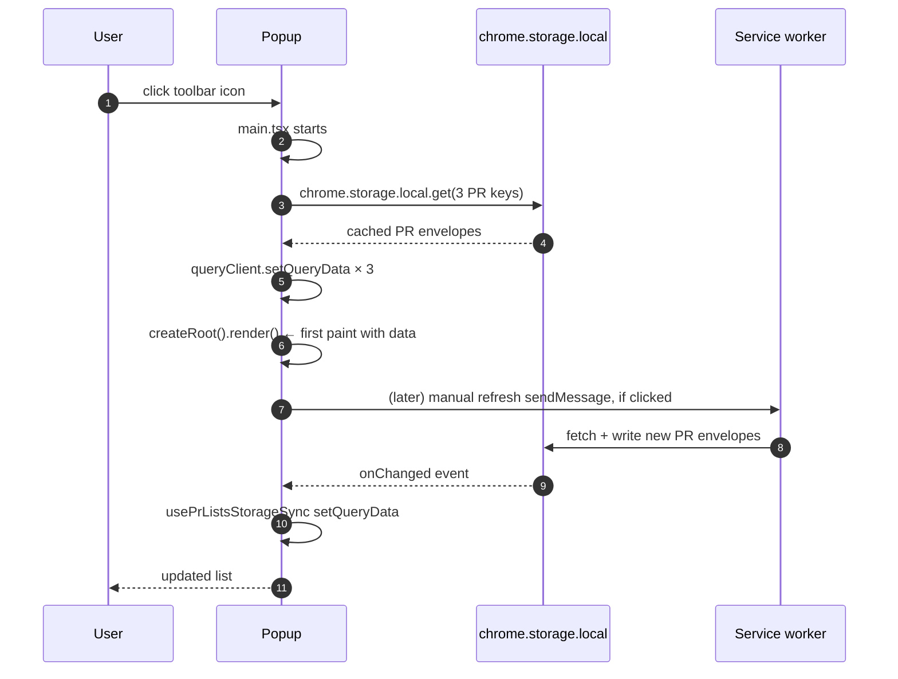

The reason the popup paints with real data the instant you open it is that `chrome.storage` is the contract between it and the service worker, not a network call. The background is the sole writer; the popup reads. TanStack Query is seeded from storage **before the first React paint**, a storage listener keeps it in sync while the popup is open, and Zustand holds only the UI state that would be awkward to round trip through storage. This page lays out why storage is the spine, what lives in each area, and the exact contract that keeps the panel feeling instant.

---

## Why storage, not messages

A lot of Chrome extensions use `chrome.runtime.sendMessage` to ferry data between the popup and the background. That works, but it has two sharp edges in Manifest V3. Runtime messages require the worker to be awake at the moment you ask, and a message reply is a single point in time that has no built in "and also notify me when this changes later" semantics.

Storage does not have either of those problems. `chrome.storage.local` is always readable, survives every worker wake, and fires `onChanged` to anyone who listens. So Pullwatch treats storage as the canonical channel for PR data, and treats runtime messages as **commands** ("go fetch now") rather than **queries** ("give me the data").

The payoff is real: a cold popup open paints full PR lists on frame one. No spinner, no waiting for the worker to wake. The same rendering path handles alarm driven, install driven, and manual refresh updates.

---

## The three storage areas

Chrome exposes three separate storage areas. Pullwatch uses all three, each for one specific purpose.

| Area                     | Scope                                                            | Synced across devices?            | What Pullwatch keeps there                                                                                   |
| ------------------------ | ---------------------------------------------------------------- | --------------------------------- | ------------------------------------------------------------------------------------------------------------ |
| `chrome.storage.local`   | This device, persisted across browser restarts.                  | No.                               | Everything operational: PR lists, parsing state, install gates, rate limit state, route hint, custom sounds. |
| `chrome.storage.sync`    | This device, plus any other Chrome profile the user signs in to. | Yes, when Chrome sync is enabled. | User preferences only: theme, notification toggles, sound choices.                                           |
| `chrome.storage.session` | This device, cleared when the browser quits.                     | No.                               | Short lived ephemera (manual refresh throttle timestamp).                                                    |

The boundary between `local` and `sync` is deliberate. PR data does not belong in `sync`, because Chrome sync has per item size limits and would punish big lists, and because a user's PR inbox is not something they usually want fanning out to a shared browser profile. Settings do belong in `sync`, because carrying your theme and notification preferences with you is the whole point.

---

## What lives where, exactly

The full inventory. All keys are defined in [extension/common/constants.ts](https://github.com/dragosdev-code/pullwatch/blob/main/extension/common/constants.ts).

### `chrome.storage.local`

| Key                              | What it is                                                              | Owner                    | Notes                                                                       |
| -------------------------------- | ----------------------------------------------------------------------- | ------------------------ | --------------------------------------------------------------------------- |
| `github_assigned_prs`            | Assigned (to review) PR list, wrapped in a `StoredPRs` envelope.        | `PRService` (write)      | Hydrated into TanStack Query on popup open.                                 |
| `github_merged_prs`              | Recently merged PR list.                                                | `PRService` (write)      | Same.                                                                       |
| `github_authored_prs`            | PRs authored by the viewer.                                             | `PRService` (write)      | Same.                                                                       |
| `last_fetch_time`                | Timestamp of the last successful fetch.                                 | `PRService`              | Displayed as "updated X ago" in the popup.                                  |
| `pr_fetch_in_progress`           | Flag that a fetch wave is running.                                      | `EventService`           | Drives the popup's subtle "refreshing" indicator.                           |
| `parser_pattern_registry`        | Compiled pattern envelope (`patterns`, `version`, `timestamp`).         | `PatternRegistryService` | See [Remote Configuration](/architecture/remote-configuration/).                           |
| `parser_breakage`                | Last observed parser failure, for the popup banner.                     | `PRService`              | Cleared on the next successful fetch.                                       |
| `github_outage`                  | Active outage payload (`detected`, `timestamp`, `lastSeenAt`, `context`, `reason`). Refreshed on repeat outage signals so the popup can age out stale flags after 2 hours. | `HealthStatusService`    | Keeps cached lists visible with an "outage" banner rather than wiping them. The reason discriminator (`transport` / `pr_component_degraded` / `pr_list_churn`) drives the banner copy. See [GitHub Health and Outages](/architecture/github-health/). |
| `github_status_cache`            | Cached Statuspage `summary.json` snapshot (`prComponentStatus`, `globalIndicator`, `fetchedAt`). Two-minute TTL. | `GitHubStatusClient`     | Mirrored by `useGitHubStatusSnapshot` to gate the banner's Statuspage link. See [Outage Banner and Statuspage](/architecture/github-health/outage-banner/). |
| `last_untrusted_fetch_at`        | Timestamp of the most recent fetch the trust gate refused to apply.    | `PRService`              | Only `pr_component_degraded` writes this; drives the banner's "Last check (kept your cached list)" subline. Cleared together with `github_outage`. |
| `pr_list_trust_state`            | Per-list limbo entries, last-trusted/last-suspicious metadata, empty-confirmation streak, recovery baseline marker. | List-trust domain (`PrListTrustStore`) | See [List Trust and Suspect Lists](/architecture/github-health/list-trust/). |
| `pr_tombstones_v1`               | Bounded per-list log of dropped PR keys with `droppedAtAlarmSeq`.       | `PrTombstoneStore`       | LRU-capped at 200 entries per list. Used to detect resurrection inside the four-alarm window and to signal `pr_list_churn`. |
| `alarm_seq`                      | Monotonic per-wave counter advanced once per alarm by `EventService`.   | `AlarmSeqClock`          | Anchors the tombstone window to alarm waves rather than wall-clock milliseconds. |
| `pulls_list_route_hint`          | Which URL shape (`search` or `legacy`) last worked, with a 24 hour TTL. | `GitHubService`          | See [The Parser Waterfall](/architecture/parser-waterfall/).                           |
| `github_viewer_identity`         | Last known signed in GitHub login.                                      | `PRService`              | Used for account swap detection; a mismatch clears cached lists.            |
| `has_seen_onboarding`            | First run gate.                                                         | Onboarding hook          | See [Onboarding and Session Gates](/architecture/onboarding-and-session-gates/).           |
| `onboarding_reauth_gate_pending` | "We thought the session was gone, waiting for user to re auth."         | Onboarding hook          | Same.                                                                       |
| `install_session_check_complete` | Whether the 12 second install time session probe has finished.          | Onboarding hook          | Same.                                                                       |
| `rate_limit_state`               | `RateLimitService` state (consecutive hits, retry timestamp).           | `RateLimitService`       | Persisted so backoff survives a worker wake.                                |
| `alarm_override_state`           | Dev only alarm cadence override.                                        | `AlarmService`           | Persisted so overrides survive a worker wake.                               |
| `custom_sounds_meta`             | Metadata for user provided notification sounds.                         | Custom sound editor      | Audio bytes live inline in the same storage area.                           |
| `dev_test_settings`              | Dev flags (trigger a notification, simulate rate limit, etc.).          | `DevTestService`         | Dev only.                                                                   |

### `chrome.storage.sync`

| Key        | What it is                                                                                                     | Owner                                                               |
| ---------- | -------------------------------------------------------------------------------------------------------------- | ------------------------------------------------------------------- |
| `settings` | Everything the user can tune in the settings overlay: theme, notification toggles per category, sound choices. | [use-extension-settings.ts](https://github.com/dragosdev-code/pullwatch/blob/main/src/hooks/use-extension-settings.ts) |

There is only one sync key on purpose. A single settings object writes atomically, which keeps the "if sync is on, both of my Chromes should agree" story simple.

### `chrome.storage.session`

| Key                      | What it is                                         | Owner          |
| ------------------------ | -------------------------------------------------- | -------------- |
| `last_manual_refresh_at` | Timestamp of the last manual refresh button click. | `EventService` |

Session storage is cleared when Chrome quits, which is exactly the right scope for a refresh throttle: a rate limiter that resets when the browser restarts is fine, but a user preference that resets when Chrome restarts would be annoying.

---

## The hydration contract

### Step 1: hydrate before render

`src/main.tsx` is deliberately shaped as an async IIFE:

```tsx
void (async () => {
  await hydratePrQueriesFromStorage(queryClient);

  createRoot(document.getElementById('root')!).render(
    <StrictMode>
      <QueryClientProvider client={queryClient}>
        <App />
      </QueryClientProvider>
    </StrictMode>
  );
})();
```

The key line is `await hydratePrQueriesFromStorage(queryClient)` **before** `createRoot(...).render(...)`. That one `await` is why the popup paints with real data on frame one instead of flashing an empty list.

Inside [src/hydrate-pr-queries-from-storage.ts](https://github.com/dragosdev-code/pullwatch/blob/main/src/hydrate-pr-queries-from-storage.ts):

```ts
const result = await runWithTransientStorageRetry(() =>
  chrome.storage.local.get([...keys] as string[])
);

const assigned = (result[STORAGE_KEY_ASSIGNED_PRS] as StoredPRs | undefined)?.prs ?? [];
const merged = (result[STORAGE_KEY_MERGED_PRS] as StoredPRs | undefined)?.prs ?? [];
const authored = (result[STORAGE_KEY_AUTHORED_PRS] as StoredPRs | undefined)?.prs ?? [];

queryClient.setQueryData(queryKeys.assignedPrs, assigned);
queryClient.setQueryData(queryKeys.mergedPrs, merged);
queryClient.setQueryData(queryKeys.authoredPrs, authored);
```

Two things to notice. Missing or corrupted values degrade to `[]`, never `undefined`; the popup can trust that `useQuery` will return an array without defensive checks. And the `runWithTransientStorageRetry` wrapper matches the retry policy that `StorageService` uses in the background, because on a post wake cold path `chrome.storage.local.get` can occasionally throw a transient error that goes away on the next tick.

### Step 2: stay in sync while open

Once the popup is rendered, [src/hooks/use-pr-lists-storage-sync.ts](https://github.com/dragosdev-code/pullwatch/blob/main/src/hooks/use-pr-lists-storage-sync.ts) takes over. It listens to `chrome.storage.onChanged`, filters to the `local` area and only to the three PR list keys, and pushes new values directly into TanStack Query via `setQueryData`:

```ts
const PR_LIST_STORAGE_SYNC_ROWS = [
  { storageKey: STORAGE_KEY_ASSIGNED_PRS, queryKey: queryKeys.assignedPrs },
  { storageKey: STORAGE_KEY_MERGED_PRS, queryKey: queryKeys.mergedPrs },
  { storageKey: STORAGE_KEY_AUTHORED_PRS, queryKey: queryKeys.authoredPrs },
] as const;

const onStorageChanged = (changes, areaName) => {
  if (areaName !== 'local') return;
  for (const row of PR_LIST_STORAGE_SYNC_ROWS) {
    if (!(row.storageKey in changes)) continue;
    const prs = (changes[row.storageKey].newValue as StoredPRs | undefined)?.prs ?? [];
    queryClient.setQueryData(row.queryKey, prs);
  }
};
```

This is how an alarm that fires while you are looking at the popup updates the list in place. No refetch, no invalidation, no runtime message. The background writes storage, Chrome fires `onChanged`, the hook writes the query cache, React re renders.

### Step 3: the cold open, visualised



Notice how the "first paint with data" step happens before any communication with the service worker. That is the whole point of the hydration contract.

---

## Identity and account switching

`github_viewer_identity` stores the GitHub login Pullwatch last resolved from the signed-in session. It exists so a change of account is handled cleanly instead of producing nonsense.

On each fetch wave, `PRService` compares the login it just resolved against that stored baseline. When they differ, it treats the wave as an account swap: it clears the route hint (the new account may be on a different `/pulls` route), and it rebaselines the lists for the new viewer rather than diffing the fresh PRs against the previous account's cached list. Diffing across accounts would mark every PR belonging to the new account as "new" and fire a wall of notifications, so the swap path deliberately skips that comparison.

Two ordering rules keep the swap honest. The identity is only written once every list in the wave has finished (`persistResolvedViewerIdentity` runs at `depth === 0`, see [Popup and Background Communication](/architecture/popup-and-background-communication/#the-fetch-in-progress-indicator)), so a half-finished wave cannot record the new login while old lists are still in storage. And if the viewer advanced after only some lists wrote, any list that did not write for the final resolved login is cleared, so storage never pairs `github_viewer_identity` with another account's PR arrays. The popup-facing summary of this behaviour is on [Inside the Popup](/architecture/inside-the-popup/#switching-github-accounts).

The "resolved login" for a wave is held to the last non-empty value the parser produced, not whatever the final request happened to return. This matters because some lists fetch several pages (the Authored list pulls one page per review state) and the last page can carry no login at all when it is empty. Holding the last known login keeps every list in the wave attributed to the same account, so a list that genuinely refreshed for the new viewer is not mistaken for a stale write and cleared.

---

## The popup's in memory stores

The popup has two layers of client state and they do different jobs.

### TanStack Query: server state

PR lists, "last fetched at" timestamps, parsing status, viewer identity. Anything that originates on GitHub or in storage lives here. The hydration step seeds it; the storage listener keeps it fresh. No query function (`queryFn`) actually fetches from GitHub directly from the popup; the popup's job is to mirror storage, not to be its own network client.

### Zustand: UI state

Three small stores, each in [src/stores/](https://github.com/dragosdev-code/pullwatch/blob/main/src/stores/), each with one job.

| Store          | File                                                                    | What it holds                                                                                       | Why Zustand and not TanStack Query       |
| -------------- | ----------------------------------------------------------------------- | --------------------------------------------------------------------------------------------------- | ---------------------------------------- |
| `debug`        | [src/stores/debug/store.ts](https://github.com/dragosdev-code/pullwatch/blob/main/src/stores/debug/store.ts)               | Debug mode toggle, diagnostics snapshot, chord slot state. Persisted via Zustand's own persistence. | Local to the popup session, not fetched. |
| `global-error` | [src/stores/global-error/store.ts](https://github.com/dragosdev-code/pullwatch/blob/main/src/stores/global-error/store.ts) | Surface level error flag that any component can read and set.                                       | Not a server resource.                   |
| `tab-control`  | [src/stores/tab-control/store.ts](https://github.com/dragosdev-code/pullwatch/blob/main/src/stores/tab-control/store.ts)   | Active tab (To review / Authored / Merged), and which direction it slid from.                       | Pure UI.                                 |

The rule of thumb: if the state originated outside the popup, it goes in TanStack Query. If the state is about the popup itself, it goes in Zustand.

There is one deliberate exception. The custom sound editor uses **vanilla Zustand** (not `create`, but `createStore` with explicit subscriptions) for its `audio-draft-store` and `async-feedback-store` in [src/components/custom-sound-editor/store/](https://github.com/dragosdev-code/pullwatch/blob/main/src/components/custom-sound-editor/store/). Vanilla gives it ergonomics for the non React parts of the editor (audio decoding pipelines) that hook based `create` does not.

---

## StorageService: the background side

Writes go through [StorageService](https://github.com/dragosdev-code/pullwatch/blob/main/extension/background/services/StorageService.ts), a thin type safe wrapper with two guarantees.

First, **retry on transient failures.** Right after a worker wake, `chrome.storage.local` can throw with "Error in invocation of storage.local.get: Cannot read properties of undefined" until Chrome finishes setting the worker up. `runWithTransientStorageRetry` (also used by the popup's hydration path) handles that with a bounded retry.

Second, **area routing.** The wrapper knows which keys live in `local`, `sync`, or `session`, so callers never have to remember. A service asking for a key it does not own gets a typed error at compile time.

---

## Edge cases and gotchas

### Hydration must run before `createRoot`, not in a `useEffect`

If hydration lived in a `useEffect` inside `App`, the first render would still see empty arrays, the empty state would flash, and then the effect would run and replace it. The async IIFE in `main.tsx` is the only place where you can get the data into the query client before any component mounts.

### Empty storage on first install returns empty arrays, not `undefined`

The hydration helper coalesces missing or malformed values to `[]`. Callers can trust `useQuery` on a fresh install, and the same tolerance applies to the live `storage.onChanged` listener, so a corrupted write cannot throw inside the listener and leave the popup in a stuck state.

### Settings live in `sync`, but PR data does not

This is the one seam between "this device" and "this user." Settings sync because the user wants them portable. PR data stays local because it is too large, changes too often, and belongs to the browser session, not the user. If you ever find yourself tempted to move a PR related key into `sync`, re read this paragraph.

### Only the three PR keys are bridged into TanStack Query

The `onChanged` hook deliberately ignores every key except the three PR lists. Writes to `rate_limit_state`, `parser_pattern_registry`, `custom_sounds_meta`, etc. fire `onChanged` events too, but they would be noise for TanStack Query. Components that care about those keys read them via their own dedicated hooks.

### The popup document is recreated on every open

Every popup open creates a fresh React root. That is why the `onChanged` listener is registered in a `useEffect`: the listener registers on mount and unregisters on unmount, matching the popup's lifecycle exactly. Forgetting to unregister would be a leak on every reopen.

---

## See also

- [The Service Worker Lifecycle](/architecture/service-worker-lifecycle/): the writer side of this contract, including why `performInitialSetup` never writes PR data and why the rate limit state has to be persisted to survive a wake.
- [Popup and Background Communication](/architecture/popup-and-background-communication/): the small surface of runtime messages Pullwatch does use, and when a message is the right tool (commands) rather than storage (data).
- [Remote Configuration](/architecture/remote-configuration/): the pattern registry storage envelope, why it is validated as a wrapper rather than just by content, and how version `0` in storage is the "defaults were persisted" sentinel.
