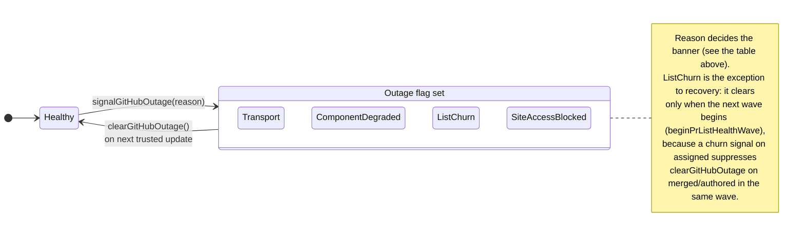

> **Why this matters.** A fetch from `github.com` can fail in ways that look identical on the surface but need very different responses. This hub maps each kind of failure to what the popup shows, what gets written to storage, and how Pullwatch recovers. The two children, [List Trust and Suspect Lists](/architecture/github-health/list-trust/) and [Outage Banner and Statuspage](/architecture/github-health/outage-banner/), unpack the integrity layer and the popup banner respectively.

Pullwatch reads HTML from `github.com` once every three minutes. Most of the time that is uneventful. Occasionally it is not, and the failure can wear several different costumes: a real GitHub outage, a Cloudflare edge timeout, a 200 OK page with a logged-out shell, a 200 OK page with parseable HTML and an incomplete list, a one-tick flake that resolves on its own, a row that briefly disappears and comes back. Each of those needs a different response, and it is `HealthStatusService`, the list-trust domain, and the popup banner that decide.

---

## The two flags `HealthStatusService` actually owns

[HealthStatusService.ts](https://github.com/dragosdev-code/pullwatch/blob/main/extension/background/services/HealthStatusService.ts) owns two flags, persists them to `chrome.storage.local`, and broadcasts every transition. It is not a "last fetch summary"; it is the orchestrator that the popup banner and the toolbar badge ultimately read.

| Flag                            | Storage key                | Set by                                                                            | Cleared by                                                                                                                       |
| ------------------------------- | -------------------------- | --------------------------------------------------------------------------------- | -------------------------------------------------------------------------------------------------------------------------------- |
| Parser breakage                 | `parser_breakage`          | `signalParserBreakage(context)` from [PrFetchErrorHandler](https://github.com/dragosdev-code/pullwatch/blob/main/extension/background/domain/PrFetchErrorHandler.ts) when a `ParserBreakageError` bubbles up | `clearParserBreakage()` on the next trusted list update.                                                                         |
| GitHub outage (reason-tagged)   | `github_outage`            | `signalGitHubOutage(context, reason)` from `PrFetchErrorHandler` and from `PRService` integrity branches | `clearGitHubOutage()` on the next trusted list update, subject to the wave-suppression rule below.                              |

Both flags follow the same lifecycle:

1. On the first error, persist a payload and broadcast a `*Detected` runtime message.
2. On subsequent errors of the same kind, refresh `lastSeenAt` so the popup can age out stale stored flags. The `context` and `reason` of the first detection stay stable until the flag clears (single in-memory dedupe), so one outage shows one banner with one message.
3. On recovery, remove the storage key and broadcast a `*Cleared` message. `clearGitHubOutage` also removes `STORAGE_KEY_LAST_UNTRUSTED_FETCH_AT`, so the popup's "last check" subline does not outlive the banner.

The in-memory mirror in `HealthStatusService` (`parserBroken`, `githubOutage`) is rehydrated from storage in `initialize()` on every wake; without that step, a real fault after a wake would skip the storage write because the mirror still said "already signalled". See [The Service Worker Lifecycle](/architecture/service-worker-lifecycle/) for why the rehydrate step is mandatory.

---

## Four `GitHubOutageReason` values, four different stories

The reason is part of the persisted payload and the broadcast `data`. The popup's [outage banner](/architecture/github-health/outage-banner/) branches its copy and its Statuspage-link visibility on this field. The union is declared once in [extension/common/types.ts](https://github.com/dragosdev-code/pullwatch/blob/main/extension/common/types.ts):

```ts
export type GitHubOutageReason =
  | 'transport'
  | 'pr_component_degraded'
  | 'pr_list_churn'
  | 'site_access_blocked';
```

| Reason                   | Source of the signal                                                                                              | Statuspage involved? | What the banner says (in plain English)                                                                                 |
| ------------------------ | ----------------------------------------------------------------------------------------------------------------- | -------------------- | ----------------------------------------------------------------------------------------------------------------------- |
| `transport`              | A thrown `GitHubOutageError` caught in [PrFetchErrorHandler](https://github.com/dragosdev-code/pullwatch/blob/main/extension/background/domain/PrFetchErrorHandler.ts) | No                   | "GitHub didn't respond. Showing your last known list."                                                                  |
| `pr_component_degraded`  | A local list anomaly: any `partial_drop_*` assessment branch, or an empty list corroborated by Statuspage         | Conditional          | "Pullwatch noticed an unusual change in your list."                                                                     |
| `pr_list_churn`          | `PrTombstoneStore` resurrection inside the 4-alarm window (a key briefly disappeared and came back)                | No                   | "A pull request briefly disappeared and came back."                                                                     |
| `site_access_blocked`    | `PrFetchErrorHandler` (or `SiteAccessWatcher` on `chrome.permissions.onRemoved`) when Chrome has revoked the extension's access to `github.com` | No                   | "Chrome is blocking Pullwatch from reaching GitHub." The banner points the user at `chrome://extensions` rather than Statuspage. |

There is one invariant worth memorising. From [IHealthStatusService.ts](https://github.com/dragosdev-code/pullwatch/blob/main/extension/background/interfaces/IHealthStatusService.ts):

> `pr_component_degraded` MUST NOT be signalled for a single-list `empty_after_non_empty` whose Statuspage is operational, `degraded_performance`, or `'unknown'` without a global incident. The legitimate-zero path stays silent. Confirmation is handled by `EmptyConfirmationTracker` and persists `[]` only after N consecutive empties under stable viewer identity.

In other words, "your assigned list went to zero" is not by itself an outage. It is most often the legitimate "I cleared my queue" steady state. The integrity layer waits for confirmation before believing it. The full state machine lives on [List Trust and Suspect Lists](/architecture/github-health/list-trust/).

---

## Transport classification

[GitHubService.fetchGitHubData](https://github.com/dragosdev-code/pullwatch/blob/main/extension/background/services/GitHubService.ts) is the only place the extension hits `github.com`, and it is also the place that classifies what came back. Three buckets matter for outages.

| HTTP shape                                         | Classification                                                                                  |
| -------------------------------------------------- | ----------------------------------------------------------------------------------------------- |
| `500, 502, 503, 504, 520-530`                      | Transient. One retry after `TRANSIENT_RETRY_DELAY_MS = 3s`, then `GitHubOutageError`.            |
| `AbortError` (timeout) or `TypeError` (DNS / reset) | Network-level failure. One retry, then `GitHubOutageError`.                                      |
| Any other non-OK status                             | Throws a generic error; not retried, not classified as outage.                                   |

Two limits keep the retry from compounding. Each attempt has its own `GITHUB_FETCH_TIMEOUT_MS` socket timeout, and the loop as a whole is capped at `GITHUB_FETCH_OVERALL_DEADLINE_MS = 18s`. If the deadline runs out mid-retry, the loop throws `GitHubOutageError` immediately rather than waiting another three seconds for a delay it cannot afford.

`GitHubOutageError` is also what `PrFetchErrorHandler.handle` sees, and the handler signals `signalGitHubOutage(error.message)` with the default reason `'transport'`. The cached PR list stays in storage; the popup paints the transport banner over the top of it.

Note the deliberate asymmetry: the parser waterfall throws `ParserBreakageError` for "the page does not parse," and `GitHubOutageError` for "the page never arrived." They land in different `instanceof` arms, light different banners, and have different recovery paths. See [The Parser Waterfall](/architecture/parser-waterfall/) for the parser side of the same fork.

---

## Statuspage in one sentence

Statuspage is a multiplier, not a lifecycle authority. The cached snapshot from `summary.json` strengthens or weakens local suspicion, but a green status page never clears the outage flag on its own and a red status page never raises one on its own. Recovery follows successful list updates from `github.com`.

The full client contract (cache TTL, fail-open behaviour, `bypassCache` semantics, the rare component-rename fallback) lives on [Outage Banner and Statuspage](/architecture/github-health/outage-banner/).

---

## Recovery and clear semantics

A list fetch that lands a trusted persist clears both flags. `clearParserBreakage` runs unconditionally; `clearGitHubOutage` runs through `maybeClearGitHubOutageAfterListSuccess`, which respects one wave-scoped suppression rule.



There are only two transitions that matter at this altitude: `Healthy` arms exactly one outage flag through `signalGitHubOutage(reason)`, and the next trusted list update clears it through `clearGitHubOutage()`. The four boxes inside **Outage flag set** are the four reasons the flag can carry; which trigger produces which reason is the table above. `ListChurn` is the one reason that does not clear on the very next trusted update, for the suppression reason in the note.

The wave suppression is small but load-bearing. `PRService.suppressGitHubOutageClearForListChurnWave` flips on when [applyTombstoneFilter](https://github.com/dragosdev-code/pullwatch/blob/main/extension/background/services/PRService.ts) records a resurrection during the assigned fetch; merged and authored fetches in the same wave still call `maybeClearGitHubOutageAfterListSuccess`, but the suppression turns those calls into no-ops. `EventService.handleAlarm` (and the install/startup paths) call `prService.beginPrListHealthWave()` before each wave, which clears the flag and lets the next round assess from scratch.

A stuck "transport" flag has its own escape hatch on the popup side: payloads whose `lastSeenAt` is older than `GITHUB_OUTAGE_STALE_AFTER_MS = 2h` are rejected by `useGitHubOutage`, so a popup mounted hours after recovery does not surface a phantom banner even if the `*Cleared` broadcast was lost. The same value is also why `signalGitHubOutage` refreshes `lastSeenAt` on every repeat hit: as long as the outage is genuinely ongoing, the popup can tell.

---

## See also

- [List Trust and Suspect Lists](/architecture/github-health/list-trust/): the integrity layer that decides whether a fresh fetch is allowed to replace the stored baseline, and the source of every `pr_component_degraded` and `pr_list_churn` signal.
- [Outage Banner and Statuspage](/architecture/github-health/outage-banner/): the popup-side contract. Reason-keyed copy, when the Statuspage link shows, the "Last check (kept your cached list)" subline.
- [The Parser Waterfall](/architecture/parser-waterfall/): the other side of the "is this an outage or a DOM change?" fork.
- [The Service Worker Lifecycle](/architecture/service-worker-lifecycle/): why `HealthStatusService` rehydrates its in-memory mirror on every wake.
