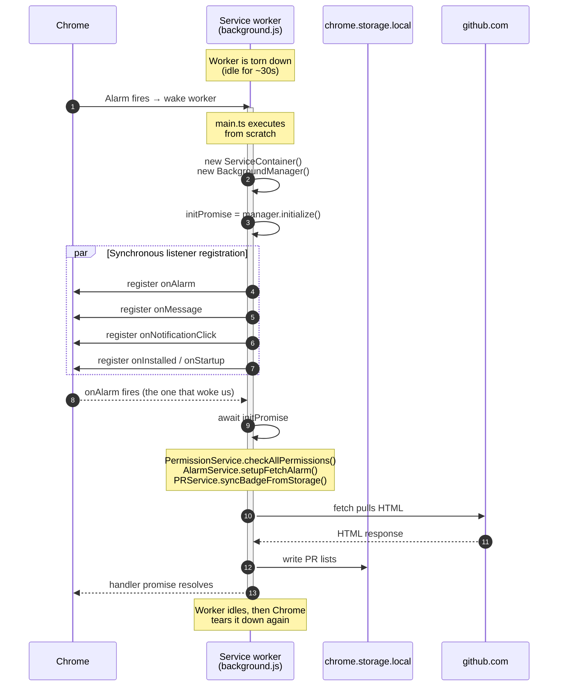

> **Summary.** Manifest V3 service workers are not long running processes. Chrome tears them down after about 30 seconds of idle time and brings them back on demand. Pullwatch survives this by registering listeners synchronously, gating every handler behind a shared init promise, and keeping every piece of state that must outlive a wake inside `chrome.storage`. This page explains the constraint, the code pattern that handles it, and the three services (`AlarmService`, `PRService`, `RateLimitService`) whose design is dictated by it.

---

## Why this page exists

If you have not shipped an MV3 extension before, the most surprising thing about the platform is that your background code is not always running. It used to be. The older "persistent background page" in MV2 kept a full document alive for the lifetime of the browser. MV3 replaced that with a service worker, and service workers are **ephemeral** by design.

That single change reshapes how you write code. Global variables do not persist. In memory caches are meaningless across wakes. Listeners that you add inside a `setTimeout` or after an `await` are invisible to Chrome. Everything that happens in the Pullwatch background exists to work around, or to take advantage of, these constraints.

---

## The MV3 constraint in one picture



Two details are easy to miss. First, `main.ts` literally runs top to bottom on every wake; there is no "already initialised" flag that Chrome remembers between wakes. Second, the listener registration has to happen **before the first `await`**. Chrome only keeps the listeners it saw synchronously when the worker started up.

---

## The initialization gate

The pattern that holds this all together lives in [extension/background/main.ts](https://github.com/dragosdev-code/pullwatch/blob/main/extension/background/main.ts). The file comments already explain the intent; here is the shape, annotated.

```ts
const serviceContainer = new ServiceContainer();
const backgroundManager = new BackgroundManager(serviceContainer);

// 1. Start init eagerly. Store the promise.
const initPromise: Promise<void> = backgroundManager.initialize().catch((error) => {
  console.error('[Main] Failed to initialize background script:', error);
});

// 2. Register every listener SYNCHRONOUSLY. No awaits before this.
chrome.runtime.onInstalled.addListener(async (details) => {
  await initPromise; // 3. Wait for init INSIDE the handler.
  await getEventService().handleInstallation(details);
});

chrome.alarms.onAlarm.addListener(async (alarm) => {
  await initPromise;
  await getEventService().handleAlarm(alarm);
});

chrome.runtime.onMessage.addListener((message, sender, sendResponse) => {
  initPromise.then(() => {
    getEventService().handleMessage(message, sender, sendResponse);
  });
  return true; // 4. Keep sendResponse channel open.
});
```

Three invariants come out of this:

1. **Init starts immediately**, before any listener fires. The returned promise is the join point.
2. **Listeners are registered synchronously.** If you added an `await` before `addListener`, Chrome would drop the registration and never deliver the event.
3. **Every listener body awaits `initPromise` first.** This guarantees that by the time the handler starts doing real work, the service container is built and `performInitialSetup` has run.

> **DevTools gotcha.** Opening DevTools on the service worker pins it alive indefinitely. Objects created by `main.ts` stick around between events, and `BackgroundManager.initialized` stays `true`. This silently hides cold start bugs. Whenever you are debugging something that only reproduces in the wild, close DevTools and let the worker idle out.

---

## Why `performInitialSetup` does not fetch PRs

This is the subtlest rule in the codebase. [BackgroundManager.performInitialSetup](https://github.com/dragosdev-code/pullwatch/blob/main/extension/background/services/BackgroundManager.ts) runs on **every** wake because it sits inside `initialize()`, and `initialize()` is the body of `initPromise`. That means the method is called before every alarm handler, every message handler, every notification click, every browser startup.

The method does three infrastructure jobs and nothing else:

```ts
async performInitialSetup(): Promise<void> {
  await permissionService.checkAllPermissions();
  await alarmService.setupFetchAlarm();
  await prService.syncBadgeFromStorage();   // derived from what is already in storage
}
```

Notice what is missing: no `fetchPRs(forceRefresh: true)`. If `performInitialSetup` fetched fresh data on every wake, the following race would happen on every alarm tick:

1. Alarm fires, Chrome wakes the worker.
2. `performInitialSetup` fetches fresh GitHub data and writes it to `chrome.storage.local`, with notifications suppressed.
3. The alarm handler runs moments later, fetches again, diffs "fresh GitHub data" against "the data just seeded in step 2," and finds **zero new PRs**.
4. No notification is shown, even though a new PR arrived.

The fix is to restrict `performInitialSetup` to idempotent infrastructure (permissions, alarm registration, badge sync from existing storage), and leave the first real seed of PR data to [EventService](https://github.com/dragosdev-code/pullwatch/blob/main/extension/background/services/EventService.ts)'s `handleInstallation` and `handleStartup`. Those fire only on true lifecycle transitions (install, update, browser start), never on routine alarm wakes, so they cannot shadow the diff.

If you ever find yourself tempted to add "one small fetch" to init, this is the comment to re read.

---

## The services shaped by the lifecycle

### AlarmService: the heartbeat

[AlarmService.ts](https://github.com/dragosdev-code/pullwatch/blob/main/extension/background/services/AlarmService.ts) owns the periodic fetch alarm. The cadence is `FETCH_INTERVAL_MINUTES = 3`, defined in [extension/common/constants.ts](https://github.com/dragosdev-code/pullwatch/blob/main/extension/common/constants.ts).

The interesting piece is not the alarm itself, it is the **cadence check on every wake**:

```ts
async setupFetchAlarm(): Promise<void> {
  const intervalMs = await this.getEffectiveFetchIntervalMs();
  const periodInMinutes = this.intervalMsToAlarmMinutes(intervalMs);
  const existingAlarm = await this.getAlarm(EVENT_FETCH_PRS);

  if (existingAlarm && this.alarmRepeatCadenceMatchesInterval(existingAlarm, intervalMs)) {
    return; // existing alarm is fine, leave it
  }
  if (existingAlarm) {
    await this.clearAlarm(EVENT_FETCH_PRS); // stale cadence, recreate
  }
  await this.createAlarm(EVENT_FETCH_PRS, { periodInMinutes });
}
```

Why recompute on every wake instead of trusting the alarm that Chrome already holds? Because dev overrides are persisted in `chrome.storage.local` (`STORAGE_KEY_ALARM_OVERRIDE`), and they can change while the worker is asleep. A developer could set a faster override, the worker sleeps, and on the next wake the live alarm is still on the old cadence. Early return on "an alarm exists" would leave the system stuck on a stale period until something else recreated the alarm. The cadence comparison solves that.

The cadence shortcut has one more consequence worth pinning down. Chrome persists each alarm's absolute `scheduledTime` across service worker restarts, so when `setupFetchAlarm` takes the cadence-match return the existing alarm keeps whatever fire time it held before the wake. After a developer reload (`chrome://extensions` Reload, which Chrome surfaces as `onInstalled` with `reason: 'update'`), [EventService.handleInstallation](https://github.com/dragosdev-code/pullwatch/blob/main/extension/background/services/EventService.ts) runs the install hydration wave (assigned, merged, authored) immediately, and the leftover alarm fires seconds or minutes later with another full wave. Both calls pass `bypassCache: true`, so neither the TTL cache nor the inflight dedup in `PRService` (described below) collapses the duplicate.

The non-install branch of `handleInstallation` and `handleStartup` close that race by calling `alarmService.rescheduleFetchAlarmFromNow()` before their fetch wave. The helper clears the existing alarm and recreates it with both `delayInMinutes` and `periodInMinutes`, anchoring the next fire to `now + interval`. It is the same primitive `ManualPrRefreshCoordinator.coalescedPushBackFetchAlarm` uses after a manual refresh, for the same reason: a fetch the popup just kicked off should not be followed by an automatic one a few seconds later. The `reason: 'install'` branch is excluded because a cold install has no preserved alarm to push back; the freshly created one already fires at `now + interval`.

### PRService: dedup and TTL cache

[PRService.ts](https://github.com/dragosdev-code/pullwatch/blob/main/extension/background/services/PRService.ts) is the coordinator for list fetches. It has two caches that look similar but solve different problems.

- **TTL cache** (`CACHE_TTL_MS = 60 * 1000`): if a list was fetched in the last 60 seconds and the caller has not asked for a forced refresh (the alarm always asks for one), return the stored envelope instead of hitting GitHub. This keeps manual refresh spam cheap.
- **Inflight dedup** (`inflightFetches: Map<slot, { promise, opts }>`): if a fetch is already in flight for the same slot, every additional caller awaits the same promise. This keeps concurrent "popup open + alarm fires" from double fetching.

Both structures live in memory, so they are scoped to a single worker lifetime. That is intentional: the TTL cache is a short horizon optimisation, and the inflight map is meaningless across wakes anyway (a fetch that was in flight when the worker died is already resolved or dropped by the time the next wake happens).

### RateLimitService: backoff that survives a wake

GitHub does throttle you if you ask too often. When a `429` comes back, [RateLimitService.ts](https://github.com/dragosdev-code/pullwatch/blob/main/extension/background/services/RateLimitService.ts) records the hit and computes a backoff:

```ts
const exponentialBackoffMs = Math.min(
  FETCH_INTERVAL_MS * Math.pow(2, this.state.consecutiveHits - 1),
  RATE_LIMIT_MAX_BACKOFF_MS // 30 minutes
);
const backoffMs = Math.max(retryAfterMs, exponentialBackoffMs);
this.state.retryAfterTimestamp = Date.now() + backoffMs;
this.persist();
```

Two things to notice. The backoff is capped at 30 minutes, so a persistent throttle never turns into a one hour silence. And the state is persisted to `chrome.storage.local`: when the worker wakes on the next alarm, `initialize()` reads the stored state back into memory, and `shouldSkipFetch()` can honour an earlier 429 even though every in memory variable was thrown away in between.

### HealthStatusService: in-memory mirror, persisted flags

[HealthStatusService.ts](https://github.com/dragosdev-code/pullwatch/blob/main/extension/background/services/HealthStatusService.ts) holds the parser-breakage and GitHub-outage flags in memory (`parserBroken`, `githubOutage`) and uses them to dedupe repeated signals. Without rehydration on every wake, a real fault after a wake would skip the storage write because the mirror still said "already signalled". `initialize()` reads both flags back from `chrome.storage.local` so the dedupe contract holds across cold starts. The full flag lifecycle, including how `lastSeenAt` is refreshed on repeat hits and why `clearGitHubOutage` also drops `STORAGE_KEY_LAST_UNTRUSTED_FETCH_AT`, lives on [GitHub Health and Outages](./github-health/).

### AlarmSeqClock: alarm-anchored counter

[AlarmSeqClock.ts](https://github.com/dragosdev-code/pullwatch/blob/main/extension/background/domain/pr-list-trust/AlarmSeqClock.ts) is a monotonic counter persisted under `STORAGE_KEY_ALARM_SEQ`, advanced exactly once per completed alarm wave by [EventService.handleAlarm](https://github.com/dragosdev-code/pullwatch/blob/main/extension/background/services/EventService.ts) (after every list has finished writing). Manual refreshes deliberately do not advance the clock, otherwise a user mashing the refresh button would expire `PrTombstoneStore` entries early and miss flapping that the four-alarm window was set up to catch. The counter is read by `applyTombstoneFilter` to decide what is "still inside the window" on the next wave; see [List Trust and Suspect Lists](./github-health/list-trust/) for how the window math works in practice.

---

## Edge cases and gotchas

### The popup opens while the worker is cold

When you click the Pullwatch icon, Chrome sends a lifecycle signal to the worker (via the implicit runtime message channel from the popup). If the worker was torn down, Chrome wakes it, `main.ts` runs, and the message listener awaits `initPromise` before responding. Meanwhile the popup is already rendering from `chrome.storage.local`, which has never stopped existing. The popup does not wait for the worker; it only waits for the worker when the user clicks **Refresh**. See [Data Hydration and Storage](./data-hydration-and-storage/) for the full cold open path.

### In memory caches must be re seeded from storage on every wake

`AlarmService`, `PRService`, and `RateLimitService` all have in memory fields. None of them are the source of truth. Every one of them rehydrates from `chrome.storage.local` inside its `initialize()` method, because the wake after next will find those fields at their default (`false`, empty map, zero counters) until the rehydration step runs. If you add a new service that has to hold state across wakes, **persist and rehydrate in `initialize()`**.

### Offline / paused behavior

If the network is unreachable, `GitHubService`'s fetch throws and `PRService` records it as a non successful outcome. Nothing is written to storage, the UI keeps showing the last known lists (with the last known timestamps), and the alarm keeps ticking. When connectivity returns, the next alarm tick fetches normally. There is no explicit "paused" state machine; offline is just a sequence of failed fetches that do not poison storage.

### Async handlers must keep the promise alive

All the `chrome.*` listeners in `main.ts` are `async` and they `await` the event handler. This is deliberate: in MV3, Chrome keeps the worker alive as long as the handler's returned promise is pending. If you wrote the alarm handler as `initPromise.then(...); return;` without awaiting, the synchronous callback would complete immediately and Chrome could tear the worker down mid fetch. The pattern of `async handler → await initPromise → await work` is the only reliable way to keep the lights on until the job finishes.

---

## See also

- [Architecture Overview](./overview/): where this page fits into the broader system.
- [Popup and Background Communication](./popup-and-background-communication/): how the popup talks to the worker, including why data flows through storage instead of message replies.
- [GitHub Health and Outages](./github-health/): the hub for `HealthStatusService`'s flags and the integrity layer that anchors `AlarmSeqClock`.
- [Data Hydration and Storage](./data-hydration-and-storage/): what survives a wake, and how the popup reads it back in.
