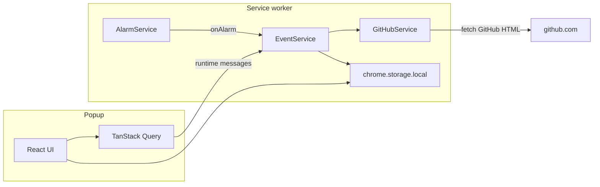

**Your GitHub PR inbox. Sorted. No tokens. No noise.**

Pullwatch is a Chrome extension that keeps the pull requests you care about visible without making you live on [github.com](https://github.com). It reuses the GitHub session your browser already has, so there are no personal access tokens, no OAuth app, and no sign in flow to worry about. A small Manifest V3 service worker quietly refreshes review requests, the PRs you authored, and your recently merged work in the background, and it backs off politely when GitHub asks it to.

These docs are the long form tour of how Pullwatch works. If the [README](https://github.com/dragosdev-code/pullwatch) tells you _what_ Pullwatch is, these pages tell you _how_ it is built. The goal is to read like a book: calm explanations, real code, and diagrams that show you the flow instead of making you guess at it.

---

## How these docs are organised

The docs have three tiers. You are free to jump around, but the tiers are meant to be read roughly in order.

| Tier                | Pages                                                                                                                                                                                                                                                                                                                                                                                                                                                    | Who it is for                          |
| ------------------- | -------------------------------------------------------------------------------------------------------------------------------------------------------------------------------------------------------------------------------------------------------------------------------------------------------------------------------------------------------------------------------------------------------------------------------------------------------- | -------------------------------------- |
| **Welcome**         | [Home](./), [Getting Started](./getting-started/)                                                                                                                                                                                                                                                                                                                                                                                                         | Anyone, including curious users.       |
| **The big picture** | [Architecture Overview](./architecture/overview/)                                                                                                                                                                                                                                                                                                                                                                                                           | Engineers starting the tour.           |
| **Deep dives**      | [The Service Worker Lifecycle](./architecture/service-worker-lifecycle/), [The Parser Waterfall](./architecture/parser-waterfall/), [GitHub Health and Outages](./architecture/github-health/) (with [List Trust and Suspect Lists](./architecture/github-health/list-trust/) and [Outage Banner and Statuspage](./architecture/github-health/outage-banner/)), [Remote Configuration](./architecture/remote-configuration/), [Data Hydration and Storage](./architecture/data-hydration-and-storage/), [Popup and Background Communication](./architecture/popup-and-background-communication/), [Onboarding and Session Gates](./architecture/onboarding-and-session-gates/), [Notifications and Sound](./architecture/notifications-and-sound/), [The Canary Monitor](./architecture/canary-monitor/) | Engineers going one concept at a time. |

---

## Features at a glance

| Feature                  | What it does                                                                                                                                                            |
| ------------------------ | ----------------------------------------------------------------------------------------------------------------------------------------------------------------------- |
| **Session based access** | Reads the GitHub HTML you can already see while signed in. No personal access tokens, no OAuth, nothing to authorise.                                                   |
| **Three tab inbox**      | **To review** (pending vs already reviewed), **Authored** (sorted by review state: changes requested, approved, pending, draft), and **Merged** (recently shipped).     |
| **Notifications**        | Optional desktop alerts and sounds for **assigned (to review)** and **merged** PRs. The **Authored** tab is for visibility only (no toasts). Draft alerts for assigned PRs are off by default and can be turned on.         |
| **Themes**               | 35 built in [DaisyUI](https://daisyui.com/) themes on Tailwind CSS 4.                                                                                                   |
| **Background sync**      | Default refresh cadence is 3 minutes. The worker pauses when you go offline.                                                                                            |
| **Resilient parsing**    | A three stage parser handles both the new and legacy GitHub list pages. Regex updates can be shipped from a public config repo without releasing a new extension build. |
| **Fast popup**           | The UI hydrates instantly from `chrome.storage.local` so the panel is filled before any network call.                                                                   |

For the mechanics behind "resilient parsing" head to [The Parser Waterfall](./architecture/parser-waterfall/). For the mechanics behind "fast popup" head to [Data Hydration and Storage](./architecture/data-hydration-and-storage/).

---

## Privacy and safety

Pullwatch is built so that you do not have to take its word for it. The whole codebase is open and the rules below are easy to verify.

- **No tokens. No OAuth app.** Pullwatch never asks for a token and never creates an OAuth integration on your account. It reads the same pages your browser would render if you typed `github.com/pulls` in the address bar yourself.
- **Outbound network (four host origins, all declared in the manifest).** Pullwatch does not run its own servers and does not use analytics or third-party SDKs. The only destinations it contacts are:
  - **`https://github.com/*`** — the background worker fetches your signed-in pulls list HTML; the popup may open PR links and load pages on this origin using your existing session.
  - **`https://avatars.githubusercontent.com/*`** — avatar images shown next to PR rows in the popup.
  - **`https://raw.githubusercontent.com/dragosdev-code/pr-live-config/*`** — a public `patterns.json` file used to update parser regexes without a new extension release.
  - **`https://www.githubstatus.com/*`** — GitHub’s public Statuspage API (`summary.json`) so outage banners can be corroborated against real Pull Requests incidents. No credentials are sent; responses are cached locally in `chrome.storage.local`.
- **Your data stays on your machine.** PR lists, route hints, rate limit state, and other operational data live in `chrome.storage.local` on this device only. Your appearance and notification preferences live in `chrome.storage.sync` so Chrome can carry them across your own signed in Chrome instances if you have Chrome sync turned on. Nothing is uploaded anywhere by Pullwatch itself.
- **Non goals.** Pullwatch does not act on PRs for you, does not write anything back to GitHub, and does not sync your PR data across devices. It is read only by design.

The [Remote Configuration](./architecture/remote-configuration/) page covers exactly what is in the config file and how it is validated before the extension will use it.

---

## The ten thousand foot view

Pullwatch has two halves that talk to each other through Chrome's own storage rather than through direct messages.

Read from left to right: the popup renders from storage (so it paints instantly when you open it), and separately asks the worker to do things like "fetch again now." Read from right to left: the alarm fires every few minutes, the worker fetches GitHub and writes the result to storage, and the popup (if it happens to be open) picks the change up through a storage listener.

If you want the full story of _why_ it is split this way, [Popup and Background Communication](./architecture/popup-and-background-communication/) is the page.

---

## The stack

Each entry below explains what the package actually does inside Pullwatch, not just that it is installed.

| Area          | Package                           | What it does here                                                                            |
| ------------- | --------------------------------- | -------------------------------------------------------------------------------------------- |
| UI            | **React 19**                      | Renders the popup and settings.                                                              |
| Data          | **@tanstack/react-query**         | Holds PR lists in the popup; hydrated from `chrome.storage.local` before the first paint.    |
| State         | **zustand**                       | Small UI stores for global error, debug mode, and tab control.                               |
| Forms         | **react-hook-form**               | Powers the settings forms in the settings overlay.                                           |
| Validation    | **valibot**                       | Validates the remote `patterns.json` at runtime before any regex is compiled or stored.      |
| Dates         | **date-fns**                      | Renders relative timestamps on PR rows ("3h ago", etc.).                                     |
| Icons         | **@heroicons/react**              | Iconography used across the popup.                                                           |
| Animation     | **@react-spring/web**             | List entrance animations and the theme picker ripple effect.                                 |
| A11y          | **react-focus-lock**              | Traps focus inside the onboarding overlay so keyboard users do not escape it by accident.    |
| Styling       | **tailwindcss 4** + **daisyui 5** | Styling and the 35 ready made themes.                                                        |
| Build         | **vite 8** + **typescript ~5.8**  | Builds the popup, service worker, and offscreen document. Strict TypeScript across the repo. |
| Static assets | **vite-plugin-static-copy**       | Copies the manifest, icons, and offscreen HTML into `dist/`.                                 |
| Unit tests    | **vitest** + **@testing-library** | Test runner and React testing helpers.                                                       |
| Browser tests | **playwright**                    | Drives the canary's Tier 2 logins and screenshot capture.                                    |
| Lint          | **oxlint**                        | Fast linter used across the repo.                                                            |

---

## Where to go next

- You are a **new user or a developer who just cloned the repo**: head to [Getting Started](./getting-started/). It walks through the install, the four commands that matter, and every permission Pullwatch asks for, explained in plain English.
- You are an **engineer who wants the full tour**: head to [Architecture Overview](./architecture/overview/). That page names every moving part and points you at the deep dive for each one.
- You are **here for one specific thing**: jump straight to the deep dive from the table at the top.

---

## Issues and feedback

Pullwatch is a personal project that is built and maintained solo, so code contributions are not being accepted at the moment. Bug reports and feature ideas are very welcome and genuinely useful.

If something is off, please open an issue at [github.com/dragosdev-code/pullwatch/issues](https://github.com/dragosdev-code/pullwatch/issues). What helps most:

- The extension version (visible in `chrome://extensions`).
- The browser and OS you are on.
- A short description of what you expected and what you saw.
- A screenshot if it is a UI issue, and a console log from the service worker if it is a background issue.

Thanks for taking the time. It really does help.

---

---

## Related docs

- [Documentation changelog](https://github.com/dragosdev-code/pullwatch/blob/main/docs/CHANGELOG.md)
- [DOM change runbook](https://github.com/dragosdev-code/pullwatch/blob/main/canary/DOM_CHANGE_RUNBOOK.md) (operational)
- [Squash minigame docs](https://github.com/dragosdev-code/pullwatch/tree/main/src/components/squash-minigame/docs)
