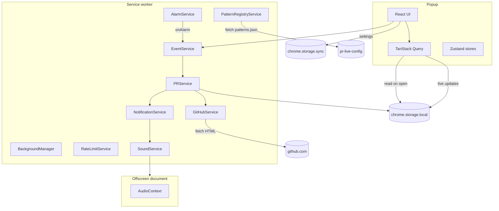

# Architecture Overview

> **What this page is.** A one page map of every moving part in Pullwatch. Think of it as the index to the rest of the wiki: every service you see here links straight to the deep dive that explains how it works. If you only read one technical page, read this one.

Imports use shared path aliases (`@common/*`, `@src/*`, `@background/*`, and others) so TypeScript, Vite, and Vitest agree; prefer them over long `../` paths into `extension/` or across top-level `src/` folders (see `tsconfig.json` and `vite.aliases.ts`). **Full conventions:** [Import paths and aliases](Import-paths-and-aliases).

---

## The shape of the system

Pullwatch is split into three runtime contexts that Chrome treats as separate lifetimes. They do not call each other directly; they communicate through `chrome.storage` and occasional runtime messages.

| Context                | What lives there                                                                                                                              | Lifetime                                                                                                    |
| ---------------------- | --------------------------------------------------------------------------------------------------------------------------------------------- | ----------------------------------------------------------------------------------------------------------- |
| **Popup**              | The React app, TanStack Query caches, Zustand UI stores. Reads from `chrome.storage.local`, writes settings to `chrome.storage.sync`.         | Lives only while the popup window is open. Every re open is a fresh React root.                             |
| **Service worker**     | All background logic: alarms, fetching GitHub, running the parser waterfall, rate limit handling, notification dispatch.                      | Chrome wakes it on demand and tears it down after about 30 seconds of inactivity. Every wake is cold state. |
| **Offscreen document** | A hidden page whose only job is to hold an `AudioContext` and play notification sounds. Exists because MV3 service workers cannot play audio. | Created on demand by the service worker and torn down when Chrome decides it is idle.                       |

The rest of this page zooms into each context.

---

## The whole system in one diagram

A few things worth noticing before you move on:

- The popup never talks to `github.com` directly. Every arrow into GitHub comes out of the service worker.
- The popup reads PR data from `Local`, not from a runtime message reply. That is on purpose; [Popup and Background Communication](Popup-and-Background-Communication) explains why.
- The alarm is the main clock. Everything that happens in steady state starts with `AL -->|onAlarm| EV`.

---

## The service map

Each row below is a service in the background. Each has a single job and a small, clearly bounded surface. The right hand column points at the wiki page where that service is fully explained.

### Core services

| Service                    | Source                                                                                                     | Role                                                                                                                                                            | Deep dive                                                                |
| -------------------------- | ---------------------------------------------------------------------------------------------------------- | --------------------------------------------------------------------------------------------------------------------------------------------------------------- | ------------------------------------------------------------------------ |
| `BackgroundManager`        | [BackgroundManager.ts](../extension/background/services/BackgroundManager.ts)                              | Orchestrates init on every wake. Calls permissions check, alarm setup, and badge sync from storage. Never fetches PRs.                                          | [Service Worker Lifecycle](The-Service-Worker-Lifecycle)                 |
| `EventService`             | [EventService.ts](../extension/background/services/EventService.ts)                                        | Routes runtime messages through a `Map` based dispatch table. Owns the depth counter that tracks overlapping fetch waves.                                       | [Popup and Background Communication](Popup-and-Background-Communication) |
| `PRService`                | [PRService.ts](../extension/background/services/PRService.ts)                                              | Coordinates per list fetches. Dedupes concurrent calls, applies a 60 second TTL cache, runs account swap detection against `github_viewer_identity`.            | [Service Worker Lifecycle](The-Service-Worker-Lifecycle)                 |
| `GitHubService`            | [GitHubService.ts](../extension/background/services/GitHubService.ts)                                      | The only place the extension calls `fetch()` against `github.com`. Picks the route using a 24 hour route hint, then runs the parser gauntlet.                   | [The Parser Waterfall](The-Parser-Waterfall)                             |
| `AlarmService`             | [AlarmService.ts](../extension/background/services/AlarmService.ts)                                        | Owns the periodic fetch alarm. Default cadence is `FETCH_INTERVAL_MINUTES = 3`. Persists any dev override across worker restarts.                               | [Service Worker Lifecycle](The-Service-Worker-Lifecycle)                 |
| `RateLimitService`         | [RateLimitService.ts](../extension/background/services/RateLimitService.ts)                                | Tracks GitHub 429 responses, applies exponential backoff (capped at 30 minutes), and persists the state so it survives a worker restart.                        | [Service Worker Lifecycle](The-Service-Worker-Lifecycle)                 |
| `PatternRegistryService`   | [PatternRegistryService.ts](../extension/background/services/PatternRegistryService.ts)                    | Pulls remote regex patterns every 6 hours. Validates with Valibot, compiles, and falls back to bundled defaults if anything is wrong.                           | [Remote Configuration](Remote-Configuration)                             |
| `NotificationService`      | [NotificationService.ts](../extension/background/services/NotificationService.ts)                          | Builds and shows Chrome notifications per category (assigned, merged, authored). Encodes the PR URL into the notification ID so click handling survives a wake. | [Notifications and Sound](Notifications-and-Sound)                       |
| `SoundService` + offscreen | [SoundService.ts](../extension/background/services/SoundService.ts), [offscreen/](../extension/offscreen/) | Plays notification sounds. Manifest V3 workers cannot play audio, so a one off offscreen document holds the `AudioContext`.                                     | [Notifications and Sound](Notifications-and-Sound)                       |
| `StorageService`           | [StorageService.ts](../extension/background/services/StorageService.ts)                                    | Type safe wrapper around `chrome.storage.local` and `chrome.storage.sync` with retry on transient post wake failures.                                           | [Data Hydration and Storage](Data-Hydration-and-Storage)                 |

### Supporting cast

These do narrower jobs and exist so the core services can stay small. You will run into them while reading code but they rarely need their own section.

| Service               | Source                                                                            | What it does                                                                                               |
| --------------------- | --------------------------------------------------------------------------------- | ---------------------------------------------------------------------------------------------------------- |
| `AvatarService`       | [AvatarService.ts](../extension/background/services/AvatarService.ts)             | Normalises and resolves avatar URLs, so parsers do not each rebuild the same logic.                        |
| `BadgeService`        | [BadgeService.ts](../extension/background/services/BadgeService.ts)               | Keeps the toolbar icon badge in sync with the unread / needs review count derived from storage.            |
| `DebugService`        | [DebugService.ts](../extension/background/services/DebugService.ts)               | Exposes structured diagnostics consumed by the in popup debug panel.                                       |
| `DevTestService`      | [DevTestService.ts](../extension/background/services/DevTestService.ts)           | Dev only helpers for triggering notifications or clearing storage from the debug panel.                    |
| `HealthStatusService` | [HealthStatusService.ts](../extension/background/services/HealthStatusService.ts) | Owns two persisted health flags (parser breakage, GitHub outage with reason tag), refreshes `lastSeenAt` on repeated outage signals, drops `STORAGE_KEY_LAST_UNTRUSTED_FETCH_AT` on outage clear, and broadcasts every transition. See [GitHub Health and Outages](GitHub-Health-and-Outages). |
| `GitHubStatusClient`  | [github-status-client.ts](../extension/common/github-status-client.ts)            | Polls `summary.json` once per wave (`bypassCache: true` on the alarm path). Two-minute cache, fail-OPEN to `'unknown'`. Used by the popup banner to gate the Statuspage link. See [Outage Banner and Statuspage](Outage-Banner-and-Statuspage). |
| `AlarmSeqClock`       | [AlarmSeqClock.ts](../extension/background/domain/pr-list-trust/AlarmSeqClock.ts) | Monotonic per-wave counter advanced once per completed alarm by `EventService`. Anchors `PrTombstoneStore` to alarm waves rather than wall-clock milliseconds.                                                                                  |
| List-trust domain     | [extension/background/domain/pr-list-trust/](../extension/background/domain/pr-list-trust/) | Decides whether a fresh fetch is allowed to replace the stored baseline. Houses `PrListTrustAssessor`, `EmptyConfirmationTracker`, `MergedLimboPromoter`, `PrTombstoneStore`, and `MergedNotificationEligibility`. See [List Trust and Suspect Lists](List-Trust-and-Suspect-Lists). |
| `PermissionService`   | [PermissionService.ts](../extension/background/services/PermissionService.ts)     | Runs the "do we actually have the permissions we declared" check on every wake.                            |

---

## The popup side in one paragraph

The React popup boots once per open. Before the first render, `main.tsx` awaits a hydration step that reads the three PR list keys from `chrome.storage.local` and seeds them into TanStack Query. That is why the popup paints with real data on frame one, no spinner, no round trip. While it is open, a storage listener forwards any `onChanged` event into the same TanStack Query keys, so if the alarm fires mid session the lists update live. Zustand stores (`global-error`, `debug`, `tab-control`) hold UI only state that does not belong on the server. Full mechanics are on [Data Hydration and Storage](Data-Hydration-and-Storage).

---

## Storage at a glance

Three Chrome storage areas, each with a very specific job.

| Area                     | What lives there                                                                                                                                                                                                            | Synced across devices?     |
| ------------------------ | --------------------------------------------------------------------------------------------------------------------------------------------------------------------------------------------------------------------------- | -------------------------- |
| `chrome.storage.local`   | PR lists (`github_assigned_prs`, `github_merged_prs`, `github_authored_prs`), route hint, rate limit state, parser pattern registry, viewer identity for account swap detection, install gate flags, custom sound metadata, health flags (`parser_breakage`, `github_outage` with reason tag and `lastSeenAt`), Statuspage snapshot cache (`github_status_cache`), trust metadata (`pr_list_trust_state`, `pr_tombstones_v1`, `alarm_seq`, `last_untrusted_fetch_at`). | No. This device only.      |
| `chrome.storage.sync`    | User settings: theme, notification preferences, sound choices.                                                                                                                                                              | Yes, if Chrome sync is on. |
| `chrome.storage.session` | Manual refresh throttle timestamp (`last_manual_refresh_at`). Cleared when the browser quits.                                                                                                                               | No. In memory only.        |

[Data Hydration and Storage](Data-Hydration-and-Storage) explains the full key list and the hydration contract.

---

## Every outbound destination, and why

Pullwatch is scoped so tightly at the manifest level that you can audit every HTTP request it can make just by reading the manifest.

| Host                                                                | Why                                                                                                       |
| ------------------------------------------------------------------- | --------------------------------------------------------------------------------------------------------- |
| `https://github.com/*`                                              | Fetches the pulls list HTML using the cookie your browser already has. Read only.                         |
| `https://avatars.githubusercontent.com/*`                           | Serves avatar images for PR rows. Images only, same as on GitHub itself.                                  |
| `https://raw.githubusercontent.com/dragosdev-code/pr-live-config/*` | Downloads `patterns.json` for the parser. The path prefix is scoped to a single repo owned by the author. |

There is no fourth. No analytics endpoint, no crash reporter, no CDN owned by the project. If you ever see Pullwatch contact anything else in DevTools, that is a bug worth an issue.

---

## Where to go next

You can read the deep dives in any order, but this sequence tends to flow well if you want a narrative tour:

1. [The Service Worker Lifecycle](The-Service-Worker-Lifecycle): why the worker is ephemeral and how Pullwatch deals with it.
2. [The Parser Waterfall](The-Parser-Waterfall): how the three stage parser stays resilient across GitHub's two experiences.
3. [Remote Configuration](Remote-Configuration): how parser regexes can be hot fixed without shipping a new build.
4. [Data Hydration and Storage](Data-Hydration-and-Storage): where every piece of state lives, and why.
5. [Popup and Background Communication](Popup-and-Background-Communication): the runtime messaging surface, and why data flows through storage instead.
6. [Onboarding and Session Gates](Onboarding-and-Session-Gates): the first run, signed out, and re auth flows.
7. [Notifications and Sound](Notifications-and-Sound): the notification pipeline and the offscreen document.
8. [The Canary Monitor](The-Canary-Monitor): how Pullwatch finds out GitHub's DOM changed before users do.
9. [GitHub Health and Outages](GitHub-Health-and-Outages): the hub that maps "what could go wrong with a fetch" to "what the popup says". Children: [List Trust and Suspect Lists](List-Trust-and-Suspect-Lists) and [Outage Banner and Statuspage](Outage-Banner-and-Statuspage).
