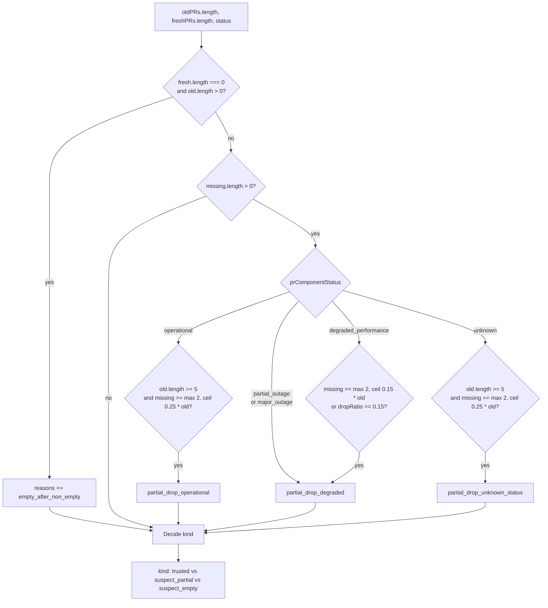
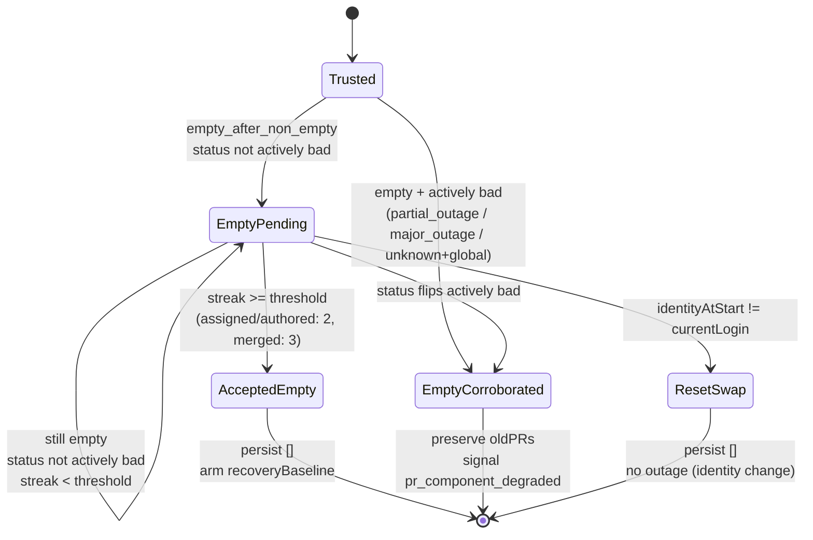

# List Trust and Suspect Lists

> **What this page is.** GitHub can return HTTP 200 with parseable HTML and an incomplete pull request list. List trust is the layer that decides whether a fresh fetch is allowed to replace the stored baseline, and what to do when it is not. This page covers the assessor, the empty-confirmation streak, the merged limbo promoter, the tombstone log, the merged freshness floor, and how those pieces compose into the six-branch dispatcher inside `PRService`.

The whole layer lives under [extension/background/domain/pr-list-trust/](../extension/background/domain/pr-list-trust/). It exists between "the parser produced a `PullRequest[]`" and "this is the list the popup will read", and it is the reason a one-tick flake from GitHub does not turn into a notification storm five minutes later.

---

## Why this page exists

Imagine the popup has eight assigned PRs in storage, all real. GitHub returns 200 OK with HTML the parser is happy with, but only six of those PRs are present in the response. Without a trust gate, `PRService` would persist six PRs as the new baseline. The next tick GitHub returns the original eight; `comparePRs` would see two PRs that are not in `oldPRs`, classify them as `isNew`, and fire two assigned notifications for PRs that have been sitting in the queue for days.

That is the failure mode the assessor was built to refuse. A suspicious read updates trust metadata and limbo, leaves the last-known-good list in place, and tells the popup we did check but kept the cached list. A trusted read overwrites storage as before. The contract is that the persisted list is always the most recent list we believed.

---

## The six-branch dispatcher

Every list fetch ([assigned](../extension/background/services/PRService.ts), merged, authored) runs the assessment through `PRService.dispatchPrListAssessment`, which routes one of six outcomes. The dispatcher is total, the discriminator is typed (no string-matching on reasons), and the policy split between assigned/authored and merged is the only behaviour difference between the three lists.

| Branch                          | When                                                                                                                       | What `PRService` does                                                                                                                       |
| ------------------------------- | -------------------------------------------------------------------------------------------------------------------------- | ------------------------------------------------------------------------------------------------------------------------------------------- |
| `trusted`                       | Assessor saw no anomaly.                                                                                                   | Compare, persist, notify (the existing happy path).                                                                                          |
| `trusted_operational_shrink`    | `partial_drop_operational` on assigned/authored, or merged with `missingCount < MERGED_SHRINK_SUSPICION_THRESHOLD = 4`.    | Persist fresh anyway; tombstones still record the dropped keys. UX freshness wins over hypothetical truncation; flapping is detected later. |
| `suspect_partial`               | Any other `partial_drop_*`, or merged with `missingCount >= 4`.                                                            | Preserve cached list; record limbo; signal `pr_component_degraded`; write `last_untrusted_fetch_at`.                                         |
| `suspect_empty_pending`         | Empty fresh, status not actively bad, streak below threshold.                                                              | Silent. Return `oldPRs`. No outage signal, no `last_untrusted_fetch_at`.                                                                     |
| `suspect_empty_accept`          | Empty fresh streak reached threshold (`assigned: 2, authored: 2, merged: 3`).                                              | Persist `[]`; arm `recoveryBaseline = 'accepted_empty'` for the next non-empty fetch.                                                        |
| `suspect_empty_corroborated`    | Empty fresh while Statuspage is "actively bad" (`partial_outage`, `major_outage`, or unknown + global incident).            | Preserve cached list; record limbo with `corroborated_by_statuspage`; signal `pr_component_degraded`.                                        |
| `suspect_empty_reset_swap`      | Empty fresh under a viewer-identity mismatch the swap pre-empt missed.                                                     | Persist `[]`; treat fresh as a new baseline; **no outage signal** (identity change is not an outage).                                        |

The split between assigned/authored and merged is deliberate. A sprint-end merge wave can take an assigned list from 10 to 4 in one tick; that is operational churn, and leaving the popup pinned on the old list until limbo eventually promotes is worse than persisting the fresh shorter list. Merged is append-heavy; losing four or more rows in one tick is the GitHub-side incompleteness pattern, not legitimate churn, so merged stays on the suspicious path.

---

## `PrListTrustAssessor` thresholds

[PrListTrustAssessor.assess](../extension/background/domain/pr-list-trust/PrListTrustAssessor.ts) scores a successful fetch before it is allowed to replace the stored baseline. The decision tree is small but every branch matters.



The `partial_drop_*` branches require a non-empty fresh response on purpose. An empty fresh response is not a partial drop; it is the `empty_after_non_empty` branch above. Without that guard, an empty fresh under any non-operational status would route through `suspect_partial` and signal `pr_component_degraded`, reintroducing the false positive on legitimate-zero for users with five or more cleared review requests.

`missConfirmationsRequired` rides along with the assessment: `3` when the status is problematic, `2` when it is operational. This is what `MergedLimboPromoter` uses to decide how many ticks a missing key stays in limbo before being pruned.

---

## `EmptyConfirmationTracker` streak

The empty-only path is a confirmation period, not a veto. [EmptyConfirmationTracker.observeEmpty](../extension/background/domain/pr-list-trust/EmptyConfirmationTracker.ts) takes one observation and returns one of four outcomes.



Per-list thresholds live in [empty-confirmation-policy.ts](../extension/background/domain/pr-list-trust/empty-confirmation-policy.ts):

```ts
export const EMPTY_CONFIRM_THRESHOLDS = {
  assigned: 2,
  authored: 2,
  merged: 3,
};
```

Two confirmations on assigned cost roughly one extra three-minute poll before the popup updates from "your old list" to "empty". That is invisible against the existing `CACHE_TTL_MS = 60s` envelope. Three on merged is the safety margin for a list owners think of as sticky.

The "actively bad" definition (in the same file) is intentionally stricter than the assessor's `isProblematicPRStatus`. `degraded_performance` does not corroborate a bare empty fetch, because Statuspage frequently reports `degraded_performance` for issues unrelated to PR search HTML. Only `partial_outage`, `major_outage`, or `unknown` paired with a non-none global indicator counts.

The bucket carries an `identityAtStart` pin so an account swap mid-streak does not let a fresh empty list (belonging to a different viewer) fold into the previous viewer's confirmation streak. The primary swap pre-empt is `PRService.detectAccountSwap`; the `reset_swap` branch is the defensive fallback for paths that pre-empt may miss.

---

## Recovery baseline marker

When the streak reaches threshold and `[]` is persisted, `PRService.markRecoveryBaseline` sets `recoveryBaseline = 'accepted_empty'` on the bucket. The next non-empty trusted fetch consumes that marker via `consumeRecoveryBaseline`, and the persist branch flips through `markAsExistingBaseline` instead of running `comparePullRequestLists([], fresh)`. Without the marker, every PR in the returning list would look new and the popup would fan out a notification storm.

This is the same shape used by the account-swap branch, on purpose: both are "treat fresh as a new baseline" cases. The marker is one-shot, lives on the same bucket as the empty streak, and is cleared inside the consumer call.

---

## `MergedLimboPromoter` confirmation horizon

The merged list is append-heavy and rows that disappear are rare. [MergedLimboPromoter](../extension/background/domain/pr-list-trust/MergedLimboPromoter.ts) keeps a per-key limbo entry for any merged PR present in `oldPRs` and absent from `freshPRs`, and only prunes after `missConfirmationsRequired` consecutive misses.

A suspicious fetch (`recordSuspiciousFetch`) records the limbo entries with the assessment reasons and clears any in-flight `emptyConfirm` bucket on the same list. A trusted fetch (`promoteTrustedMergedList` or `recordTrustedFetch`) does the same reset on the empty streak: a successful trusted update is the canonical "list is healthy" signal, and any prior empty streak is logically broken by it.

`promoteTrustedMergedList` returns the merged list with limbo entries appended for keys still under their confirmation horizon, which is what the popup ends up rendering. If `oldPRs` was 100 and the fresh fetch returned 95 because five entries are mid-flap, the user still sees 100 until the misses cross the horizon.

---

## `PrTombstoneStore` and `pr_list_churn`

Trust assessment decides what list to persist; tombstones decide notification eligibility on top of it. They are orthogonal: an operational shrink can also be a flap. [PrTombstoneStore](../extension/background/domain/pr-list-trust/PrTombstoneStore.ts) keeps a per-list bounded log of dropped PR keys with their `droppedAtAlarmSeq`. `applyTombstoneFilter` runs on every persist branch (trusted and trusted_operational_shrink), in two halves:

1. **Resurrection check.** Any fresh key whose tombstone is still inside the `TOMBSTONE_ALARM_WINDOW = 4` wave is a flap. The key is removed from `newPRs`, its `isNew` flag is cleared, and `signalGitHubOutage('pr_list_churn')` fires. Wave-level clear suppression turns on (`suppressGitHubOutageClearForListChurnWave = true`) so a clean merged or authored fetch later in the same wave cannot erase the integrity flag.
2. **Drop record.** Keys present in `oldKeys` but missing from `freshKeys` are tombstoned at the current `alarmSeq`. Recording happens after the resurrection check, so a key that just reappeared is not re-tombstoned by the same `oldKeys` snapshot.

The window is anchored to alarm waves, not wall-clock milliseconds. [AlarmSeqClock](../extension/background/domain/pr-list-trust/AlarmSeqClock.ts) is advanced exactly once per completed alarm wave by `EventService.handleAlarm`, after all three lists have persisted. Manual refreshes between alarms deliberately do not advance the clock, otherwise a user mashing the refresh button would expire tombstones early. The bound on the log is `PR_TOMBSTONE_MAX_ENTRIES_PER_LIST = 200`, LRU by `droppedAtAlarmSeq`.

---

## `MergedNotificationEligibility` freshness floor

Even after trust says "persist this merged list" and tombstones say "no flapping", a merged candidate still has to pass the freshness gate before a notification fires. [MergedNotificationEligibility.filterFreshCandidates](../extension/background/domain/pr-list-trust/MergedNotificationEligibility.ts) drops:

- Candidates whose event timestamp is older than `lastTrustedAt - FETCH_INTERVAL_MS`. After a long quiet window followed by a recovery, the merged list can balloon back; without the floor, every restored row would alert.
- Candidates whose event timestamp cannot be parsed at all, but only when Statuspage is problematic (`isProblematicPRStatus`). Under operational status, an unparseable timestamp is not enough to suppress.

The freshness gate runs **before** the tombstone filter, which is what reserves `pr_list_churn` for genuine flapping rather than for stale rows the freshness window would have suppressed anyway.

---

## The single Statuspage snapshot per wave

`PrListTrustAssessor.assess` accepts an optional `preFetchedStatus`, and the call sites pass one through deliberately. [EventService.handleAlarm](../extension/background/services/EventService.ts) prefetches the snapshot once with `bypassCache: true` at the top of every alarm wave and threads it into all three list fetches:

```ts
const waveStatus = await gitHubStatusClient.getStatus({ bypassCache: true });
prService.beginPrListHealthWave();
await prService.fetchAndUpdateAssignedPRs(false, true, waveStatus);
await prService.updateMergedPRs(false, true, waveStatus);
await prService.updateAuthoredPRs(false, true, waveStatus);
```

That solves a small but real problem. Without the prefetch, each list either burns its own network call to `summary.json` (three round trips per wave) or quietly reuses the TTL'd cache (and risks missing a degraded state that flipped between the first and the third list). Sharing one snapshot across the wave is the dedupe primitive. The `bypassCache: true` write also overwrites the cached entry, so any incidental same-wave non-bypass read picks up the refreshed snapshot.

---

## Edge cases and gotchas

### Account swap during a wave clears the empty streak

Both `detectAccountSwap` (the primary pre-empt) and the `reset_swap` branch in `EmptyConfirmationTracker` clear any in-flight `emptyConfirm` bucket. Without the clear, a fresh empty list under a different viewer could fold into the previous viewer's streak and prematurely accept `[]` for the new account.

### `lastSeenAt` refresh on repeat outage signals

A wave that re-asserts the same outage reason does not produce a new banner; `HealthStatusService.signalGitHubOutage` calls `refreshGitHubOutageLastSeen` instead. The popup's stale-flag expiry (see [Outage Banner and Statuspage](Outage-Banner-and-Statuspage)) keys on `lastSeenAt`, so this refresh is what keeps a genuinely ongoing outage from ageing out.

### Wave suppression survives one full wave at most

The `suppressGitHubOutageClearForListChurnWave` flag is set inside `applyTombstoneFilter` and cleared at the top of the next wave by `beginPrListHealthWave`. If a churn signal fires on assigned and the wave finishes without a follow-up trusted fetch on the same list, the next wave starts fresh and the flag clears as soon as any list lands a trusted persist.

### "Operational shrink" still records tombstones

The `trusted_operational_shrink` branch is the freshness-wins side of the merged policy split, not a free pass. `applyTombstoneFilter` still runs on this branch, so a key dropped during an operational shrink is recorded; if it reappears within four alarms, `pr_list_churn` fires exactly as it would on the strict path.

---

## See also

- [GitHub Health and Outages](GitHub-Health-and-Outages): the hub. The `GitHubOutageReason` taxonomy and the wave-suppression rule for `pr_list_churn`.
- [Outage Banner and Statuspage](Outage-Banner-and-Statuspage): the popup-side contract. How `pr_component_degraded` and `pr_list_churn` produce different banner copy and different Statuspage-link visibility.
- [The Parser Waterfall](The-Parser-Waterfall): the layer below this one. The parser produces the `PullRequest[]` that the assessor scores.
- [Notifications and Sound](Notifications-and-Sound): the gates this layer feeds. Most of the suppression rules in that page point at this one.
