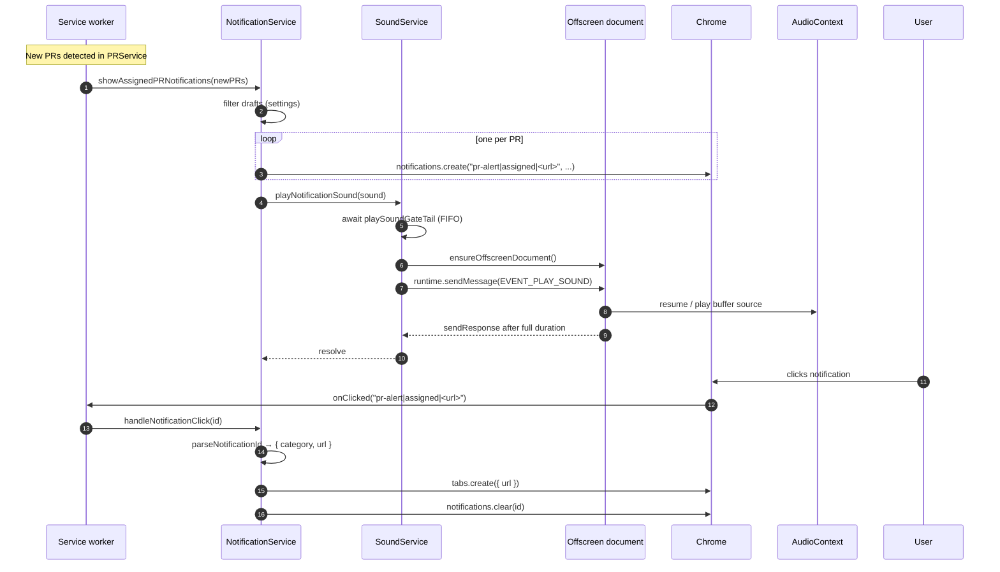

# Notifications and Sound

> **Summary.** When a new pull request arrives, two things happen: Chrome fires a visual notification, and a sound plays. The visual half is simple; the audio half is not, because Manifest V3 service workers are not allowed to use `AudioContext`. Pullwatch solves that by spinning up a hidden **offscreen document** on demand, passing sound instructions across a runtime message, and keeping the worker alive until playback finishes. A deterministic notification ID encodes the PR URL so clicks open the right tab even after a worker restart, and a FIFO promise gate in `SoundService` keeps concurrent sound requests from overlapping.

---

## Why this page exists

If you are reading the code top down, `NotificationService` looks innocent: build some notifications, call `chrome.notifications.create`, done. The complicated part is across the boundary: `SoundService`, the offscreen document, and the generation counter that keeps two rapid fire play requests from producing overlapping audio. None of that is obvious from one file.

This page stitches the pipeline together so the full path ("new PR detected" to "the user hears ping and sees the toast") is visible in one place, and so the MV3 audio quirk has an explanation that is not buried in a constructor comment.

---

## The pipeline in one diagram



Two things are worth noticing before zooming in. First, the click handler does not look anything up: the URL is right there in the notification ID, so a worker that was torn down between "notification shown" and "user clicked" can still route the click to the right tab. Second, `SoundService` awaits the offscreen's `sendResponse` until playback finishes, which keeps the service worker alive for the full sound duration.

---

## NotificationService: categories and draft filtering

[NotificationService.ts](../extension/background/services/NotificationService.ts) owns "turn a `PullRequest[]` into Chrome notifications." The public surface is small:

- `showAssignedPRNotifications` — new assigned PRs. Respects the `assigned.notificationsEnabled` setting, and filters drafts unless `notifyOnDrafts` is on.
- `showMergedPRNotifications` — PRs the user's changes were merged into. Respects `merged.notificationsEnabled`.
- `fireSettingsTestNotification(category)` — a throttled preview fired from the settings panel.
- `handleNotificationClick(id)` — opens the PR in a new tab and clears the toast.

Notifications are per PR (one row per pull request, not one row per batch) so the native OS notification center shows a list the user can skim. Every row uses the same icon, and every row is created with `silent: true` because audio is owned by `SoundService`, not by the OS.

| Category   | Default        | Produces a sound?             | Filters drafts?                                                                                                                       |
| ---------- | -------------- | ----------------------------- | ------------------------------------------------------------------------------------------------------------------------------------- |
| `assigned` | On             | Yes, `assigned.sound` setting | Yes unless `notifyOnDrafts` is on (see [effective-assigned-draft-notify.ts](../extension/common/effective-assigned-draft-notify.ts)). |
| `merged`   | On             | Yes, `merged.sound` setting   | No concept of drafts in merged PRs.                                                                                                   |
| `authored` | Off (no toast) | n/a                           | `authored` is a visible list but does not notify; noise budget.                                                                       |

Why no toast for authored? Because the user owns those PRs. Notifying on "your own PR exists" produces a toast on every draft commit push, every title edit, every CI round trip. The list is still there to look at, but the interrupt budget is better spent on assigned and merged.

### Drafts are off by default

`notifyOnDrafts` defaults to `false`. The reasoning: a draft PR is a "work in progress" signal, and most teams use drafts explicitly to say "not ready for review yet." Notifying on drafts would be the same as notifying when someone opened a document, not when they asked you to read it.

There is a guardrail against an inconsistent settings combo (`notifyOnDrafts: true` with `showDraftsInList: false`). When that combo appears, `effectiveAssignedNotifyOnDrafts` treats it as off, because notifying on a PR the user cannot see in the list would be a dead end click, and silently dropping the notification is less confusing than a notification that leads to an empty list.

---

## The click ID contract

Chrome calls `notifications.onClicked(notificationId)` with the ID the notification was created with. The service worker may have been torn down and rebuilt since the notification fired, so any in memory map from ID to URL would be gone.

The workaround is to put the URL **in the ID**:

```ts
private static readonly NOTIFICATION_PREFIX = 'pr-alert';
private static readonly NOTIFICATION_DELIMITER = '|';

const notificationId = `${NOTIFICATION_PREFIX}${d}${category}${d}${pr.url}`;
```

Decoding is the inverse:

```ts
private static parseNotificationId(notificationId: string): { category; url } | null {
  if (!notificationId.startsWith(`${prefix}${d}`)) return null;
  const firstPipe = notificationId.indexOf(d);
  const secondPipe = notificationId.indexOf(d, firstPipe + 1);
  if (secondPipe === -1) return null;
  const category = notificationId.substring(firstPipe + 1, secondPipe);
  const url = notificationId.substring(secondPipe + 1);
  if (!url) return null;
  return { category, url };
}
```

Two details worth calling out. `indexOf` based splitting (not `split('|')`) means that any delimiter characters inside the URL itself are preserved rather than truncated; URLs generally do not contain pipes, but the defensive shape costs nothing. And the deterministic ID gives free deduplication: if Chrome has already shown a notification with the same ID, a second `create` with the same ID updates the existing row rather than stacking duplicates.

The preview notifications from `fireSettingsTestNotification` deliberately use a different prefix (`extension-settings-test|...`) so the click handler's `parseNotificationId` returns `null` and the preview is just cleared from the tray, not routed to a nonexistent tab.

---

## SoundService and the FIFO gate

The service worker can receive two runtime messages at once: an alarm fired, and the popup clicked a sound preview. Both paths end up calling `SoundService.playNotificationSound`. Without coordination, both would send `EVENT_PLAY_SOUND` to the offscreen document in overlapping windows, and the user would hear two sounds at once.

[SoundService.ts](../extension/background/services/SoundService.ts) serialises them with a promise chain:

```ts
private playSoundGateTail: Promise<void> = Promise.resolve();

async playNotificationSound(sound = 'ping'): Promise<void> {
  const waitPrev = this.playSoundGateTail;          // 1. the promise the next caller must await

  let unlockGate!: () => void;
  this.playSoundGateTail = new Promise<void>((resolve) => {  // 2. publish a new tail synchronously
    unlockGate = resolve;
  });

  await waitPrev;                                    // 3. wait for everyone ahead of us
  try {
    await this.doPlayNotificationSound(sound);
  } finally {
    unlockGate();                                    // 4. always wake the next waiter
  }
}
```

The mental model: every caller grabs the old tail to wait on, publishes a new tail for the next caller, does its work, and then resolves its tail. It is a mutex implemented with promises rather than a boolean, because a boolean would race across `await`. The `finally` is important: if playback throws, the queue must still move forward, or one failure would freeze every subsequent sound.

`stopNotificationPlayback` deliberately does **not** go through the gate: "stop" must preempt immediately; queueing it after a long play would block preview UX. It bypasses the gate, fires `EVENT_STOP_SOUND_PLAYBACK` at the offscreen document, and the offscreen side handles interrupting the current play.

---

## Why the offscreen document exists at all

MV3 service workers cannot call `new AudioContext()`. They have no DOM and no media APIs. Chrome's answer is the **offscreen document**: a hidden HTML page the worker can spawn, which has a real DOM, real `AudioContext`, and a message channel back to the worker.

[extension/offscreen/offscreen.html](../extension/offscreen/offscreen.html) is a three line HTML file that loads [offscreenMain.ts](../extension/offscreen/offscreenMain.ts). `SoundService.ensureOffscreenDocument` spawns it on demand:

```ts
async ensureOffscreenDocument(): Promise<void> {
  if (this.creatingOffscreenDocument) {
    return this.creatingOffscreenDocument;   // dedup concurrent creators
  }
  this.creatingOffscreenDocument = this.doEnsureOffscreenDocument().finally(() => {
    this.creatingOffscreenDocument = null;
  });
  return this.creatingOffscreenDocument;
}
```

The dedup lock matters. Two callers that both think "no offscreen yet" would each try to create one; Chrome only allows a single offscreen document per extension, so the second one would throw "Only a single offscreen document may be created." Holding a single creation promise collapses concurrent calls into one round trip.

Chrome decides when to close the offscreen document. Pullwatch does not try to close it preemptively because a follow up sound within seconds is common, and re spinning the document would be wasteful.

---

## Inside the offscreen: one AudioContext, many plays

[offscreenMain.ts](../extension/offscreen/offscreenMain.ts) holds a **singleton** `AudioContext` shared across every playback:

```ts
let sharedAudioContext: AudioContext | null = null;

function getOrCreateAudioContext(): AudioContext {
  if (sharedAudioContext && sharedAudioContext.state !== 'closed') return sharedAudioContext;
  sharedAudioContext = new (window.AudioContext || webkitAudioContext)();
  return sharedAudioContext;
}
```

Why one, not one per sound? Because Chrome caps concurrent AudioContexts at roughly six per origin. An extension that created a fresh context per notification would hit that ceiling quickly under rapid fire notifications, and new contexts would silently fail.

The trickier part is that the gate in `SoundService` serialises **requests** but decoding a custom sound is async; a STOP or a new PLAY can arrive mid decode. A generation counter in the offscreen keeps late writes from colliding with current ones:

```ts
let playRequestGeneration = 0;

async function handlePlayNotificationSound(...) {
  const myGeneration = ++playRequestGeneration;
  interruptActivePlayback();
  // ... later, after every await ...
  if (myGeneration !== playRequestGeneration) return;   // superseded
}
```

Every PLAY and every STOP bumps the counter. A decoder that finishes after the counter moved knows to discard its buffer rather than call `source.start()` on top of whatever is already playing. This is the same "cancellation token" pattern you would use in async UI code, adapted to the fact that there is no `AbortController` threading through `decodeAudioData`.

A parallel set of `activeCustomBufferSource` / `activeBuiltInOscillators` trackers exists so `interruptActivePlayback` can actually stop the running nodes; `AudioContext.suspend()` alone only pauses time, and `resume()` for the next clip would un pause them too.

---

## Custom sounds: worker reads, offscreen plays

Offscreen documents cannot access `chrome.storage`. That sounds like a constraint, but it is fine: custom WAV data is small, base64 encoded, and easy to pass over the message channel.

`SoundService.buildPlaySoundPayload` reads the custom sound from `chrome.storage.local` in the worker and puts the base64 blob on the `EVENT_PLAY_SOUND` payload:

```ts
const result = await chrome.storage.local.get(storageKey);
const customSoundBase64 = result[storageKey] as string | undefined;
if (!customSoundBase64) return { soundType: 'ping' }; // graceful fallback
return { soundType: sound, customSoundBase64 };
```

The offscreen `decodeAudioData` path reads the base64, turns it into an `AudioBuffer`, and plays it via a `BufferSource`. The fallback to `ping` when a custom slot's WAV is missing matters for the cross device sync case: a user's settings (in `chrome.storage.sync`) can name a custom sound that their other machine has not downloaded yet; rather than silently failing, the fallback keeps the notification audible.

### The custom sound editor

The editor UI (in [src/components/custom-sound-editor/](../src/components/custom-sound-editor/)) is the one place in the popup that reaches for **vanilla Zustand** instead of the app wide hook based stores:

- [audio-draft-store.ts](../src/components/custom-sound-editor/store/audio-draft-store.ts) — the loaded buffer, its waveform peaks, start/end trim in seconds.
- [async-feedback-store.ts](../src/components/custom-sound-editor/store/async-feedback-store.ts) — decode and save errors, and the saving spinner.

Two stores instead of one because the trim geometry and the save pipeline are independent concerns: clicking a draft's delete button should not stomp the editor's trim range, and a decode error should not reset the trim. Keeping them split means each reset call only touches the UI it owns.

Vanilla (not hook based) Zustand because the editor composes multiple non React things (`AudioContext`, decode helpers, waveform canvases) that want to read and write the store outside React's render cycle. Vanilla stores expose a `getState`, `setState`, and `subscribe` that do not require a React component to sit in the middle.

Once the user saves, the final base64 blob is persisted to `chrome.storage.local` under `custom_sound_<slot>` and a metadata entry is written to `custom_sounds_meta`. From that point on, the sound is just another `NotificationSound` value that the worker can play through the pipeline above.

---

## Edge cases and gotchas

### The notification ID includes a pipe character in the URL

Real GitHub PR URLs should never contain a pipe, but `parseNotificationId` uses `indexOf` based splitting (not `split('|')`) so any stray pipe in the URL is preserved rather than truncated. The defensive parsing costs nothing and survives a hypothetical URL format change upstream.

### The offscreen document is closed when a notification fires

`ensureOffscreenDocument` checks `chrome.runtime.getContexts` and recreates the document if it is not there. The first sound after a long idle pays a small setup cost; subsequent sounds reuse the existing document. If creation fails because of the "Only a single offscreen document may be created" race, `SoundService` recovers by checking `hasOffscreenDocument` again before throwing, so two concurrent callers do not both report the error.

### A STOP arrives while a custom sound is still decoding

The STOP handler bumps `playRequestGeneration` and calls `interruptActivePlayback`. When the decoder resumes after its `decodeAudioData` await, the generation check sees a mismatch and the decoded buffer is discarded without ever calling `start()`. No audible playback; no lingering node to `stop()` later.

### Two rapid fire settings test clicks

`fireSettingsTestNotification` enforces a `SETTINGS_NOTIFICATION_TEST_COOLDOWN_MS` throttle per category. The first click fires, the second click inside the cooldown throws `SETTINGS_TEST_ERROR_COOLDOWN`, and the popup surfaces that as "please wait a moment" guidance rather than a hard error. A successful fire clears the previous preview notification so the native Notification Center does not accumulate one row per cooldown window.

### Chrome denies notification permission

`fireSettingsTestNotification` queries `getChromeNotificationPermissionLevel` before touching storage or the notification API. If the level is `denied`, it throws `SETTINGS_TEST_ERROR_CHROME_DENIED`, and the popup maps that into inline unblock guidance so the user knows the problem is in Chrome's settings, not Pullwatch's.

### The click fires but `chrome.tabs.create` fails

`handleNotificationClick` wraps the tab creation in an inner try/catch so a tab failure does not prevent the notification from being cleared. Leaving the toast in the tray with no way to dismiss it programmatically is a worse outcome than failing to open the tab; the user can click the PR link from the popup directly if the tab path is blocked.

---

## See also

- [The Service Worker Lifecycle](The-Service-Worker-Lifecycle): why the worker cannot play audio itself, and why the offscreen document has to outlive a message round trip.
- [Popup and Background Communication](Popup-and-Background-Communication): the `EVENT_PLAY_SOUND` and `PREVIEW_SOUND_ACTION.*` messages the popup uses to drive sound previews from the settings panel.
- [Data Hydration and Storage](Data-Hydration-and-Storage): where custom sound blobs and their metadata live in `chrome.storage.local`, and how settings in `chrome.storage.sync` name them.
