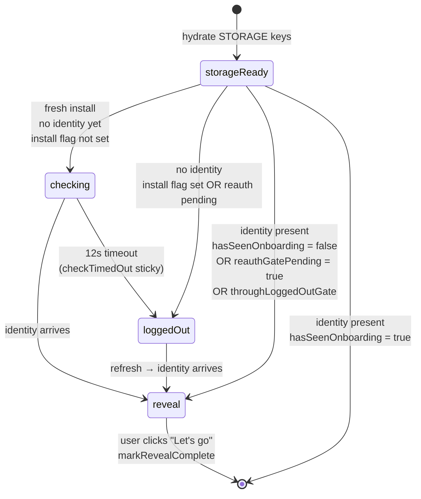

# Onboarding and Session Gates

> **Summary.** Pullwatch has no login of its own. It relies on whatever GitHub session the browser already holds, which means the popup has to be graceful about three states it can find itself in: "we don't know yet" (install is still running the first fetch), "there's no session" (signed out or cookie expired), and "fresh session, hasn't seen the welcome yet" (re auth after a session wipe). One overlay shell, one hook (`useOnboarding`), and four storage keys coordinate all three. A single `react-focus-lock` wraps the shell so keyboard users cannot tab past the gate into lists that are not yet safe to show.

---

## Why this page exists

The popup is a tiny UI with a big assumption: that it is running on behalf of a logged in GitHub user. If that assumption is wrong in either direction (no session at all, or "session restored but the user has not yet seen the welcome"), showing the three tab inbox would be at best confusing and at worst actively misleading.

The onboarding layer exists so the popup has a well defined thing to say in every state. It is not decorative; it is the place where "unknown session status" gets resolved into either "proceed" or "the user needs to do something." Getting the state machine right matters, because it runs on every popup open.

---

## The three gate phases



All three phases live inside one `OnboardingOverlay` shell. The shell switches which panel it renders based on a `phase` prop that `useOnboarding` computes, so there is one dialog, one focus lock, and one crossfade. The previous design mounted two independent dialogs and flashed at the handoff; collapsing them into one shell removes that flash without changing the state transitions.

---

## The four storage keys that drive the hook

Every decision `useOnboarding` makes comes from reading and watching four keys in `chrome.storage.local`:

| Key                              | Written by                                      | Meaning                                                                                                  |
| -------------------------------- | ----------------------------------------------- | -------------------------------------------------------------------------------------------------------- |
| `github_viewer_identity`         | `PRService.persistResolvedViewerIdentity`       | Login extracted from the latest fetch. Presence equals "signed in right now."                            |
| `has_seen_onboarding`            | `markRevealComplete` in the popup               | True once the user has clicked through the welcome reveal at least once on this machine.                 |
| `onboarding_reauth_gate_pending` | `StorageService.clearGitHubWebSessionCaches`    | Set when the worker wipes the session after an auth failure. Forces the welcome overlay on next sign in. |
| `install_session_check_complete` | `EventService.handleInstallation` (try/finally) | True once the install time probe settles. Used to distinguish "still checking" from "checked and empty." |

The popup treats `chrome.storage.local` as the source of truth. It hydrates once on mount and then subscribes to `chrome.storage.onChanged` for live updates, the same pattern as PR list hydration ([Data Hydration and Storage](Data-Hydration-and-Storage)).

---

## Phase 1: checking

This phase only runs on a truly fresh install, while the service worker's `handleInstallation` is still doing the first three fetches (assigned, merged, authored). The popup cannot yet tell whether the user is signed in; the answer is about to arrive in storage.

The condition is strict on purpose:

```ts
const initialCheckInProgress =
  !checkTimedOut &&
  storageReady &&
  !isLoggedIn &&
  !hasSeenOnboarding &&
  !reauthGatePending &&
  !installCheckComplete &&
  onboardingOverlaysActive;
```

Every clause is there to exclude someone who should be in a different phase. Re auth gate returners are **not** in checking; they already know they are out. Users who saw onboarding on a previous install are **not** in checking; they went straight to the lists. Timed out checks are **not** in checking; they fell through to logged out.

### The 12 second timeout

The install time fetch can hang for many reasons: a slow network, a service worker that never woke, an outage on GitHub's edge. Leaving the popup pinned on a spinner is the worst outcome.

```ts
const INSTALL_CHECK_MAX_MS = 12_000;

useEffect(() => {
  if (!initialCheckInProgress) return;
  const id = window.setTimeout(() => setCheckTimedOut(true), INSTALL_CHECK_MAX_MS);
  return () => window.clearTimeout(id);
}, [initialCheckInProgress]);
```

Twelve seconds is a balance: long enough that a slow but working network still resolves inside the checking phase, short enough that a dead worker does not strand the popup on a loader.

`checkTimedOut` is **sticky**: once it flips to `true`, it never flips back, even if identity arrives five seconds later. Without that stickiness, a late identity write could yank the user from `loggedOut` back into `checking` mid click. The identity is still honoured: `isLoggedIn` going true moves the user straight from `loggedOut` to `reveal`, just not by regressing to `checking`.

### The install flag's try/finally

The service worker cooperates from the other side. [EventService.handleInstallation](../extension/background/services/EventService.ts) wraps the install fetch in a try/finally so the install flag settles to `true` even when the fetch throws:

```ts
try {
  await storageService.remove(STORAGE_KEY_INSTALL_SESSION_CHECK_COMPLETE);
  await badgeService.setLoadingBadge();
  await this.withPrUiFetchIndicator(async () => {
    await prService.fetchAndUpdateAssignedPRs(true, true);
    await prService.updateMergedPRs(true, true);
    await prService.updateAuthoredPRs(true, true);
  });
} finally {
  try {
    await storageService.set(STORAGE_KEY_INSTALL_SESSION_CHECK_COMPLETE, true);
  } catch (flagErr) {
    this.debugService.error('[EventService] Failed to persist install-check flag:', flagErr);
  }
}
```

Why is the flag set in `finally`? Because the popup's 12 second client side timeout is a safety net, not the primary signal. The primary signal is the worker saying "I finished; you can stop waiting on me now." If the fetch succeeds, the flag lands with identity already populated and the popup moves to either `reveal` (first run) or skips straight to lists. If the fetch fails, the flag still lands and the popup falls through to `loggedOut` (because there is no identity).

---

## Phase 2: loggedOut

Reached whenever `storageReady && !isLoggedIn` after the checking phase has either resolved or timed out. The `LoggedOutView` panel shows a calm "sign in to GitHub" message and a **Refresh status** button that reruns the three list fetches.

```ts
const refreshGitHubSession = useCallback(async () => {
  setRefreshState('loading');
  try {
    await Promise.all([
      chromeExtensionService.fetchFreshAssignedPRs(),
      chromeExtensionService.fetchFreshMergedPRs(),
      chromeExtensionService.fetchFreshAuthoredPRs(),
    ]);
    const result = await runWithTransientStorageRetry(() =>
      chrome.storage.local.get(STORAGE_KEY_GITHUB_VIEWER_IDENTITY)
    );
    const login = readViewerLogin(result);
    if (!login) {
      setAuthWall(true);
      setRefreshInfoMessage(REFRESH_NO_GITHUB_SESSION_INFO);
    }
    setRefreshState('idle');
  } catch (error) {
    // map auth errors to a calm info message, others to refreshState 'error'
  }
}, [prefersReducedMotion]);
```

Three details worth noting:

- **Three fetches, not one.** The refresh mirrors the header refresh path (`useRateLimitedRefresh`) exactly, so storage backed lists and `github_viewer_identity` stay consistent once the user signs in.
- **Auth like errors do not surface as red errors.** Messages that start with `NotLoggedIn` or `AuthenticationError` become an informational line ("finish signing in on github.com"), because they are expected while the gate is up. Only transport faults (5xx, parser breakage) surface as the red error state.
- **`REFRESH_MIN_UI_MS = 850`.** The button stays in its loading state for at least 850ms unless the user prefers reduced motion. Motion design, not a network delay; exists so the button doesn't flicker when the fetch is instant.

---

## Phase 3: reveal

The welcome overlay. Appears when `storageReady && isLoggedIn && needsOnboardingReveal`.

```ts
const needsOnboardingReveal = !hasSeenOnboarding || reauthGatePending || throughLoggedOutGate;
```

Three situations trigger it:

1. **First install.** `has_seen_onboarding` has never been set. Standard path.
2. **Re auth after a session wipe.** `reauth_gate_pending` was set when the worker nuked the session, and stays true until the reveal is dismissed. This is why a returning user sees the welcome one more time after getting signed back in, even though they have seen it before.
3. **Mid session logged out.** `throughLoggedOutGate` is set whenever this popup mount observed the `loggedOut` phase. It persists in React state (not storage) until the user clicks "Let's go." This guarantees the overlay stays visible for the transition from `loggedOut` to logged in even when `has_seen_onboarding` is already true and no `reauth_gate_pending` flag exists (the storage write for the pending flag may not have landed in the same tick as the identity write).

### Dismissing the reveal atomically

When the user clicks "Let's go", `markRevealComplete` runs:

```ts
const markRevealComplete = useCallback(() => {
  setHasSeenOnboarding(true);
  setReauthGatePending(false);
  setThroughLoggedOutGate(false);
  void (async () => {
    await persistOnboardingDismissal();
  })();
}, []);

async function persistOnboardingDismissal(): Promise<void> {
  await Promise.all([
    runWithTransientStorageRetry(() =>
      chrome.storage.local.set({ [STORAGE_KEY_HAS_SEEN_ONBOARDING]: true })
    ),
    runWithTransientStorageRetry(() =>
      chrome.storage.local.remove(STORAGE_KEY_ONBOARDING_REAUTH_GATE_PENDING)
    ),
  ]);
}
```

Two invariants come out of this shape:

- **React state flips first, storage second.** The overlay unmounts immediately; if the popup window is destroyed before the IPC lands, the next open rehydrates from authoritative storage and the user sees the welcome again. An optimistic flash is better than a stuck overlay.
- **`Promise.all`, not sequential `await`s.** If the two writes ran one after the other and the popup closed between them, storage would be half written: `has_seen_onboarding = true` but `reauth_gate_pending` still `true`. Next open would show the welcome again for the wrong reason. Firing both in parallel keeps the dismissal atomic from the user's perspective.

---

## Why the overlay is focus locked

The single `FocusLock` wrapper in [onboarding-overlay.tsx](../src/components/onboarding/onboarding-overlay.tsx) matters for one specific failure mode: a keyboard user pressing Tab while the overlay is up. Without focus containment, Tab would move focus into the lists tree behind the overlay, which is rendered with `inert={true}` and `aria-hidden={true}` but is still in the DOM so storage sync and TanStack Query stay live. The combination of "in the DOM" and "invisible to assistive tech" without focus containment is the exact shape that confuses screen readers and lets keyboard users interact with controls they cannot see.

`react-focus-lock` solves both problems: focus is trapped inside the overlay, and `returnFocus` sends it back to whatever owned it when the overlay is dismissed. The same treatment is not applied to the settings overlay because settings is navigable (users intentionally want to reach both settings controls and the header), and trapping focus there would break the usual escape paths.

---

## The storage generation counter

`useOnboarding` hydrates from storage on mount and subscribes to `chrome.storage.onChanged` for live updates. If `onChanged` fires **during** the hydrate call (more common than you would think on the very first open), the hydrate write would land _after_ the live update with strictly older values, briefly regressing the UI.

```ts
let storageGeneration = 0;

const hydrate = async () => {
  const readGeneration = storageGeneration;
  const result = await runWithTransientStorageRetry(() => chrome.storage.local.get([...]));
  if (storageGeneration > readGeneration) {
    setStorageReady(true);
    return; // skip the stale write
  }
  setHasSeenOnboarding(!!result[STORAGE_KEY_HAS_SEEN_ONBOARDING]);
  // ...
};
```

Every `onChanged` event on one of the four keys bumps `storageGeneration`. If the generation moved between "we started reading" and "we are about to write," the write is skipped. Non onboarding keys (PR lists, fetch flags) do **not** bump the counter, because a legitimate first hydrate for onboarding state must not be skipped for an unrelated storage write.

---

## Edge cases and gotchas

### GitHub is reachable but the cookie expired

The worker's fetch returns a 200 page with a logged out HTML shell. [isGitHubLoggedOutHtmlShell](../extension/common/github-html-session.ts) detects this, and the fetch throws a session auth error. That error propagates to `EventService.handleAlarm`, which calls `invalidateGitHubWebSessionAfterAuthFailure` on `StorageService`. That wipes `github_viewer_identity`, clears the PR lists, and sets `onboarding_reauth_gate_pending`. The popup's `onChanged` listener sees all three changes, `isLoggedIn` flips to `false`, and the next render is the `loggedOut` phase. When the user signs in and refreshes, the reveal phase will show one more time thanks to the reauth gate flag.

### Install check times out before any response arrives

`checkTimedOut` flips true, which removes the `!checkTimedOut` clause that was keeping `initialCheckInProgress` true. The hook falls through to the `loggedOut` phase. From the user's perspective this is a gentle handoff: a checking spinner for up to 12s, then a signed out screen with a Refresh button they can click if they genuinely are signed in and the worker just had trouble reaching GitHub.

### A late identity write arrives after the timeout

The sticky `checkTimedOut` flag prevents the regression. `showCheckingLayer` stays false, and the identity write transitions the user from `loggedOut` directly to `reveal` (via the `throughLoggedOutGate` sticky flag) or straight to the lists if they have dismissed the reveal before.

### Popup is closed between React state flip and storage write on "Let's go"

`markRevealComplete` fires React state updates synchronously (overlay unmounts immediately) and the storage writes via an unawaited IIFE. If the popup dies before the IPC completes, the next open rehydrates from storage, sees `has_seen_onboarding = false`, and shows the welcome again. The cost of one repeated welcome is preferable to the cost of the overlay getting stuck open because the storage write lost.

### Settings overlay and focus lock

The settings overlay deliberately does not use `FocusLock`. Settings is meant to be navigable: users reach it from the header, tab around it, and leave via the close button or the back arrow. Trapping focus inside settings would break the normal escape paths. Focus locking is scoped to the onboarding gate because that gate represents "the app is not safe to interact with yet," which is a different kind of modal from settings.

---

## See also

- [Data Hydration and Storage](Data-Hydration-and-Storage): the hydration contract this hook reuses, and the `runWithTransientStorageRetry` wrapper that guards every storage read in the gate.
- [Popup and Background Communication](Popup-and-Background-Communication): the `fetchFreshAssignedPRs` messages the Refresh button sends, and how `EVENT_SETTINGS_UPDATED` broadcasts let the gate react to settings changes while it is up.
- [The Parser Waterfall](The-Parser-Waterfall): where the logged out HTML shell is detected and turned into the session auth error that ultimately sets the reauth gate flag.
