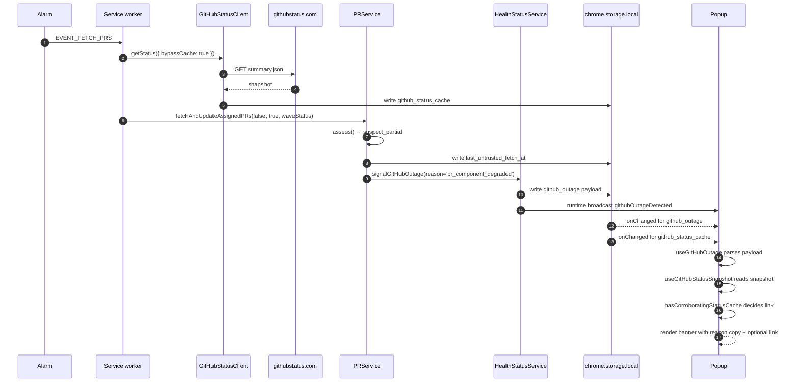

# Outage Banner and Statuspage

> **What this page is.** The popup's outage banner has to mean something different in three different situations. This page covers what the banner says, when, why the Statuspage link is sometimes hidden, and how the popup gets its read on `summary.json` without ever fetching it itself.

The background is the only context that touches `githubstatus.com`. The popup mirrors a cached snapshot from `chrome.storage.local` and decides whether to render a link based on what is in that cache. Same pattern as PR data, same reason: the popup paints from storage, it does not perform network IO of its own.

---

## `GitHubStatusClient`: cached, fail-open, popup-read-only

[GitHubStatusClient](../extension/common/github-status-client.ts) wraps the `summary.json` endpoint at `https://www.githubstatus.com/api/v2/summary.json`. The contract:

| Concern                   | Value / behaviour                                                                                                    |
| ------------------------- | -------------------------------------------------------------------------------------------------------------------- |
| Endpoint                  | `GITHUB_STATUS_API_URL`                                                                                              |
| Per-request timeout       | `GITHUB_STATUS_FETCH_TIMEOUT_MS = 3s`                                                                                |
| Cache TTL                 | `GITHUB_STATUS_CACHE_TTL_MS = 120s`                                                                                  |
| Cache storage key         | `STORAGE_KEY_GITHUB_STATUS_CACHE` in `chrome.storage.local`                                                          |
| Fail mode                 | **Open.** Every transport or parse failure resolves to `{ prComponentStatus: 'unknown', globalIndicator: 'unknown' }` |
| `bypassCache` semantics   | Skip the TTL short-circuit, fetch fresh, **overwrite the cache** with the new snapshot                                |

Failing open is the load-bearing design choice. Real transport outages on `github.com` are caught upstream by `GitHubOutageError` from `GitHubService`, and the flaky status endpoint must not silently *suppress* legitimate notifications by masking a healthy PR fetch as "degraded". The trade-off is honest: a real PR component degradation that coincides with a status-API blip will not arm the gate; the existing transport-error path still paints the outage banner if PR fetches fail outright.

The PR component name the parser looks for is exactly `'pull requests'` (`GITHUB_PR_COMPONENT_NAME`), case-folded on read. If GitHub renames the component, the snapshot logs a warning and falls back to the global `status.indicator`. That gives a one-cycle escape hatch before the constant has to be updated.

The `bypassCache` flag exists for one specific caller. [EventService.handleAlarm](../extension/background/services/EventService.ts) prefetches one snapshot at the top of every alarm wave with `bypassCache: true`, and the snapshot is threaded through all three list assessments. The bypass write overwrites the cache entry, so any incidental same-wave non-bypass read picks up the refreshed snapshot rather than triple-hitting `summary.json`. See [List Trust and Suspect Lists](List-Trust-and-Suspect-Lists) for how `assess()` consumes that wave-scoped snapshot.

---

## What the popup reads

Two hooks. Neither performs network IO; both subscribe to `chrome.storage.onChanged` so a write in the background reaches React without an explicit refresh.

### `useGitHubStatusSnapshot`

[src/hooks/use-github-status-snapshot.ts](../src/hooks/use-github-status-snapshot.ts) mirrors `STORAGE_KEY_GITHUB_STATUS_CACHE` into local React state. It validates the parsed shape (both `prComponentStatus` and `globalIndicator` must belong to known unions) and returns `null` for a missing or malformed cache. The two-minute staleness on the cache is deliberate: this snapshot is used to gate an informational link, and the alternative (always-on or always-off) is strictly worse.

### `useGitHubOutage`

[src/hooks/use-github-outage.ts](../src/hooks/use-github-outage.ts) mirrors `STORAGE_KEY_GITHUB_OUTAGE` plus `STORAGE_KEY_LAST_UNTRUSTED_FETCH_AT`, and also subscribes to the `githubOutage{Detected,Cleared}` runtime broadcasts. Two parsing rules are worth calling out:

- **Legacy payload fallback.** Pre-`reason` builds wrote `{ detected, timestamp, context }` without a discriminator. The hook defaults `reason` to `'transport'` for those payloads so the banner shows the most generic, never-over-promising copy and the link stays gated by `hasCorroboratingStatusCache`.
- **Stale-flag expiry.** Payloads whose `lastSeenAt` is older than `GITHUB_OUTAGE_STALE_AFTER_MS = 2h` are rejected outright. Broadcasts are best-effort and a popup can mount hours after recovery; without the expiry, a missed `*Cleared` broadcast would leave the banner pinned. `signalGitHubOutage` refreshes `lastSeenAt` on every repeat hit, so a genuinely ongoing outage stays visible.

Both hooks treat `chrome.storage.local.remove` (which surfaces as `newValue: undefined` on `onChanged`) as a clear, so a key removal flips the banner off without waiting for the broadcast.

---

## Banner copy by reason

[github-outage-banner.tsx](../src/components/github-outage-banner.tsx) renders one of three copy variants, keyed on the outage reason. The `data-variant-id` attribute is stable so support reports and integration tests can match it directly.

| `reason`                | `data-variant-id`            | Title                                                            | Body                                                                                                                                                  |
| ----------------------- | ---------------------------- | ---------------------------------------------------------------- | ----------------------------------------------------------------------------------------------------------------------------------------------------- |
| `transport` (default)   | `outage.transport`           | "GitHub didn't respond. Showing your last known list."           | "Pullwatch will retry on its own. If this sticks around, a quick refresh or a check on your connection usually clears it."                            |
| `pr_component_degraded` | `outage.component-degraded`  | "Pullwatch noticed an unusual change in your list."              | "Keeping your last known list while things settle. New review requests during this window may not show until the next clean sync."                    |
| `pr_list_churn`         | `outage.list-churn`          | "A pull request briefly disappeared and came back."              | "Pullwatch held back the bouncing one to avoid duplicate alerts. Other list updates still flow through normally."                                     |

The copy is intentionally calm and never names "GitHub" as broken when Pullwatch is not sure GitHub is broken. `pr_component_degraded` says "an unusual change in your list", not "GitHub is degraded", because the local anomaly is what we are confident about. `pr_list_churn` is the one banner that explicitly explains the suppression: a notification did not fire, that is by design, and the rest of the popup is still alive.

---

## Statuspage link gating

The link to `https://www.githubstatus.com` is not always shown. It is gated by reason and by what the cached Statuspage snapshot actually says.

| `reason`                | Link visibility                                              |
| ----------------------- | ------------------------------------------------------------ |
| `transport`             | Shown iff `hasCorroboratingStatusCache(snapshot)` is `true`. |
| `pr_component_degraded` | Shown iff `hasCorroboratingStatusCache(snapshot)` is `true`. |
| `pr_list_churn`         | **Always hidden.**                                            |

`hasCorroboratingStatusCache` (in [use-github-status-snapshot.ts](../src/hooks/use-github-status-snapshot.ts)) returns `true` when:

- `prComponentStatus` is `partial_outage` or `major_outage`, **or**
- `globalIndicator` is `minor`, `major`, or `critical`.

The reason narrows the banner copy; the snapshot decides whether pointing the user at `githubstatus.com` would line up with what they will see there. `pr_component_degraded` includes the gate too because the signal also fires for sub-threshold local shrinks (a merged shrink at the `MERGED_SHRINK_SUSPICION_THRESHOLD`) that do not require Statuspage corroboration; linking unconditionally would dump those users on an all-green page.

`pr_list_churn` skips the gate because Statuspage is by definition irrelevant: the integrity signal fires on tombstone resurrection regardless of `summary.json`. Linking would be misleading.

---

## The "Last check (kept your cached list)" subline

Below the banner body, the `pr_component_degraded` variant renders one extra line:

> Last check (kept your cached list): _N_ minutes ago

It only ever shows on `pr_component_degraded`, because only that reason writes `STORAGE_KEY_LAST_UNTRUSTED_FETCH_AT` (in `PRService.persistUntrustedFetchMetadata`). Showing the subline for `transport` would tick against a stale or unrelated timestamp; for `pr_list_churn` it would be dishonest, because the wave that signalled churn did persist a list.

The relative-time formatter is the same `formatLastFetchDetail` used by the header tooltip, so staleness reads consistently across the popup. A 30-second tick (`OUTAGE_SUBLINE_TICK_MS`) keeps the line alive without burning a per-second timer on a non-critical banner. The subline disappears the moment `clearGitHubOutage` runs, because that call also removes `STORAGE_KEY_LAST_UNTRUSTED_FETCH_AT` ([HealthStatusService.clearGitHubOutage](../extension/background/services/HealthStatusService.ts)).

---

## Stale-banner expiry

A popup can mount hours after a brief outage. Three layers prevent a phantom banner in that case.

1. **Storage source of truth.** `useGitHubOutage` always reads from `chrome.storage.local` on mount, even though the broadcast may have fired in the meantime. The hook's storage-fallback path is documented to be safe because `signalGitHubOutage` awaits `storage.local.set` before `runtime.sendMessage`.
2. **2-hour `lastSeenAt` expiry.** `parsePayload` rejects any payload whose `lastSeenAt` is older than `GITHUB_OUTAGE_STALE_AFTER_MS = 2h`. A wave that re-asserts the same outage refreshes `lastSeenAt`, so genuinely ongoing outages survive; a flag forgotten in storage after a missed clear broadcast does not.
3. **Listener convergence.** Both the `*Detected` and `*Cleared` broadcasts and the `chrome.storage.onChanged` listener can flip the banner; whichever arrives first wins, the other is a no-op.

---

## End-to-end sequence

When the next wave lands a trusted persist, `Health.clearGitHubOutage` removes `github_outage` and `last_untrusted_fetch_at`, broadcasts `githubOutageCleared`, and the banner unmounts on the next React tick.

---

## See also

- [GitHub Health and Outages](GitHub-Health-and-Outages): the hub. The full `GitHubOutageReason` taxonomy and the wave-suppression rule that decides when `clearGitHubOutage` may fire.
- [List Trust and Suspect Lists](List-Trust-and-Suspect-Lists): the integrity layer that produces `pr_component_degraded` and `pr_list_churn` signals.
- [Notifications and Sound](Notifications-and-Sound): the sibling suppression layer. Most of its rules are described in terms of the same trust dispatch this banner reflects.
- [Data Hydration and Storage](Data-Hydration-and-Storage): every storage key referenced on this page, in one inventory.
