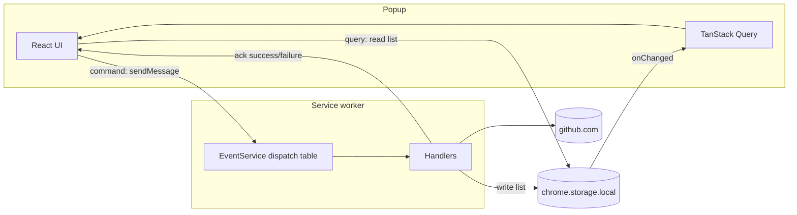
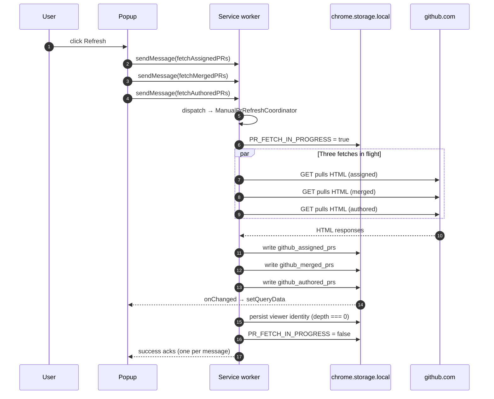

# Popup and Background Communication

> **Summary.** The popup talks to the service worker in two very different ways depending on what it wants. To **read** PR data it reads `chrome.storage.local` directly and subscribes to `chrome.storage.onChanged`; no runtime message is ever needed to see the lists. To **ask the worker to do something** (fetch fresh data, save settings, play a sound, fire a dev test notification), the popup sends a single runtime message that a `Map` based dispatch table inside `EventService` routes to exactly one handler. Data flows through storage, commands flow through messages, and the two channels never swap jobs.

---

## Why this page exists

The rule worth memorising before reading any communication code in Pullwatch is this: **storage is the query channel, messages are the command channel.** A new reader who expects "popup asks the worker for the PR list, worker responds with data" will try to wire that up, hit two problems at once (worker teardown, `sendResponse` reliability), and end up fighting the platform.

The design avoids that fight entirely. The popup never waits for a reply to get data. It renders from `chrome.storage.local` on open, and re renders when the storage key changes. Messages are only ever "please do a side effect," and the reply is just "done" or "failed."

---

## Commands vs queries at a glance



The left half is how the popup **sees** state. The right half is how the popup **asks for work**. The reply on the command path carries only `{ success, error? }`; it never carries PR data, because by the time the popup cares about the result, the data is already in `chrome.storage.local` and the `onChanged` listener has already routed it into TanStack Query.

---

## The single popup side entry point

Every runtime message from the popup goes through one file: [extension/common/chrome-extension-service.ts](../extension/common/chrome-extension-service.ts) (import as `@common/chrome-extension-service`). Having one entry point means every message is typed, every call site can be found with one search, and the "popup talking to worker" surface cannot quietly grow sideways.

The core is a tiny wrapper:

```ts
private sendMessage<T = unknown>(message: RuntimeRequestMessage): Promise<T> {
  return new Promise((resolve, reject) => {
    chrome.runtime.sendMessage(message, (response: MessageResponse<T>) => {
      if (chrome.runtime.lastError) return reject(chrome.runtime.lastError);
      if (response?.success) resolve(response.data as T);
      else reject(new Error(response?.error ?? 'Unknown error'));
    });
  });
}
```

`chromeExtensionService` groups popup behavior under domain clients (`prs`, `settings`, `sound`, `devTest`, `messages`). Each RPC-style call is either one of these `sendMessage` commands, or a direct `chrome.storage.*` read for data the popup owns.

| Popup surface (on `chromeExtensionService`)              | What it does                                                            | Channel                                |
| -------------------------------------------------------- | ----------------------------------------------------------------------- | -------------------------------------- |
| `prs.fetchFreshAssigned` / `fetchFreshMerged` / `fetchFreshAuthored` | Ask the worker to refresh one list.                         | `sendMessage`                          |
| `settings.save`                                          | Persist a settings diff and broadcast to other open contexts.           | `sendMessage`                          |
| `settings.get`                                           | Read current settings.                                                  | **Direct `chrome.storage.sync.get`**   |
| `settings.onChange`                                      | Subscribe to settings updates across tabs.                              | `chrome.storage.onChanged` (sync area) |
| `sound.playPreview` / `sound.stopPreview`                | Play or halt a notification sound.                                      | `sendMessage`                          |
| `settings.testNotification`                              | Fire a category test notification with cooldown.                        | `sendMessage`                          |
| `prs.readAssignedFromLocal` / `readMergedFromLocal` / `readAuthoredFromLocal` | Read `github_assigned_prs`, `github_merged_prs`, `github_authored_prs`. | **Direct `chrome.storage.local.get`**  |

The pattern is the same every time. **Reading something the popup could always read from storage** goes straight to `chrome.storage`. **Asking the worker to do work** goes through a message. `settings.get` being a direct storage read rather than a message is deliberate: it is a pure query, and routing it through the worker would wake it for no reason.

---

## The EventService dispatch table

On the worker side, every message lands in one method: [EventService.handleMessage](../extension/background/services/EventService.ts). It does nothing but look up a handler in a `Map` and delegate:

```ts
handleMessage(message, _sender, sendResponse): void {
  const handler = this.dispatchTable.get(message.action);
  if (!handler) {
    sendResponse({ success: false, error: `Unknown action: ${message.action}` });
    return;
  }
  const result = handler(message, sendResponse);
  if (result && typeof result.catch === 'function') {
    result.catch((err) => {
      this.debugService.error(`[EventService] Error in async handler for action ${message.action}:`, err);
      sendResponse({ success: false, error: `Unhandled error in ${message.action} handler` });
    });
  }
}
```

Two properties fall out of this shape. First, routing is O(1) and typo resistant: a message action that nobody registered fails fast with a structured error, never accidentally hits the wrong handler. Second, async handler rejections are always caught at the top level; a forgotten `await` cannot bring down the service worker.

The dispatch table is built in the constructor with a `registerDispatchGroup` helper so one handler can claim many actions at once:

```ts
registerDispatchGroup(
  dispatchTable,
  (m, r) => this.handleSettingsActions(m, r),
  SETTINGS_ACTION.saveSettings,
  SETTINGS_ACTION.getSettings,
  SETTINGS_ACTION.testSettingsNotification
);
```

| Action                                                                      | Handler                                                     | What happens                                                                                         |
| --------------------------------------------------------------------------- | ----------------------------------------------------------- | ---------------------------------------------------------------------------------------------------- |
| `PR_DATA_ACTION.fetchAssignedPRs` / `fetchMergedPRs` / `fetchAuthoredPRs`   | `handleXxxPRDataActions`                                    | Delegates to `ManualPrRefreshCoordinator.run(slot, sendResponse)`.                                   |
| `SETTINGS_ACTION.saveSettings` / `getSettings` / `testSettingsNotification` | `handleSettingsActions`                                     | Saves a settings diff (then broadcasts), reads settings, or fires a throttled test notification.     |
| `EVENT_PLAY_SOUND` / `EVENT_OFFSCREEN_READY`                                | `handleOffscreenActions`                                    | Plays a sound through the FIFO gate in `SoundService`, or acknowledges the offscreen document ready. |
| `PREVIEW_SOUND_ACTION.previewSound` / `stopPreviewSound`                    | `handlePreviewSoundAction` / `handleStopPreviewSoundAction` | Plays or stops a preview sound from the sound picker.                                                |
| `DEV_TEST_ACTION.*`                                                         | `handleDevTestActions`                                      | Fires test notifications, starts the test loop, overrides the alarm cadence.                         |

The boundary of what the popup can ask the worker to do is visible right there. Anything not in the table is an "Unknown action" error.

---

## The fetch in progress indicator

Manual refresh fires three separate runtime messages (one per list), and the alarm path runs all three lists inside a single nested block. Both surfaces need a single `STORAGE_KEY_PR_FETCH_IN_PROGRESS` flag that the popup watches to show "Updating…" without the popup driving the fetch.

A single boolean per handler is not enough: sibling fetches could clear the flag while other fetches are still running. The fix is a depth counter around every fetch wave:

```ts
private async withPrUiFetchIndicator<T>(fn: () => Promise<T>): Promise<T> {
  if (this.prUiFetchDepth === 0) {
    await storageService.set(STORAGE_KEY_PR_FETCH_IN_PROGRESS, true);
  }
  this.prUiFetchDepth += 1;
  try {
    return await fn();
  } finally {
    this.prUiFetchDepth -= 1;
    if (this.prUiFetchDepth === 0) {
      try {
        await prService.persistResolvedViewerIdentity();
      } catch (err) {
        this.debugService.error('[EventService] persistResolvedViewerIdentity failed:', err);
      }
      await storageService.set(STORAGE_KEY_PR_FETCH_IN_PROGRESS, false);
    }
  }
}
```

The second job of the counter is the **account swap barrier**. `PRService` compares the viewer login extracted from each fetch against the stored `github_viewer_identity`. If identity were persisted when the first sibling finished, later siblings would read "baseline equals current" and miss a swap that the first sibling actually detected. Persisting only on `depth === 0` means all three fetches are already done and the decision to clear or keep cached lists is consistent across them.

The same wrapper is used on the alarm, install, and startup paths, so install time hydration obeys the same "don't flip the UI flag early, don't persist identity early" contract as manual refresh.

---

## Manual refresh end to end



Notice where the data flows. The popup never consumes `sendResponse` for the PR list itself; the acks are just "done/failed." The actual re render is driven by the `onChanged` event on the storage key, handled by `use-pr-lists-storage-sync` on the popup side. See [Data Hydration and Storage](Data-Hydration-and-Storage) for the hydration half of this pipeline.

---

## Settings: save through message, read through storage, broadcast on change

Settings are the odd one out in the communication model because they live in `chrome.storage.sync`, not `local`, but the same asymmetry applies: read direct, write through the worker.

Saves run through the worker so the settings broadcast is centralised. [EventService.handleSettingsActions](../extension/background/services/EventService.ts) takes a partial settings diff, persists it via `storageService.setExtensionSettings`, then fires an `EVENT_SETTINGS_UPDATED` runtime message to **every open extension context**:

```ts
await storageService.setExtensionSettings(message.payload);
const settings = await storageService.getExtensionSettings();
this.broadcastSettingsUpdate(settings);
sendResponse({ success: true, data: settings });
```

Why broadcast, rather than letting each popup pick up the `chrome.storage.onChanged` event and re read? Because `onChanged` only carries the key and the new value; a settings save that changed five fields still results in one event, and every receiver would need the same merge logic. Broadcasting the **computed** settings object makes the contract "receive the whole settings shape, no merging required."

On the popup, [useExtensionSettings](../src/hooks/use-extension-settings.ts) listens for this broadcast and keeps local React state in sync, with one wrinkle:

```ts
const unsubscribe = chromeExtensionService.settings.onChange((newSettings) => {
  if (!isSavingRef.current) {
    setSettings(newSettings);
  }
});
```

If the same popup is mid save when the broadcast arrives, ignoring it prevents a stale "pre save" shape from clobbering the optimistic update. The save path also queues additional diffs via `pendingSaveRef`, so rapid toggles collapse into a single trailing save once the first one acks.

---

## Why `sendResponse` is not used to return PR data

The temptation for a new contributor is to write a handler that fetches the list, then calls `sendResponse(data)`. That appears to work in the happy path and breaks in three specific ways:

1. **Service worker teardown between send and receive.** A slow fetch can outlive the popup's attention span; the worker is not guaranteed to stay alive long enough to call `sendResponse` if the popup closed. The storage write, on the other hand, is durable.
2. **Multiple receivers.** Two popup windows, or the options page, all want the same data. Broadcasting through storage reaches all of them with one write. A single `sendResponse` only reaches the caller.
3. **The cold open path has no message.** When the popup boots, there is no in flight `sendMessage` to respond to. The popup just reads storage. If `sendResponse` were the canonical transport, cold open would need a separate code path that does the same thing, defeating the purpose.

Keeping `sendResponse` for `{ success, error? }` only makes the channel boring, and boring is what you want for a channel that has to survive worker sleep.

---

## Edge cases and gotchas

### Popup is closed by the time the worker finishes

The popup's `sendMessage` promise rejects when Chrome tears the channel down. That is fine: the worker still completes its fetch, writes the list to storage, and flips the flag off. When the popup opens again, it reads the fresh data from storage. No message means no caller to notify, and nothing to retry.

### Two refresh clicks in a row

`ManualPrRefreshCoordinator` (via `PRService.inflightFetches`) coalesces overlapping fetches for the same slot, and `STORAGE_KEY_LAST_MANUAL_REFRESH_AT` in `chrome.storage.session` throttles the button itself. A second click inside the throttle window is a no op; a second click after the window joins the same in flight promise if there is one. In both cases, only one GitHub round trip runs per list.

### A settings save races an `onChanged` for the same key

`useExtensionSettings` sets `isSavingRef.current = true` before calling `settings.save` and clears it in `finally`. Any `settings.onChange` callback that arrives in that window is ignored so the optimistic update is not overwritten with a pre save snapshot. Saves queued during that window accumulate in `pendingSaveRef` and are sent as one trailing diff.

### An unknown action makes it to the worker

`handleMessage` responds with `{ success: false, error: "Unknown action: <name>" }` and never throws. The popup's `sendMessage` wrapper converts that into a rejected promise with the same message. The worker does not crash, and the user sees a structured error rather than a silent hang.

### A dispatch handler forgets `await` on an internal promise

The top level `.catch` inside `handleMessage` catches any rejection the handler returns and replies `{ success: false, error: "Unhandled error in <action> handler" }`. This is a safety net, not an excuse: every real handler still wraps its work in try/catch with a more specific error message so the log tells you what actually broke.

---

## See also

- [Data Hydration and Storage](Data-Hydration-and-Storage): the other half of this page. How `chrome.storage.onChanged` events become TanStack Query updates, and why the popup paints with real data on frame one.
- [The Service Worker Lifecycle](The-Service-Worker-Lifecycle): why messages have to survive worker teardown, and why `async` message handlers keep the worker alive.
- [Notifications and Sound](Notifications-and-Sound): how `EVENT_PLAY_SOUND` and `PREVIEW_SOUND_ACTION.*` messages cross from the worker to the offscreen document.
