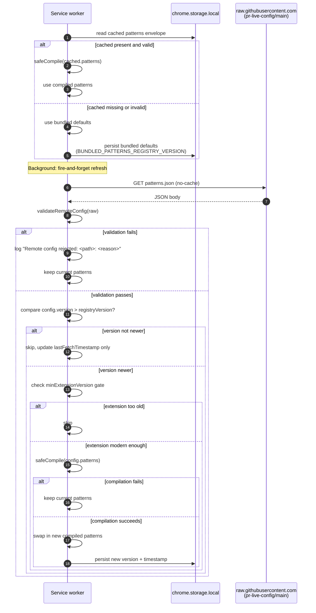

# Remote Configuration

> **Summary.** Every regex and selector that the parser waterfall relies on lives in a pattern registry. A bundled default set ships inside the extension, and a remote `patterns.json` file hosted in a public GitHub repo can override it at runtime. The remote fetch runs at most every 6 hours, is validated with Valibot, each regex is compiled inside a guard, and any failure falls back cleanly to the previously known good set. This is how a DOM change on GitHub can be patched live, without releasing a new extension build.

---

## Why this page exists

GitHub's DOM can change faster than a Chrome Web Store review cycle. If the only way to fix a broken selector was to publish a new extension version, every small DOM tweak would leave users with empty lists for hours or days.

Remote configuration turns that from a release problem into a commit on a separate repository. The flow is deliberately cautious: a bad remote config must never be able to disable the extension, roll users backward, or execute arbitrary regex syntax unchecked.

---

## Two sources of truth

The parser reads from exactly one set of compiled patterns at runtime, but that set can come from either of two places.

| Source               | Where it lives                                                                                               | Who owns it                                                                         |
| -------------------- | ------------------------------------------------------------------------------------------------------------ | ----------------------------------------------------------------------------------- |
| **Bundled defaults** | [extension/common/default-patterns.ts](../extension/common/default-patterns.ts)                              | Ships inside every release. Always available, even offline.                         |
| **Remote patterns**  | [github.com/dragosdev-code/pr-live-config](https://github.com/dragosdev-code/pr-live-config) (`main` branch) | Separate public repo. Hot patches here reach live users on the next 6 hour refresh. |

The bundled defaults are the floor. No matter what happens with the remote file, the extension can always compile and use the defaults; new installs start on them, and any failure in the remote path leaves them in place.

### Bundled floor version

Each extension build stamps a floor version in [`BUNDLED_PATTERNS_REGISTRY_VERSION`](../extension/common/constants.ts) (currently `6`). On first install, or after cached patterns are rejected, the service worker persists bundled `default-patterns.ts` under that number, not `0`. Remote config is applied only when `config.version` is strictly greater than the loaded version. That prevents an older `patterns.json` on `main` (for example v4) from replacing a newer bundle after someone clears `chrome.storage.local`.

### When to bump which version

Two numbers matter. They are related but you do not bump both on every change.

| What changed | Bump in pullwatch | Bump in `pr-live-config` |
| ------------ | ----------------- | ------------------------ |
| Regex fix shipped only via remote (OTA, no store release) | Nothing | `patterns.json` `version` (+1) |
| Regex fix in [`default-patterns.ts`](../extension/common/default-patterns.ts) (new extension build) | `BUNDLED_PATTERNS_REGISTRY_VERSION` (+1) | Same `version` on `main` (keep in sync) |

**Remote-only hotfix.** Edit `patterns.json` on `staging`, smoke test, merge to `main`. Example: users are on floor `6`, you publish remote `7`. The extension picks up `7` on the next fetch because `7 > 6`. You do not need to touch `BUNDLED_PATTERNS_REGISTRY_VERSION` unless you also changed bundled defaults in the extension repo.

**Extension release.** Change `default-patterns.ts`, bump `BUNDLED_PATTERNS_REGISTRY_VERSION`, and publish the same (or higher) `version` in `patterns.json` on `main`. That covers new installs (bundle), users who clear storage (floor), and users who still have an old cached remote (OTA).

Keep `staging` and `main` aligned for anything you expect production to read. The extension never fetches `staging`.

The `pr-live-config` repo has two branches worth knowing about:

- `main` is what production extensions read, at `raw.githubusercontent.com/dragosdev-code/pr-live-config/main/patterns.json`.
- `staging` is what the schema smoke tests (`npm run test:remote-patterns:staging`) read. It exists so a proposed change can be validated end to end before being promoted to `main`.

---

## The full update flow



The diagram looks long because it has a lot of safety rails. The happy path is short: read cache, use cache, in the background fetch remote, validate, compile, swap.

---

## Three safety rails

Each rail is independent. A failure at any rail stops the update without affecting the running pattern set.

### Rail 1: Valibot structural validation

A malformed remote JSON is rejected before any regex is compiled, let alone stored. [pattern-registry-schema.ts](../extension/common/pattern-registry-schema.ts) defines a Valibot schema that mirrors every expected field, including a minimum of one entry for arrays that must never be empty (`prRowSelectors`, `prLink`, `author`, `viewerLogin`, `timestamp`, `prType`):

```ts
export const RemotePatternConfigSchema = v.object({
  version: v.pipe(v.number(), v.integer(), v.minValue(1)),
  minExtensionVersion: v.string(),
  updatedAt: v.optional(v.string()),
  patterns: PatternRegistrySchema,
});
```

If validation fails, the service logs the offending path (for example `patterns.prRowSelectors.0.regex: Invalid type`) and returns. The previously loaded patterns stay in place.

Valibot was chosen over Zod for the size budget. Only the validators Pullwatch imports are pulled into the bundle, which keeps the runtime cost down in a service worker where cold start time matters.

### Rail 2: `safeCompile` per regex

Even structurally valid JSON can contain a malformed regex string. `PatternRegistryService.safeCompile` wraps the compilation step in a try/catch so that `new RegExp("[unclosed", "g")` cannot throw out of the fetch path:

```ts
private safeCompile(registry: PatternRegistry): CompiledPatterns | null {
  try {
    return compilePatterns(registry);
  } catch (error: unknown) {
    this.debugService.error('[PatternRegistry] Compilation failed:', error);
    return null;
  }
}
```

A `null` here is treated the same as validation failure: log, keep the current patterns. This matters for the cached storage path too. If a stored registry was compiled successfully yesterday but today's extension build has stricter regex parsing, `safeCompile` gives the extension a chance to bail gracefully onto the bundled defaults rather than crash the service worker.

### Rail 3: version gate

Updates move in one direction. `PatternRegistryService.doFetchRemote` accepts a remote config only when its `version` field is strictly greater than the currently loaded version:

```ts
if (config.version <= this.registryVersion) {
  this.lastFetchTimestamp = Date.now();
  return;
}
```

Why `<=` rather than `!==`? Because a strict `!==` would let a misconfigured push (say, resetting the version to `1`) silently roll live users backward to an older, potentially broken config. The comparison is one way on purpose: a new config has no effect unless its version is bumped above the last one anyone saw.

### When remote is older than the bundle

“Older” here means a lower integer `version`, not an older git commit. A remote file can be recent in the repo but semantically stale (for example missing a regex fix that already shipped in the extension bundle). If `main` is still on v4 and the bundle floor is v6, the fetch logs `Remote v4 is not newer than local v6` and skips the update; the bundle wins. That is why a local rebuild can fix parsing without pushing `pr-live-config`, until you need OTA for users who still have cached v4 in storage.

There is a second gate, optional but useful: `minExtensionVersion`. If the remote config names a minimum extension version that the running build does not satisfy, the config is skipped. This is how a new selector that depends on a new parser field can be staged without breaking users who have not yet updated.

---

## Cadence and dedup

Remote fetches are not tight. Two mechanisms keep them polite:

- **TTL via `PATTERN_REFRESH_TTL_MS = 6 hours`.** `refreshIfStale` returns immediately if the last fetch was within that window. [GitHubService.fetchPRs](../extension/background/services/GitHubService.ts) calls `refreshIfStale` as fire and forget at the start of every list fetch; most of those calls no op.
- **In flight dedup via `fetchInProgress`.** If a fetch is currently running, additional callers share the same promise. Two manual refreshes cannot trigger two simultaneous remote downloads.

Plus the fetch itself uses `AbortSignal.timeout(REMOTE_FETCH_TIMEOUT_MS)` so a slow GitHub CDN cannot hang the service worker. The fetch is issued `no-cache` because a newly published config must not sit behind a stale HTTP cache.

---

## What the extension actually stores

The persisted envelope in `chrome.storage.local` under `STORAGE_KEY_PATTERN_REGISTRY` is the full `StoredPatternData` object, not just the patterns:

```ts
export const StoredPatternDataSchema = v.object({
  patterns: PatternRegistrySchema,
  version: v.pipe(v.number(), v.integer(), v.minValue(0)),
  timestamp: v.pipe(v.number(), v.minValue(0)),
});
```

Why validate the wrapper, not just the patterns? Because a corrupted `version` or `timestamp` would silently poison both the staleness check (`Date.now() - NaN` is `NaN`, which compares `false` to everything) and the version comparison (`NaN <= n` is `false`, which would pass the "newer than local" gate by accident). Storing the envelope with an explicit schema makes both fields tamper evident.

Version `0` may still appear in storage from installs before the bundled floor existed; treat that as “no meaningful remote revision yet.” New installs persist `BUNDLED_PATTERNS_REGISTRY_VERSION` (see constants). The remote config schema requires `version >= 1`, so a production `patterns.json` cannot claim to be a fresh install.

For releases, keep `staging` and `main` in sync. The extension always reads `main`. If you bump `version` on `staging` but forget to merge to `main`, production extensions keep fetching the old `main` file while laptop smoke tests pass against `staging`. That mismatch often shows up as “I thought remote was v5 but logs say v4.”

---

## Validating config before it goes live

Editing `patterns.json` directly on `main` would be risky. The repo is set up so that:

1. Changes land on the `staging` branch first.
2. `npm run test:remote-patterns:staging` runs the Valibot schema against the staging file. The CI equivalent is what the canary suite uses before promotion.
3. `npm run test:remote-patterns:production:parity` confirms that the fields production and staging share are still in agreement where they should be.
4. Once green, staging promotes to `main`, and the next 6 hour refresh on every live install picks up the new version.

The point of the parity check is that staging can add strictly more than production (new optional fields, new experimental selectors), but it should not silently diverge on the fields that already exist.

---

## Edge cases and gotchas

### Remote JSON is malformed (missing a field, wrong type, extra garbage)

Rail 1 rejects it. The service logs `[PatternRegistry] Remote config rejected: <path>: <reason>` with up to three issues, which is usually enough to diagnose the problem. The running pattern set does not change. Users are unaffected.

### One regex in the remote config is invalid syntax

Rail 2 catches the `new RegExp(...)` throw inside `safeCompile`. The remote update is discarded wholesale, not partially. "Keep the rest, drop the bad one" was deliberately not implemented, because a partial registry with some stages missing is a harder shape to reason about than a clean "keep the last good version."

### Someone bumps the version backwards

Rail 3 refuses it. Live users stay on whatever version they last accepted until a proper forward bump arrives. The worst case of a bad push is "no update," never "users silently rolled back."

### The remote config adds a field that needs a new extension capability

That is what `minExtensionVersion` is for. A config that names `minExtensionVersion: "1.2.0"` will be skipped by users on `1.1.9` and accepted by users on `1.2.0` and above. No crash, no partial application.

### Storage is corrupted on first read

`validateStoredPatternData` rejects the envelope, the service logs, and falls back to the bundled defaults at `BUNDLED_PATTERNS_REGISTRY_VERSION`. The next remote fetch runs normally but only promotes when remote `version` exceeds that floor.

### Someone cleared extension local storage while testing

Clearing storage wipes the pattern envelope. On the next startup the service loads bundled patterns at the floor version, then fetches remote. Before the bundled floor existed, a clear reset the stored version to `0`, so any remote `version >= 1` (even an outdated `main` v4) could overwrite a newer bundle. That was the opposite of what you want when debugging a parser fix. After the floor change, outdated remote configs are ignored until `pr-live-config` `main` catches up.

If a PR still disappears after a clear and rebuild, check the service worker log for which patterns won (`Initialized with bundled default patterns v6` versus `Updated to remote patterns v4`) and confirm the PR appears on GitHub under the same query the extension uses (`user-review-requested:@me` for To Review).

### Staging passed smoke tests but main was not updated

Extensions never read the staging URL in production. Until `main` is updated, live users and production fetches stay on the previous `main` version regardless of what `npm run test:remote-patterns:staging` validated.

### The extension is offline at startup

No network means no remote fetch means no update. The service uses whatever is in storage (or falls back to defaults if storage is empty or invalid). The next wake with network connectivity will refresh.

---

## See also

- [The Parser Waterfall](The-Parser-Waterfall): the consumer of this registry. Every selector and regex the parsers use comes from here.
- [The Canary Monitor](The-Canary-Monitor): the operational system that detects when a pattern update is needed, and how fixes flow from staging to `main` to live users.
- [Data Hydration and Storage](Data-Hydration-and-Storage): how the persisted `STORAGE_KEY_PATTERN_REGISTRY` envelope fits into the rest of the extension's storage story.
