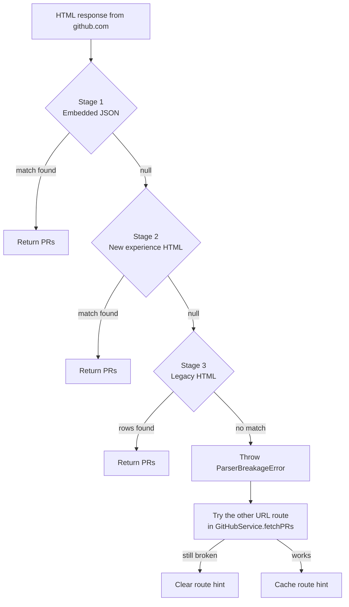
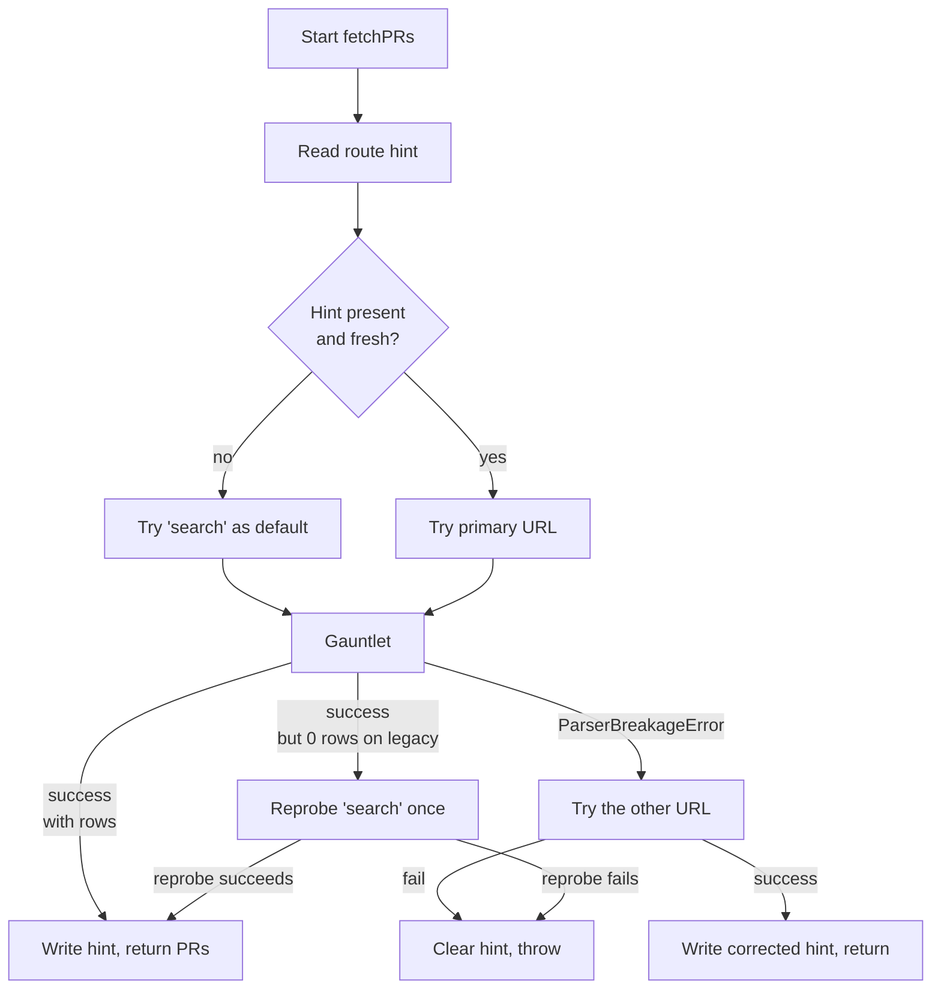

# The Parser Waterfall

> **Summary.** GitHub ships two different "all my pull requests" experiences (a new SSR dashboard and the classic HTML page), and it rolls them out unevenly per user, per repository, per feature flag. Hardcoding selectors against one of them would break the other. Pullwatch solves this with a three stage gauntlet: try the embedded SSR JSON first, fall back to the new experience HTML, then fall back to the classic legacy HTML. A separate **route hint** remembers which URL shape (`/pulls/search` vs `/pulls?q=...`) last worked, so steady state polling only issues one request per list.

---

## Why this page exists

Scraping GitHub is a moving target. Most weeks nothing changes; some weeks a class name flips, a data attribute moves, or a whole new `/pulls/search` route appears. If Pullwatch had one parser wired to one URL, a single GitHub change would mean a user facing breakage and a scramble for a new Chrome Web Store release.

The waterfall makes that story boring. When the page shape changes, one of the three parsers keeps working; the fetch path cleanly degrades onto the next stage; and when a user is still on the other experience entirely, the route hint keeps their polling cheap. The extension does not need to know _which_ experience you are on. It only needs to succeed at one of them.

---

## The gauntlet in one diagram



Two loops are worth calling out. The gauntlet itself is the vertical one: JSON, then new experience HTML, then legacy HTML, each in [extension/common/pulls-list-parser.ts](../extension/common/pulls-list-parser.ts). The horizontal loop is the **route fallback** in [GitHubService.fetchPRs](../extension/background/services/GitHubService.ts): if the gauntlet throws `ParserBreakageError` on one URL shape, the service retries on the other URL shape before giving up.

---

## Stage 1: the embedded JSON

The cleanest source of truth, when it exists.

The new dashboard ships its pull request data as an SSR JSON blob embedded in the page. [GitHubEmbeddedJsonPullHarvest](../extension/background/services/GitHubEmbeddedJsonPullHarvest.ts) locates the blob, parses it, and returns a fully shaped `PullRequest[]` with no DOM walking at all. If the JSON is there and well formed, nothing else runs.

Why is this stage first? Because it is the most stable across CSS churn. A JSON key survives a visual refresh; a CSS class name does not. Whenever you can parse structure, parse structure.

---

## Stage 2: the new experience HTML

The dashboard without its JSON.

[NewExperienceGitHubHTMLParser](../extension/background/services/NewExperienceGitHubHTMLParser.ts) targets the new dashboard's DOM directly. It uses the `patterns.newExperience` block from the pattern registry (all selectors come from there; no hardcoded regexes). It returns `null` if it cannot recognise the document at all (for example the legacy page does not match any of its probes), which is the signal for the waterfall to move on.

Why does the parser return `null` for "not my kind of page" rather than throwing? Because throwing would trip the route fallback in `GitHubService.fetchPRs`, but "this is the other experience" is not a fault worth retrying another URL for. It is just the waterfall telling the next stage "your turn."

---

## Stage 3: the legacy HTML

The classic `/pulls?q=...` page, unchanged in spirit since the old GitHub.

[GitHubHTMLParser](../extension/background/services/GitHubHTMLParser.ts) parses the legacy list. Unlike the first two stages, the legacy stage **cannot return `null`**. If the waterfall reached stage 3 and this parser also fails to find rows, that is a genuine parsing problem, so it throws [ParserBreakageError](../extension/common/errors.ts). That error is the signal `GitHubService` listens for when deciding whether to fall back to the other URL shape.

The contract is tight: stages 1 and 2 probe, stage 3 commits. Between the three of them, every supported page shape has an owner.

---

## How the three stages compose

The composition lives in [pulls-list-parser.ts](../extension/common/pulls-list-parser.ts) and is intentionally small:

```ts
export function parsePullsListHTML(
  html: string,
  baseUrl: string,
  patterns: CompiledPatterns,
  observer?: ParsePullsListObserver
): PullRequest[] {
  const jsonResult = GitHubEmbeddedJsonPullHarvest.extractFromHTML(html);
  observer?.onJsonProbed?.(jsonResult);
  if (jsonResult !== null) return jsonResult;

  const newExpResult = NewExperienceGitHubHTMLParser.parseFromHTML(html, baseUrl, patterns);
  observer?.onNewHtmlProbed?.(newExpResult);
  if (newExpResult !== null) return newExpResult;

  const legacyResult = GitHubHTMLParser.parseFromHTML(html, baseUrl, patterns);
  observer?.onLegacyHtmlProbed?.(legacyResult);
  return legacyResult;
}
```

The `observer` parameter is how the [canary suite](The-Canary-Monitor) watches the waterfall in CI. Production calls the function with no observer, so the gauntlet has zero runtime cost when nothing is listening. The canary uses the hooks to emit markers like `CANARY_EMBEDDED_JSON_DRIFT` and `CANARY_NEW_HTML_FALLBACK_DEGRADED` whenever an earlier stage declines and a later one takes over.

Every selector and every regex referenced by stages 2 and 3 comes from the pattern registry, which means every one of them can be patched in production via [Remote Configuration](Remote-Configuration) without releasing a new extension build.

---

## The route hint

Parsing is only half of the resilience story. The other half is **which URL do we hit in the first place**.

GitHub serves the same PR list at two different URL shapes:

| Route    | URL template          | Which experience it tends to serve |
| -------- | --------------------- | ---------------------------------- |
| `search` | `/pulls/search?q=...` | New dashboard, forward rollout.    |
| `legacy` | `/pulls?q=...`        | Classic experience.                |

If the extension had to probe both every cycle, every user would see two HTTP requests per list per alarm. That is wasteful and it doubles the chance of a rate limit. The fix is a small persisted hint in `chrome.storage.local` under `STORAGE_KEY_ROUTE_HINT`:

```ts
interface RouteHint {
  route: RouteType; // 'search' | 'legacy'
  timestamp: number;
}
```

Each successful fetch writes the hint. Each new fetch reads it, defaulting to `search` when the hint is missing (the new experience is the forward rollout). The hint has a **24 hour TTL** (`ROUTE_HINT_TTL_MS`), so if a GitHub rollout flips the user to the other experience, the stale hint expires on its own. No user can be permanently pinned to the wrong route.

The full decision tree for a single list fetch, from [GitHubService.fetchPRs](../extension/background/services/GitHubService.ts):



The "0 rows on legacy → reprobe search" branch deserves a mention. The new experience can return a 200 OK shell with zero pull requests even when the legacy URL is what you asked for, because a feature flag decides the experience based on the user, not the URL. Without the reprobe, a user caught mid rollout could see an empty inbox until the 24 hour TTL expires. The reprobe escapes that trap on the very next cycle.

---

## What each parser owns at a glance

| Stage | Parser                                                                                             | Returns `null` when                                         | Pattern block it consumes                    |
| ----- | -------------------------------------------------------------------------------------------------- | ----------------------------------------------------------- | -------------------------------------------- |
| 1     | [GitHubEmbeddedJsonPullHarvest](../extension/background/services/GitHubEmbeddedJsonPullHarvest.ts) | No SSR JSON blob is present in the document.                | Structural JSON extraction; no regex needed. |
| 2     | [NewExperienceGitHubHTMLParser](../extension/background/services/NewExperienceGitHubHTMLParser.ts) | The document is not the new experience at all.              | `patterns.newExperience` from the registry.  |
| 3     | [GitHubHTMLParser](../extension/background/services/GitHubHTMLParser.ts)                           | Never returns `null`; throws `ParserBreakageError` instead. | `patterns.legacy` from the registry.         |

---

## Edge cases and gotchas

### All three stages decline on the primary URL

Stage 1 returns `null`, stage 2 returns `null`, stage 3 throws `ParserBreakageError`. `GitHubService` catches the parser error (but not auth, rate limit, or outage errors, because those would be the same on the other URL), and retries the whole fetch on the alternate URL shape. If that also throws `ParserBreakageError`, the hint is cleared so the next alarm tick probes from scratch, and the error bubbles up as a UI banner.

### GitHub is down, not changed

HTTP 5xx and Cloudflare edge codes (520 through 530) are classified as [GitHubOutageError](../extension/common/errors.ts), not `ParserBreakageError`. Outage errors skip the route fallback because the other URL would hit the same infrastructure problem, and they intentionally preserve the cached PR lists in the popup with an "outage" banner instead of the misleading "parser broken" banner. Transient cases are also retried once after a 3 second delay, so the very common "blip" does not surface an error at all. Full classification, including the network-level failures that map to `GitHubOutageError`, lives on [GitHub Health and Outages](GitHub-Health-and-Outages).

### 200 OK, parseable HTML, incomplete list

The waterfall's job is "produce a `PullRequest[]` from the document". When GitHub returns 200 OK with HTML the parser is happy with, but the list is incomplete (a partial drop, or empty when storage held PRs), the parser cannot tell. The decision belongs to the layer above. [List Trust and Suspect Lists](List-Trust-and-Suspect-Lists) describes the assessor and the empty-confirmation streak that catch this case before it can shrink storage and produce a notification storm on recovery.

### The session is expired, but the HTTP status is 200

GitHub sometimes returns a 200 page with a logged out shell instead of a 401. `fetchGitHubData` handles this with [isGitHubLoggedOutHtmlShell](../extension/common/github-html-session.ts), which inspects the HTML metadata (`user-login`, `is_logged_out_page`) before the gauntlet runs. If it looks logged out, the fetch throws a session error and [Onboarding and Session Gates](Onboarding-and-Session-Gates) takes over.

### A regex has the global flag and an old `lastIndex`

Compiled regex objects live in the pattern registry and are reused across fetches. If a remote pattern ever introduces the `g` flag, a successful `exec()` mutates `lastIndex`, and the next call could skip a valid match. The extractor in `GitHubService.extractViewerLoginFromHtml` resets `lastIndex = 0` before every exec as a precaution. Any new parser that reuses `CompiledPattern.compiled` should do the same.

### Account swaps invalidate cached data

If you sign out of GitHub and sign in as someone else, the cached PR lists would be the previous account's. `PRService` compares the viewer login extracted from every fetch against `github_viewer_identity` in storage; a mismatch clears the lists. The viewer login itself is extracted by the registry's `viewerLogin` pattern chain, not hardcoded.

---

## See also

- [Remote Configuration](Remote-Configuration): how the patterns that drive stages 2 and 3 can be patched in live production.
- [The Canary Monitor](The-Canary-Monitor): the hourly DOM change watcher that uses the waterfall's `observer` hook to catch breakages before users do.
- [GitHub Health and Outages](GitHub-Health-and-Outages): the other side of the "is this an outage or a DOM change?" fork, including the full transport classification table and the recovery path.
- [The Service Worker Lifecycle](The-Service-Worker-Lifecycle): where `PRService` lives, how the TTL cache and inflight dedup wrap these fetches, and why the route hint has to be persisted to survive a wake.
